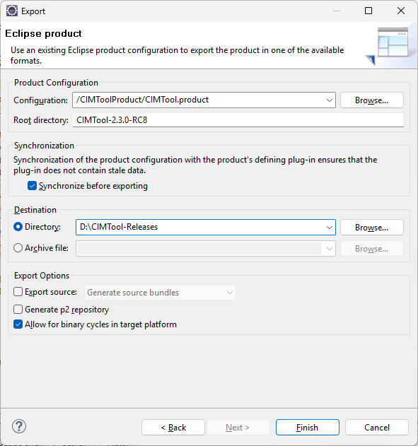
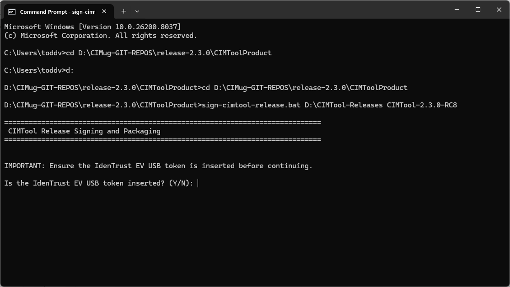
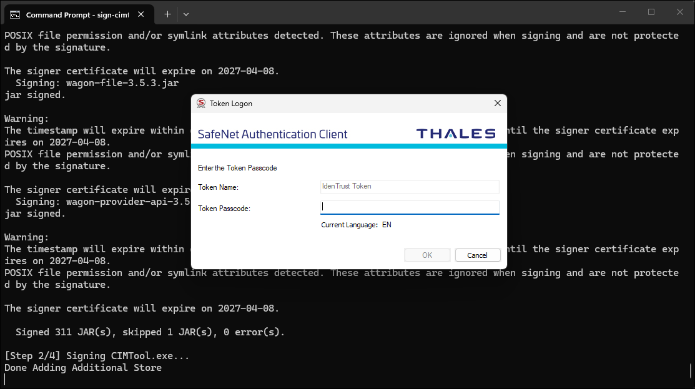
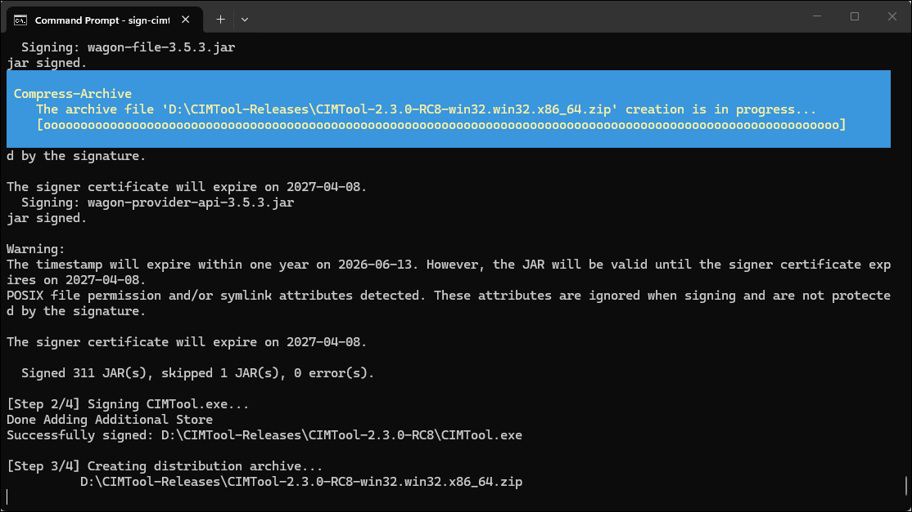
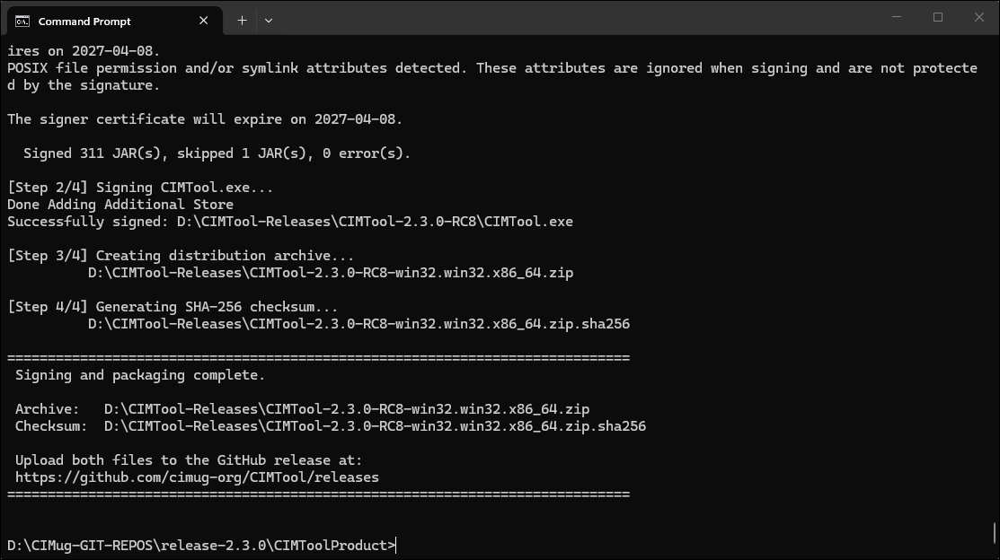
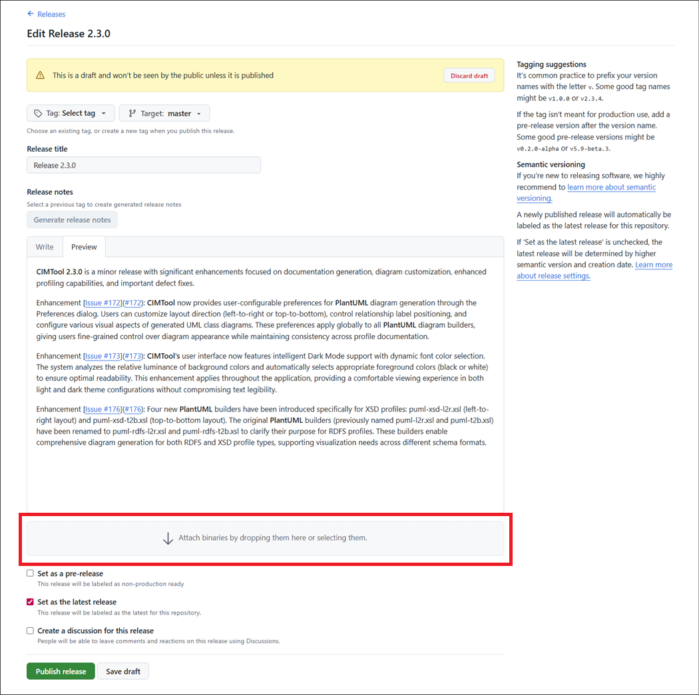

# CIMToolProduct

An Eclipse PDE product project that defines and packages the CIMTool application
as a standalone, distributable Eclipse RCP product.

This project contains no Java source of its own. Its sole purpose is to declare
the product identity, branding, launch configuration, and packaging metadata that
the Eclipse PDE build system uses to assemble a distributable CIMTool ZIP archive.


## Overview

In Eclipse PDE terminology a **product** is the outermost packaging unit — it
defines what an end user actually runs. The `CIMTool.product` file at the root of
this project is the authoritative descriptor for everything about the CIMTool
application from the user's perspective: its name, version, icons, splash screen,
JVM arguments, included plugins, and launcher name.

This project is responsible for:

1. Declaring the set of plugins that constitute the CIMTool application
2. Configuring branding assets (icons, splash screen, about dialog image)
3. Setting JVM arguments for the launched application
4. Defining default workspace preferences via `plugin_customization.ini`
5. Bundling `logging.properties` for extraction to the installation root at runtime
6. Producing the `CIMTool-<version>` ZIP archive via the Eclipse PDE product export


## Project Structure

```
CIMToolProduct/
├── CIMTool.product             ← Master product descriptor — the PDE export entry point
├── META-INF/
│   └── MANIFEST.MF             ← OSGi bundle manifest (au.com.langdale.cimtool.product)
├── build.properties            ← Declares files included in the bundle and export
├── plugin.xml                  ← Registers the product extension and branding properties
├── plugin.properties           ← Externalised strings for plugin.xml
├── plugin_customization.ini    ← Default workspace preferences (perspective, UI settings)
├── helpData.xml                ← Ordering of help table-of-contents entries
├── logging.properties          ← JUL logging configuration — extracted to install root at startup
├── cimtool-about.png           ← Image shown in the Help > About dialog
├── splash.bmp                  ← Splash screen displayed on startup
├── cimtool-v2.ico              ← Windows application icon
├── cimtool-v2.icns             ← macOS application icon
├── cimtool-v2.xpm              ← Linux application icon
├── makeicons.sh                ← Script to regenerate icon assets from source
└── icons/                      ← Window title bar and taskbar icons at multiple resolutions
    ├── cimtool-v2_16x16.png
    ├── cimtool-v2_32x32.png
    ├── cimtool-v2_48x48.png
    ├── cimtool-v2_64x64.png
    ├── cimtool-v2_96x96.png
    ├── cimtool-v2_128x128.png
    ├── cimtool-v2_256x256.png
    └── ...                     ← BMP variants for Windows ICO assembly
```


## Dependencies on Other Projects

This project has **no compile-time dependencies**. It contains no Java source and
does not declare `Require-Bundle` dependencies in its MANIFEST. Instead it
references other plugins by symbolic name in `CIMTool.product` via the `<plugins>`
list — these are resolved by the PDE export at packaging time.

The plugins that CIMTool.product explicitly includes which are developed within
this repository are:

| Plugin | Symbolic Name | Role |
| --- | --- | --- |
| CIMToolPlugin | `au.com.langdale.cimtoole` | Core Eclipse UI plugin — perspectives, editors, views, wizards, builders |
| CIMUtil | `au.com.langdale.cimutil` | Profile processing, XMI import, validation, XSLT transforms, CLI entry point |
| Kena | `au.com.langdale.kena` | RDF/OWL abstraction layer over Apache Jena |
| RCPUtil | `au.com.langdale.rcputil` | Reusable Eclipse RCP UI utilities (binding, builder, plumbing) |
| CIMToolHelp | `au.com.langdale.cimtoole.help` | Integrated HTML help documentation |
| com.cimphony.cimtoole | `com.cimphony.cimtoole` | CIMphony extensions — Ecore integration, additional buildlets |

All remaining plugins in the `<plugins>` list are Eclipse platform and third-party
plugins resolved from the active Eclipse target platform at export time.


## Key Configuration Files

### CIMTool.product

The central descriptor consumed by the PDE export wizard. Key settings:

| Setting | Value |
| --- | --- |
| Product UID | `au.com.langdale.cimtool.deployment` |
| Application | `org.eclipse.ui.ide.workbench` |
| Launcher name | `CIMTool` (produces `CIMTool.exe` on Windows, `CIMTool` on macOS/Linux) |
| JVM heap | `-Xms40m -Xmx4G` |
| Logging config | `-Djava.util.logging.config.file=./logging.properties` |
| Java requirement | JavaSE-20 |

### plugin_customization.ini

Sets default Eclipse preference values that apply when a user first opens a new
workspace. Key settings:

- Opens the **CIMTool Perspective** by default (`au.com.langdale.cimtoole.CIMToolPerspective`)
- Enables new-style tabs
- Places the perspective switcher in the top-right
- Shows a progress indicator on startup

These are default values only — users can override them through Eclipse preferences
and their choices are persisted per-workspace.

### logging.properties

Configures `java.util.logging` (JUL) for the running application. This file is:

1. Bundled inside the `au.com.langdale.cimtool.product` plugin via `bin.includes`
2. Extracted by `CIMToolPlugin.extractLoggingProperties()` to the installation root on first startup
3. Loaded by the JVM on all subsequent startups via the `-Djava.util.logging.config.file=./logging.properties` JVM argument

It configures a rolling `FileHandler` that writes to `logs/cimtool-%u-%g.log`
under the installation root (5 × 10 MB rotating files), suppresses spurious
UCanAccess/HSQLDB reserved-word warnings, and — in production mode — captures
`System.out` and `System.err` output through JUL loggers (`stdout` and `stderr`
respectively) so all console output is captured in the log file.

Changes to `logging.properties` take effect on the next restart.


## Release Process

The CIMTool release process consists of four sequential phases. All phases must
be completed in order — no phase should begin until the previous one is fully
complete and verified.

| Phase | Description |
| --- | --- |
| **1 — Pre-Build Preparation** | Versioning, release notes, PR to master |
| **2 — PDE Product Export** | Eclipse product export to a local directory |
| **3 — Code Signing and Packaging** | Signing, cimtool-cli build, ZIP assembly, checksums |
| **4 — Post-Build and Publishing** | `lib-repo/` PR, GitHub Release creation, tagging, artifact upload |

### Phase 1 — Pre-Build Preparation

All preparation work must be completed, reviewed, and merged to master via Pull
Request **before** any build or signing activity begins. Master is intended to
always reflect the latest release state and must be in a clean, final condition
before the export is performed.

#### Versioning

Before performing a product export or any of the subsequent steps in the release
process, all relevant sub-project versions must be reviewed and updated as needed
to reflect the release being prepared. Shipping a release with stale or
inconsistent version values is difficult to retract once published, and will
produce incorrectly identified artifacts on the GitHub releases page. Version
review and update is the mandatory first step in every release cycle.

All CIMTool sub-projects follow **Semantic Versioning** as defined at [https://semver.org](https://semver.org). A version number takes the form `MAJOR.MINOR.PATCH`, where each element is incremented according to the following rules:

- **MAJOR** — incremented when incompatible API or behavioral changes are introduced that would break existing consumers of the component.
- **MINOR** — incremented when new functionality is added in a backward-compatible manner (new features, new builders, new extension points, etc.).
- **PATCH** — incremented for backward-compatible bug fixes, documentation corrections, or minor internal changes that do not alter the component's public interface or behavior.

#### Product-Aligned Projects

The following projects must always be versioned in lockstep with the primary CIMTool release version declared in `CIMTool.product`. When a new release is prepared, all of these must be updated consistently before the product export is run:

| Project | Version Descriptor(s) | Notes |
| --- | --- | --- |
| CIMToolProduct | `CIMTool.product`, `META-INF/MANIFEST.MF`, `plugin.xml` | Primary release anchor |
| CIMToolPlugin | `META-INF/MANIFEST.MF` | Core UI plugin — ships in every release |
| CIMToolHelp | `META-INF/MANIFEST.MF` | Help content is release-specific |
| CIMUtil | `META-INF/MANIFEST.MF` | Core processing library — ships in every release |
| RCPUtil | `META-INF/MANIFEST.MF` | Eclipse RCP utility layer — ships in every release |
| CIMToolFeature | `feature.xml` | Top-level feature version matches the product version; internal plugin references use `0.0.0` and require no manual updates |

> **Note:** Before running a product export at release time, verify that all version references above are updated and consistent. Exporting with stale or mismatched version values will produce an incorrectly versioned distribution that is difficult to retract once published.

#### Independently-Versioned Projects

The following projects maintain their own version lifecycle and should only be updated when changes are actually made to that project:

| Project | Current Version | Notes |
| --- | --- | --- |
| Kena | `3.4.0` | RDF/OWL abstraction library; versioned on its own API contract independent of the CIMTool release cycle. **When Kena's version changes, the `kena` dependency version in `cimtool-cli/pom.xml` must also be updated to match before running `install-jars.bat`.** |
| com.cimphony.cimtoole | `1.1.0` | CIMphony extensions; versioned independently of the core product |
| CIMToolTest | `1.2.0` | Test suite; only increment when tests or test infrastructure are changed or added |

#### Dormant Projects

The following projects are currently dormant. Their versions do not need to be actively managed or maintained:

| Project | Current Version |
| --- | --- |
| CIMToolUpdate | `1.8.3` |
| SKena | `1.1.0` |
| ScalaRCP | `1.1.0` |
| ScalaUtil | `1.1.0` |

#### Release Notes

Before the release is built, the public-facing release notes page must be updated.
This page is located at `docs/release-notes.md` in the repository and is the
source of content for the CIMTool website at
[https://cimtool.ucaiug.io/release-notes/](https://cimtool.ucaiug.io/release-notes/). A new entry for the
release being prepared must be added at the top of the file following the
established format used by prior releases.

The content of this entry is also used verbatim as the release notes body when
creating the GitHub Release in Phase 4. Authoring the release notes here first —
as part of the pre-build PR — ensures the notes are reviewed before publication
and that the GitHub Release and the public website remain in sync.

Once versioning updates and release notes are complete, open a Pull Request to
merge all changes to master and obtain the required review approval before
proceeding.

### Phase 2 — PDE Product Export

The CIMTool distribution is produced via the Eclipse PDE product export. The export must always target a **Directory** destination — the distribution ZIP is produced by the code signing pipeline in the subsequent step, not by the PDE exporter directly.

1. From the Eclipse menu select **File > Export**
2. In the Export dialog select **Plug-in Development > Eclipse product** and click **Next**
3. Set the fields as shown in the screenshot below:
   - **Configuration:** `/CIMToolProduct/CIMTool.product`
   - **Root directory:** `CIMTool-<version>` (e.g. `CIMTool-2.3.0-RC8`) — replace with the actual release version being built
   - **Destination:** Select **Directory** and set the path to your release staging area (e.g. `D:\CIMTool-Releases`)
   - Check **Synchronize before exporting**
   - Check **Allow for binary cycles in target platform**
4. Click **Finish**



The export produces a versioned directory under the destination path:

```
<export-root>/
└── CIMTool-<version>/
    ├── CIMTool.exe             ← Windows launcher
    ├── CIMTool.ini             ← JVM arguments (heap, logging config path)
    ├── logging.properties      ← Extracted here by CIMToolPlugin on first run
    ├── logs/                   ← Created by CIMToolPlugin on first run
    ├── plugins/
    │   ├── au.com.langdale.cimtoole_<version>/
    │   ├── au.com.langdale.cimutil_<version>/
    │   ├── au.com.langdale.kena_<version>/
    │   └── ...
    └── ...
```

> **Note:** The `logging.properties` file at the installation root is not placed
> there by the PDE export directly. It is extracted from the
> `au.com.langdale.cimtool.product` plugin bundle at first startup by
> `CIMToolPlugin.extractLoggingProperties()`.

Once the export completes, proceed immediately to Phase 3 — Code Signing and Packaging before creating the distribution ZIP.


### Phase 3 — Code Signing and Packaging

> ⚠️ **Authorized Personnel Only**
>
> The code signing procedure described in this section may only be performed by a
> UCA vetted and approved representative. EV (Extended Validation) code signing
> requires a combination of specialized hardware and software installed and
> configured on a designated build machine: a SafeNet USB hardware security token
> issued by IdenTrust that physically stores the private signing key, the SafeNet
> Authentication Client (SAC) software that manages access to the token, and the
> Eclipse Temurin JDK and Windows SDK tools used to perform the signing operations.
> Because the private key never leaves the hardware token, the signing procedure
> can only be carried out on the machine where the token is present and the
> supporting software is installed. Unauthorized use of the signing certificate is
> a violation of the UCA Users Group's certificate policy and the terms of the
> IdenTrust EV certificate agreement.

All CIMTool release artifacts must be code signed before distribution. Signing serves two purposes: it assures end users that the software originates from the UCA International Users Group and has not been tampered with, and it prevents Windows SmartScreen from flagging the `CIMTool.exe` launcher as an unknown or untrusted application.

CIMTool uses an EV (Extended Validation) code signing certificate issued to **UCA USERS GROUP** by TrustID (IdenTrust). The certificate is stored on a SafeNet USB hardware token and the private key never leaves the token — all signing operations are performed on the hardware itself.

> **Certificate renewal:** The UCA Users Group EV code signing certificate is renewed annually per industry requirements. All releases must therefore be signed with an RFC 3161 TSA timestamp so that signed artifacts remain valid after the certificate expires. Releases signed with a timestamp remain trusted indefinitely regardless of certificate expiry.

#### Prerequisites

Ensure the following are in place on the build machine before running the signing script:

1. **Eclipse Temurin JDK 20** — must be installed from [https://adoptium.net](https://adoptium.net). Temurin is specifically required because it includes the `SunPKCS11` security provider that `jarsigner` uses to communicate with the IdenTrust EV hardware token. Other OpenJDK distributions such as Zulu omit this provider and cannot be used for JAR signing. The script expects `jarsigner` at `C:\Program Files\Eclipse Adoptium\jdk-20.0.2.9-hotspot\bin\jarsigner.exe` (the default install location for the `OpenJDK20U-jdk_x64_windows_hotspot_20.0.2_9` installer) — update the `JARSIGNER` variable in the script if your installation path differs.

2. **Windows SDK `signtool.exe`** — used to apply Authenticode signatures to `CIMTool.exe`. Installed with Visual Studio or as a standalone Windows SDK download. The script expects it at `C:\Program Files (x86)\Windows Kits\10\bin\10.0.26100.0\x64\signtool.exe` — update the `SIGNTOOL` variable in the script if your installation path differs.

3. **SafeNet Authentication Client (SAC)** — must be installed and the IdenTrust EV USB token must be inserted before running the script. SAC installs the PKCS#11 library at `C:\Windows\System32\eTPKCS11.dll`. If this file is not found the script will automatically attempt the alternate location `C:\Windows\System32\pkcs11.dll`.

4. **Token PIN** — the script prompts for the hardware token PIN once at startup
   using a masked input field (characters are not echoed). The PIN is held in
   memory for the duration of the signing session and cleared immediately on
   completion. It is never written to disk.

5. **Certificate alias** — The `CERT_ALIAS` variable in the script is set to the
   UUID that the IdenTrust token uses internally to identify the certificate entry.
   Note that this UUID does not match the friendly display name (`UCA USERS GROUP`)
   shown in the SafeNet Authentication Client GUI — `jarsigner` resolves aliases
   through the PKCS#11 provider which exposes the underlying token UUID. If the
   certificate is ever renewed onto a new token the alias UUID will change and the
   `CERT_ALIAS` variable must be updated. To rediscover the alias run the following
   command with Temurin's `keytool` (not Zulu or any other JDK distribution) with
   the token inserted:
   ```cmd
   "C:\Program Files\Eclipse Adoptium\jdk-20.0.2.9-hotspot\bin\keytool.exe" ^
     -list -keystore NONE -storetype PKCS11 ^
     -providerClass sun.security.pkcs11.SunPKCS11 ^
     -providerArg pkcs11.cfg
   ```
   The alias is the value appearing before the first comma in the output entry, e.g.:
   `2a5b28ed-47ef-2c08-a705-896ee5b3016e, PrivateKeyEntry, ...`

#### Running the Signing Script

The `sign-cimtool-release.bat` script located in the `CIMToolProduct/` directory handles the complete post-export signing and packaging pipeline. It must be run from a standard Windows Command Prompt (not PowerShell) after the PDE product export completes.

**Usage:**
```cmd
sign-cimtool-release.bat <export-root> <version-string>
```

**Example:**
```cmd
sign-cimtool-release.bat D:\CIMTool-Releases CIMTool-2.3.0-RC8
```

The script performs the following steps in sequence:

1. **Signs all JAR files** in the `plugins/` directory using `jarsigner` with the IdenTrust EV token via PKCS#11, SHA-256 digest, and a TSA timestamp
2. **Signs `CIMTool.exe`** using `signtool` Authenticode with SHA-256 and a TSA timestamp
3. **Populates `cimtool-cli/lib-repo/`** by invoking `install-jars.bat` with the signed export directory
4. **Builds `cimtool-cli.jar`** by invoking `mvn clean package` in the `cimtool-cli/` project
5. **Signs `cimtool-cli.jar`** using `jarsigner` with the IdenTrust EV token via PKCS#11
6. **Deploys `cimtool-cli.jar`** to `cimtool-cli/dist/` and generates its SHA-256 checksum
7. **Packages** the signed export directory into `CIMTool-<version>-win32.win32.x86_64.zip`
8. **Generates** a `CIMTool-<version>-win32.win32.x86_64.zip.sha256` checksum file alongside the ZIP

The script exits immediately with a non-zero error code if any step fails.

#### Script Execution Walkthrough

The following screenshots illustrate a complete successful run of the signing pipeline.

**Confirm Prerequisites — Confirm EV USB token inserted / Step 1 — Start JAR signing:**



**Step 1 — JAR signing complete / Step 2 — CIMTool.exe signing begins:**



When Step 2 begins, the SafeNet Authentication Client presents a native GUI dialog
prompting for the **Token Passcode** again. This second prompt is expected and
cannot be automated — `signtool` communicates with the hardware token through
Windows CryptoAPI rather than the PKCS#11 path used by `jarsigner`, which triggers
a separate authentication dialog from the SafeNet middleware. Enter the token PIN
in this dialog and click **OK** to proceed.

**Step 2 complete / Step 3 — Distribution archive creation in progress:**



**Steps 3 and 4 complete — Successful completion summary:**



> **Note — Expected `jarsigner` console warnings:** During JAR signing the
> following three warnings will appear in the console output for every JAR
> processed. They are all purely informational and do not indicate any problem
> with the signing process. The presence of **`jar signed.`** after each JAR
> is the only confirmation needed that signing succeeded.
>
> - `The timestamp will expire within one year on <date>. However, the JAR will be valid until the signer certificate expires on <date>.`
>   This warning has two distinct subjects that are easy to conflate. The first
>   date refers to the **TSA server's own infrastructure certificate** — the
>   IdenTrust timestamp authority server's cert, not the UCA Users Group signing
>   cert and not the timestamp embedded in the JAR. When that cert expires
>   IdenTrust simply renews it as with any server cert, and it has no effect
>   whatsoever on timestamps already embedded in signed JARs. The second date is
>   the EV signing certificate's expiry — `jarsigner` is confirming that the JAR
>   remains valid through the signing cert's full lifetime.
>   More importantly: once a JAR is signed with a TSA timestamp embedded, it
>   remains trusted and valid **indefinitely** — even after the EV signing cert
>   expires. The timestamp is permanent cryptographic proof that the signature was
>   created while the cert was valid. This is how every major software vendor ships
>   signed software and is precisely why timestamping is mandatory for all release
>   builds.
>
> - `POSIX file permission and/or symlink attributes detected. These attributes are ignored when signing and are not protected by the signature.`
>   Some JARs contain Unix-style file metadata. These attributes are harmless and
>   are simply ignored by `jarsigner` during the signing process.
>
> - `The signer certificate will expire on <date>.`
>   Informational only — confirms the expiry date of the EV signing certificate.
>   No action required until renewal time.

> **Note — Unpacked plugin resources:** Some plugins in the CIMTool distribution
> are deployed with resources unpacked directly onto the filesystem rather than
> bundled inside a JAR. For example, the `au.com.langdale.cimutil_<version>\builders\`
> directory contains `.xsl` transform files that are written loose to disk so that
> the Saxon XSLT processor can access them directly at runtime. These files are not
> covered by JAR signing — there is no JAR container for `jarsigner` to sign. Their
> integrity is instead protected by the SHA-256 checksum published alongside the ZIP
> archive. Users who verify the checksum before extracting the distribution are
> assured of the integrity of all contents, including unpacked resources.

> **Note — Third-party library JAR re-signing:** The `plugins/` directory contains
> third-party library JARs bundled under `\lib\` subdirectories (for example,
> Saxon, Apache Commons, HSQLDB, and others under
> `au.com.langdale.cimutil_<version>\lib\`). These JARs were originally signed by
> their respective publishers. When `jarsigner` processes them as part of this
> pipeline it replaces those original publisher signatures with the UCA Users Group
> EV certificate signature. This is standard practice for Eclipse RCP distributions:
> by re-signing all bundled JARs under a single certificate the UCA Users Group is
> asserting that this specific combination of libraries — as integrated, tested, and
> shipped in CIMTool — has been reviewed and vouched for. The original publisher
> signatures served their purpose at the point of download; at the point of
> redistribution the responsibility for the bundled artifact passes to the
> distributor. Running `jarsigner -verify` on any `\lib\` JAR after signing will
> show the UCA Users Group signature rather than the original publisher signature —
> this is expected and correct.

> **Note — Known unsignable JARs:** One JAR in the distribution cannot be signed
> due to a structural defect in the JAR itself that is outside of CIMTool's
> control: `asp-server-asciidoctorj-dist.jar`, part of the `de.jcup.asciidoctoreditor`
> plugin. It contains a duplicate `META-INF/BSDL` entry in its internal ZIP
> structure which causes `jarsigner` to reject it with a `ZipException: duplicate entry`
> error. The signing script handles this automatically via the `SKIP_JARS`
> configuration variable — the JAR is skipped without aborting the pipeline and
> is reported in the final summary as a skipped entry rather than an error. The
> JAR remains protected by the distribution ZIP SHA-256 checksum. If future
> releases of the AsciiDoc editor plugin correct this defect, the entry can be
> removed from `SKIP_JARS`.

### Phase 4 — Post-Build and Publishing

#### Commit lib-repo/ Changes

`sign-cimtool-release.bat` invokes `install-jars.bat` during Step 3, which purges
and reinstalls `kena` and `cimutil` entries in `cimtool-cli/lib-repo/`. Since
`lib-repo/` is committed to source control, the build may produce changes to it
that must be committed back to master before the release is tagged.

> **Note:** This commit is only required when the Kena or CIMUtil versions have
> actually changed since the previous release. If both versions are unchanged,
> `install-jars.bat` reinstalls identical JARs producing identical checksums,
> resulting in no git diff — and no PR is needed.

When changes are present, open a Pull Request containing only the `lib-repo/`
changes, obtain review approval, and merge to master. **The tag must not be
created until this PR is merged** — the tag must capture the exact `lib-repo/`
state that produced the release, so that any developer cloning at the tag can
immediately run `mvn clean package` without needing to re-run `install-jars.bat`.

#### Create the GitHub Release

Navigate to [https://github.com/cimug-org/CIMTool/releases](https://github.com/cimug-org/CIMTool/releases)
and create a new release against master. Set the tag to the release version (e.g.
`2.3.0`). Copy the release notes entry for this version from `docs/release-notes.md`
into the release notes body. Attach all four release artifacts by dropping them
into the Assets upload area highlighted below, then click **Publish release**:

- `CIMTool-<version>-win32.win32.x86_64.zip`
- `CIMTool-<version>-win32.win32.x86_64.zip.sha256`
- `cimtool-cli.jar`
- `cimtool-cli.jar.sha256`



Publishing the release simultaneously creates the tag on master at the current
HEAD commit — which at this point includes all pre-build version changes, release
notes, and the post-build `lib-repo/` commit. This tagged commit is the definitive
reproducible state for this release.

#### Verifying Signatures

To verify JAR signing:
```cmd
jarsigner -verify -verbose -certs plugins\au.com.langdale.cimtoole_<version>.jar
```

To verify the `CIMTool.exe` Authenticode signature:
```cmd
signtool verify /pa /v CIMTool.exe
```

#### macOS

In the event of future macOS support, `codesign` would be used in place of `signtool` for signing the macOS launcher (`CIMTool.app`). JAR signing via `jarsigner` would remain unchanged across platforms.


## Relationship to cimtool-cli

The PDE product export produces versioned plugin folders under `plugins/`. Two of
these — `au.com.langdale.kena_<version>/kena.jar` and
`au.com.langdale.cimutil_<version>/cimutil.jar` — are consumed by the
`cimtool-cli` project's `install-jars.bat` script to assemble the standalone CLI
uber JAR. See `cimtool-cli/cimtool-cli-README.adoc` for details.

> **Note:** Whenever the Kena project version changes, the `kena` dependency
> version declared in `cimtool-cli/pom.xml` must be updated to match the new
> plugin folder name (e.g. `au.com.langdale.kena_3.4.0` → version `3.4.0`).
> Failure to keep these in sync will cause the `cimtool-cli` Maven build to fail
> with a dependency resolution error.
