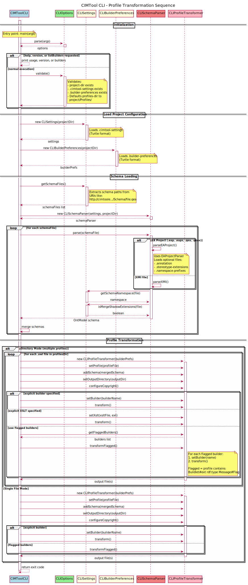

# CIMUtil

The core library plugin for CIMTool. It provides all model processing logic —
XMI/EA project import, CIM profile manipulation, XSLT-based artefact generation,
CIM/XML validation, CIM Modelling Guide compliance checking, and the standalone
CLI entry point. It contains no Eclipse UI code of its own.

This is the most substantive of the in-repository plugins from a pure Java
perspective. The Eclipse UI in `CIMToolPlugin` and the standalone CLI in
`cimtool-cli` are both shells around the logic that lives here.


## Overview

CIMUtil (`au.com.langdale.cimutil`) serves two distinct roles:

1. **Eclipse plugin** — required by `CIMToolPlugin` and `com.cimphony.cimtoole` at runtime. Exports its packages via OSGi so they are available to other bundles in the Eclipse workbench.

2. **Standalone library** — its compiled `cimutil.jar` is extracted from the PDE product export and installed into the `cimtool-cli` local Maven repository by `install-jars.bat`, where Maven Shade packages it into the CLI uber JAR.

The key functional areas are:

- **XMI / EA project import** — parses Sparx Enterprise Architect `.eap`, `.eapx`, `.qea`, and `.qeax` project files (via UCanAccess / SQLite JDBC) and XMI exports into an RDF ontology graph via Kena
- **Profile model** — the CIM profile object model (`ProfileClass`, `ProfileModel`, `HierarchyModel`) and profile manipulation operations (reorganize, refactor, rename, remap, repair)
- **XSLT transform engine** — 34 XSLT builders in `builders/` that generate diverse output artefacts (XSD, RDFS, OWL, JSON Schema, HTML, RTF, SQL, Java, Scala, C#, Avro, LinkML, PlantUML, AsciiDoc, and more) from a CIM profile
- **Validation** — CIM/XML and Turtle instance document validation against a profile using a Jena rules engine
- **CIM Modelling Guide compliance** — an Easy Rules engine with 100+ rules implementing the IEC CIM Modelling Guidelines, used to generate the audit/compliance report
- **CLI entry point** — `CIMToolCLI` and supporting classes in `profiles.cl` provide a headless command-line interface for profile transformation


## Project Structure

```
CIMUtil/
├── META-INF/
│   └── MANIFEST.MF                    ← OSGi bundle manifest — exports, lib classpath, dependencies
├── build.properties                   ← PDE build configuration — source JAR, bin.includes
├── lib/                               ← Vendored third-party JARs (see Dependencies section)
├── builders/                          ← XSLT stylesheets and supporting resources
│   ├── builders.json                  ← Builder registry — maps builder IDs to XSLT styles and output extensions
│   ├── includes/                      ← Shared XSLT includes (e.g. namespace definitions)
│   ├── adoc-themes/                   ← AsciiDoc theme files for report generation
│   ├── *.xsl                          ← 34 XSLT builder stylesheets (see Builder Stylesheets section)
│   └── default-copyright-template-*.txt ← Default copyright header templates
├── import-reports/                    ← AsciiDoc templates for the CIM Modelling Guide
│   │                                     audit/compliance report generated into /Schema
│   ├── asciidoc/
│   │   ├── includes/                  ← Per-category rule documentation includes
│   │   ├── styles/                    ← CSS stylesheets for rendered reports
│   │   └── themes/                    ← AsciiDoc PDF themes and logos
│   ├── puml/                          ← PlantUML templates for report diagrams
│   └── schema/                        ← JSON/XML schemas for report configuration
├── CIMUtil-README.adoc                ← This README (AsciiDoc)
├── CIMUtil-README.md                  ← This README (Markdown)
├── CIMUtil-Sequence-Diagrams.adoc     ← Architecture & sequence diagram reference document (AsciiDoc)
├── CIMUtil-Sequence-Diagrams.md       ← Architecture & sequence diagram reference document (Markdown)
├── readme-images/                     ← PlantUML source and rendered SVG sequence diagrams
│   ├── CIMTool_CLI_Profile_Transformation_Sequence_Diagram.puml
│   ├── CIMTool_CLI_Profile_Transformation_Sequence_Diagram.svg
│   ├── CIMUtil_EasyRules_CIM_Modelling_Guide_Compliance_Sequence_Diagram.puml
│   ├── CIMUtil_EasyRules_CIM_Modelling_Guide_Compliance_Sequence_Diagram.svg
│   ├── CIMUtil_Kena_Jena_Adapters_Sequence_Diagram.puml
│   ├── CIMUtil_Kena_Jena_Adapters_Sequence_Diagram.svg
│   ├── CIMUtil_Profile_Transformation_Sequence_Diagram.puml
│   ├── CIMUtil_Profile_Transformation_Sequence_Diagram.svg
│   ├── CIMUtil_Validation_Sequence_Diagram.puml
│   ├── CIMUtil_Validation_Sequence_Diagram.svg
│   ├── CIMUtil_XMI_Import_Sequence_Diagram.puml
│   └── CIMUtil_XMI_Import_Sequence_Diagram.svg
└── src/
    └── au/com/langdale/
        ├── cim/                       ← CIM vocabulary constants (CIM, CIMS)
        ├── colors/util/               ← Color utilities and NodeTraits — used by icon cache in CIMToolPlugin
        ├── easyrules/                 ← CIM Modelling Guide compliance rule engine
        │   ├── engine/               ← Rule validators (model-level, DB-level, combined)
        │   └── rules/                ← 100+ rules organised by category:
        │       ├── associations/     ← Association rules (Rule065–Rule198)
        │       ├── attributes/       ← Attribute rules (Rule049–Rule195)
        │       ├── classes/          ← Class rules (Rule038–Rule187)
        │       ├── common/           ← Base rule infrastructure
        │       ├── descriptions/     ← Description/documentation rules (Rule104)
        │       ├── enumerations/     ← Enumeration rules (Rule084–Rule205)
        │       ├── extensions/       ← Extension/shadow class rules
        │       ├── inheritance/      ← Inheritance rules (Rule115–Rule119)
        │       ├── metadata/         ← Rule metadata annotations (severity, category, type)
        │       ├── namespaces/       ← Namespace rules (Rule143–Rule146)
        │       ├── packages/         ← Package rules (Rule025–Rule182)
        │       └── utils/            ← Utility helpers (British spelling, PlantUML, CIM rules)
        ├── jena/                     ← Jena/Kena tree model abstractions (UMLTreeModel, MappingTree)
        ├── logging/                  ← Schema import logging interface and implementations
        ├── preferences/              ← Global preferences API (shared between GUI and CLI)
        ├── profiles/                 ← Core profile model and transform engine
        │   ├── ProfileClass.java     ← Profile class representation
        │   ├── ProfileModel.java     ← Profile OWL model wrapper
        │   ├── HierarchyModel.java   ← Profile class hierarchy
        │   ├── OWLGenerator.java     ← OWL/RDF output generator
        │   ├── RDFSGenerator.java    ← RDFS output generator
        │   ├── SchemaGenerator.java  ← XSD schema generator base
        │   ├── ProfileSerializer.java ← Profile serialization
        │   ├── ProfileReorganizer.java / Reorganizer.java ← Profile structure operations
        │   ├── Refactory.java / Renamer.java / Remapper.java ← Profile refactoring operations
        │   ├── ProfileFixes.java     ← Profile repair utilities
        │   ├── SpreadsheetParser.java ← Excel spreadsheet import
        │   ├── EAGuidUtils.java      ← EA GUID handling utilities
        │   └── cl/                   ← CLI entry point and headless transform infrastructure
        │       ├── CIMToolCLI.java   ← Main entry point for the standalone CLI
        │       ├── CLIOptions.java   ← Command-line argument parsing
        │       ├── CLIProfileTransformer.java ← Headless profile transform orchestration
        │       ├── CLISchemaParser.java ← Headless XMI/EA schema parsing
        │       ├── CLISettings.java  ← CLI project settings adapter
        │       └── builders/         ← CLI builder registry and configuration serialization
        ├── validation/               ← CIM/XML and Turtle validation engine
        │   ├── ProfileValidator.java ← Validates instance documents against a profile
        │   ├── ConsistencyChecker.java ← Cross-reference consistency checks
        │   ├── DiagnosisModel.java   ← Validation result RDF model
        │   ├── ModelValidator.java / SplitValidator.java ← Single/split model validators
        │   ├── RepairMan.java        ← Automated profile repair
        │   └── ValidatorUtil.java    ← Shared validation helpers
        └── xmi/                      ← XMI and EA project import
            ├── EAPParser.java        ← Sparx EA .eap / .eapx file parser (via UCanAccess JDBC)
            ├── QEAParser.java        ← Sparx EA .qea / .qeax (SQLite) file parser
            ├── EAProjectParser.java / EAProjectParserFactory.java ← EA project parser facade
            ├── XMIParser.java / XMIModel.java ← XMI file parser
            ├── CIMInterpreter*.java  ← CIM-specific XMI interpretation
            ├── UMLInterpreter.java   ← Generic UML XMI interpretation
            ├── Translator.java / LegacyTranslator.java ← XMI-to-RDF translation
            ├── StereotypeExtensions.java ← EA stereotype handling
            ├── NamespaceResolver.java / NamespacePrefixes.java ← Namespace management
            └── XSDTypeUtils.java / XSDFacets.java ← XSD type mapping utilities
```


## Dependencies on Other Projects

CIMUtil has a single OSGi `Require-Bundle` dependency on another in-repository plugin:

| Bundle | What CIMUtil uses from it |
| --- | --- |
| `au.com.langdale.kena` | The `OntModel`, `ModelFactory`, `Resource`, and related RDF/OWL graph APIs used throughout profile processing, XMI import, and validation |

### Vendored Third-Party Libraries

The following JARs are declared in `Bundle-ClassPath` in `MANIFEST.MF` and included in the plugin bundle:

| Library | Version | Purpose |
| --- | --- | --- |
| Saxon HE | 10.8 | XSLT 2.0 / 3.0 processor — executes all builder stylesheets |
| Apache POI | 3.9 | Excel `.xls` spreadsheet reading for `SpreadsheetParser` |
| UCanAccess | 4.0.4 | JDBC bridge for reading Sparx EA `.eap` and `.eapx` Access database files |
| HSQLDB | 2.3.6 | In-memory SQL engine used internally by UCanAccess |
| Jackcess | 2.2.3 | Low-level MS Access file reader used by UCanAccess |
| SQLite JDBC | 3.45.2.0 | JDBC driver for reading Sparx EA `.qea` and `.qeax` SQLite files |
| Gson | 2.8.6 | JSON serialization for builder configuration and CLI output |
| Easy Rules Core + Support | 4.1.0 | Rule engine framework for CIM Modelling Guide compliance rules |
| commons-lang | 2.6 | Apache Commons general utilities |
| commons-logging | 1.1.3 | Logging facade used by vendored dependencies |
| SLF4J API | 2.x (platform) | Logging facade used by Saxon-HE and other vendored dependencies. Resolved via `Import-Package` rather than vendored — `MANIFEST.MF` declares `org.slf4j`, `org.slf4j.event`, `org.slf4j.helpers`, and `org.slf4j.spi`, wiring these calls to the platform SLF4J 2.x bundle. Saxon's SLF4J log events route through the platform bundle into the Logback pipeline. |
| xml-resolver | 1.2 | XML catalog resolver for XSLT stylesheet includes |

Three additional Easy Rules extension JARs are physically present in `lib/` but are intentionally excluded from `Bundle-ClassPath` and from the table above: `easy-rules-jexl-4.1.0.jar`, `easy-rules-mvel-4.1.0.jar`, and `easy-rules-spel-4.1.0.jar`. These provide JEXL, MVEL, and Spring EL expression language support for Easy Rules and are retained for planned future use. None of the current compliance rule implementations use these expression languages.


## Builder Stylesheets

The `builders/` directory contains 34 XSLT stylesheets registered in `builders.json`. Each transforms a CIM profile's internal XML representation into a specific output artefact format. The builders are executed by Saxon HE 10.8 and are all XSLT 3.0 compliant unless otherwise noted. For detailed documentation on individual builders, their NTE (Name/Type/Extension) settings, and usage guidance see the [CIMTool Builders Library](https://cimtool-builders.ucaiug.io/).

| Stylesheet | Output Extension | Description |
| --- | --- | --- |
| `xsd.xsl` | `.xsd` | Generates an XSD schema compliant with [IEC 62361-100:2016](https://webstore.iec.ch/publication/25114) (CIM Profiles to XML Schema Mapping). The generated schemas are also compatible with [IEC 61968-100:2013](https://webstore.iec.ch/publication/6198) (Implementation Profiles Ed 1.0) used for enterprise integration via JMS and web services. XSLT 1.0 compliant. |
| `xsd-part100-ed2.xsl` | `.part100-ed2.xsd` | Generates an XSD schema also compliant with IEC 62361-100:2016, but uniquely targeting [IEC 61968-100:2022](https://webstore.iec.ch/publication/67766) (Implementation Profiles Ed 2.0), which is not backwards compatible with Ed 1.0. Use this builder when your integration infrastructure is based on the newer 2022 standard. |
| `rdfs-2020.xsl` | `.rdfs-2020.rdfs` | Generates an RDFS schema reflecting the RDFS2020 de facto agreements on extensions to [IEC 61970-501:2006](https://webstore.iec.ch/publication/6215). This is the current recommended RDFS format for profiles targeting modern CGMES and IEC TC57 toolchains. |
| `rdfs-501ed2-beta.xsl` | `.rdfs-501ed2-beta.rdfs` | Generates an RDFS schema targeting the draft IEC 61970-501 Ed 2.0 specification. This builder is in beta and tracks the evolving Ed 2.0 standard including potential LinkML-based semantics representation. |
| `html.xsl` | `.html` | Generates a standalone HTML file containing complete documentation for all classes, attributes, and associations defined in a profile. Suitable for publishing as a human-readable profile reference without any additional tooling. |
| `profile-doc-rtf.xsl` | `.rtf` | Generates a Microsoft Word compatible RTF (Rich Text Format) document containing complete documentation for all classes, attributes, and associations in a profile. The output can be opened directly in Microsoft Word for further editing or distribution. |
| `json-schema-draft-07.xsl` | `.draft-07.schema.json` | Generates a JSON Schema compliant with the draft [IEC 62361-104](https://webstore.iec.ch/publication/67199) standard (CIM Profiles to JSON Schema Mapping). Targets JSON Schema draft-07 specification. Suitable for use with JSON Schema validators and code generation tools that support draft-07. |
| `json-schema-draft-2020-12.xsl` | `.draft-2020-12.schema.json` | Generates a JSON Schema compliant with the draft IEC 62361-104 standard targeting the JSON Schema draft-2020-12 specification. Use this builder when your toolchain supports the newer 2020-12 vocabulary. |
| `json-ld-context-json-beta.xsl` | `.context-json-beta.jsonld` | Generates a JSON-LD context document derived from a JSON Schema profile, enabling RDF-compatible JSON serialization of CIM instance data. Beta release targeting IEC 62361-104 JSON-LD serialization requirements. |
| `json-ld-context-rdfs.xsl` | `.context-rdfs-beta.jsonld` | Generates a JSON-LD context document derived from an RDFS profile, enabling RDF-compatible JSON serialization of CIM instance data. Beta release targeting IEC 62361-104 JSON-LD serialization requirements. |
| `apache-avro-schema.xsl` | `.avsc` | Generates an Apache Avro schema for a profile, enabling compact binary serialization of CIM instance data in high-throughput data pipeline contexts. Suitable for use with Kafka, Spark, and other Avro-compatible data platforms. |
| `linkml.xsl` | `.linkml.yaml` | Generates a [LinkML](https://linkml.io/) schema for a profile in YAML format. LinkML is a semantic modelling language being explored in IEC 61970-501 Ed 2.0 as a potential semantic representation for the CIM. The generated schema includes `ea_guid` for direct traceability to Sparx EA UML elements. |
| `jpa.xsl` | `.java` | Legacy generator for generating a Java source file containing JPA (Java Persistence API) entity classes compatible with JPA 2.2 and earlier. The generated entities are designed to correlate directly to the SQL database schema produced by the `sql.xsl` generator. The defined classes can be used in Java applications for persisting CIM profile instances to a relational database via any JPA 2.2 compliant ORM provider. The legacy generator does not support CIM Compound classes and has been retained for backwards compatibility. |
| `jpa-rdfs.xsl` | `.jpa-rdfs.java` | Generates a Java source file containing JPA (Java Persistence API) entity classes compatible with JPA 3.1. The generated entities are designed to correlate directly to the SQL database schema produced by the `sql-rdfs-ansi92.xsl` generator. The defined classes can be used in Java applications for persisting CIM profile instances to a relational database via any JPA 3.1 compliant ORM provider. Supports CIM Compound classes and is the recommended replacement for the legacy `jpa.xsl` builder. |
| `csharp-ef-rdfs.xsl` | `.csharp-ef-rdfs.cs` | Generates C# source code containing Entity Framework Core entity classes for a profile. The generated entities are designed to correlate directly to the SQL database schema produced by the `sql-rdfs-ansi92.xsl` generator. Entity relationships and constraints are defined using the Entity Framework Core Fluent API, enabling precise control over table mappings, foreign keys, and cascade behaviours. The generated classes support LINQ-based querying of CIM profile instances via Entity Framework Core. |
| `scala.xsl` | `.scala` | Generates a Scala source file defining a vocabulary for a profile. The output contains Scala classes and objects representative of those in the profile and may be used in applications implemented in Scala, including those running on the JVM alongside Java code. |
| `sql.xsl` | `.sql` | Legacy generator for generating an ANSI SQL-92 compliant DDL script from a profile that is defined with the full class hierarchy and without anonymous or inline definitions. The legacy generator does not support CIM Compound classes and has been retained for backwards compatibility. |
| `sql-rdfs-ansi92.xsl` | `.rdfs-ansi92.sql` | Generates an ANSI SQL-92 compliant DDL script from a profile that is defined with the full class hierarchy and without anonymous or inline definitions. |
| `cimantic-graphs.xsl` | `.cimantic-graphs.py` | Generates a specialized Python dataclass schema for use with the [CIMantic Graphs](https://github.com/PNNL-CIMug/cimantic-graphs) open source library for creating, parsing, and editing CIM power system models using in-memory knowledge graphs. |
| `cimantic-graphs-init.xsl` | `.__init__.py` | Companion builder to `cimantic-graphs.xsl` — generates the Python `__init__.py` file required for library imports to work correctly. Both builders must be enabled together for the CIMantic Graphs output to be usable as a Python package. |
| `puml-rdfs-t2b.xsl` / `puml-rdfs-l2r.xsl` | `.rdfs-t2b.puml` / `.rdfs-l2r.puml` | Generates a PlantUML class diagram representing the profile classes and relationships derived from an RDFS schema. Two layout variants are provided — top-to-bottom (`t2b`) and left-to-right (`l2r`). |
| `puml-xsd-t2b.xsl` / `puml-xsd-l2r.xsl` | `.xsd-t2b.puml` / `.xsd-l2r.puml` | Generates a PlantUML class diagram representing the profile classes and relationships derived from an XSD schema. Two layout variants are provided — top-to-bottom (`t2b`) and left-to-right (`l2r`). |
| `puml-json-t2b.xsl` / `puml-json-l2r.xsl` | `.json-t2b.puml` / `.json-l2r.puml` | Generates a PlantUML class diagram representing the profile classes and relationships derived from a JSON Schema. Two layout variants are provided — top-to-bottom (`t2b`) and left-to-right (`l2r`). |
| `adoc-article-xsd.xsl` / `adoc-inline-xsd.xsl` | `.article-xsd.adoc` / `.inline-xsd.adoc` | Generates AsciiDoc documentation for a profile derived from an XSD schema. Two structural variants are provided — `article` (standalone AsciiDoc document) and `inline` (content fragment for inclusion in a larger document). ¹ |
| `adoc-article-rdfs.xsl` / `adoc-inline-rdfs.xsl` | `.article-rdfs.adoc` / `.inline-rdfs.adoc` | Generates AsciiDoc documentation for a profile derived from an RDFS schema. Two structural variants are provided — `article` (standalone AsciiDoc document) and `inline` (content fragment for inclusion in a larger document). ¹ |
| `adoc-article-json.xsl` / `adoc-inline-json.xsl` | `.article-json.adoc` / `.inline-json.adoc` | Generates AsciiDoc documentation for a profile derived from a JSON Schema. Two structural variants are provided — `article` (standalone AsciiDoc document) and `inline` (content fragment for inclusion in a larger document). ¹ |
| `adoc-article-rdfs-mappings.xsl` / `adoc-inline-rdfs-mappings.xsl` | `.article-rdfs-mappings.adoc` / `.inline-rdfs-mappings.adoc` | Generates AsciiDoc documentation describing the RDFS mappings for a profile — classes, attributes, associations, and their corresponding RDFS/RDF URI mappings. Two structural variants are provided — `article` and `inline`. ¹ |

¹ The `article` and `inline` variants differ in their intended embedding context. An **article** builder generates a complete, standalone AsciiDoc document — it includes a document title (`=`), preamble, and full section structure that can be processed independently by Asciidoctor to produce a self-contained HTML, PDF, or other output format. An **inline** builder generates only the body content of the documentation as a fragment without a document header or title, designed to be pulled into a larger parent document using AsciiDoc's `include::` directive. Use the `article` variant when the profile documentation is the primary deliverable; use the `inline` variant when embedding profile documentation within a larger technical specification or report.


## CIM Modelling Guide Rule Engine

The `easyrules/` package implements the CIM Modelling Guide compliance checker using the Easy Rules framework. Rules are organised into categories matching the IEC CIM Modelling Guidelines document structure — packages, classes, attributes, associations, enumerations, descriptions, inheritance, namespaces, and extensions — with over 100 rules in total. Each rule class implements the Easy Rules `Rule` interface and carries `@RuleMetadata` annotations declaring its rule number, severity, category, and type. Extension rule variants apply the same checks to user-defined CIM extension classes and packages.

The compliance check runs during the CIMBuilder build cycle and results are written as an AsciiDoc report into the project's `/Schema` folder using the templates in `import-reports/`.


## CLI Entry Point

The `profiles/cl/` package provides the standalone command-line interface used by `cimtool-cli`:

| Class | Role |
| --- | --- |
| `CIMToolCLI` | Main entry point — initialises logging, delegates to `run()` |
| `CLIOptions` | Parses and validates command-line arguments (`--project-dir`, `--builder`, `--output`, `--schema`, `--namespace`, `--help`, `--version`, `--list-builders`) |
| `CLIProfileTransformer` | Orchestrates the headless transform pipeline — loads schema, loads profile, runs the selected builder stylesheet via Saxon |
| `CLISchemaParser` | Headless XMI/EA project schema parser — wraps `EAPParser` / `QEAParser` for use outside the Eclipse workspace |
| `CLISettings` | Adapts the CLI project directory structure to the `Settings` interface expected by the profile model |

The following sequence diagram documents the full CLI transform pipeline architecture.




## Relationship to Other Projects

- **Kena** — CIMUtil's single OSGi dependency. All RDF graph operations use the Kena `OntModel` API rather than calling Apache Jena directly.
- **CIMToolPlugin** — the Eclipse UI shell around CIMUtil's logic. The builder system, profile editors, import wizards, and validation views all delegate to CIMUtil classes. CIMToolPlugin does not duplicate any model processing.
- **com.cimphony.cimtoole** — extends CIMUtil's profile buildlet extension point to add Ecore output support, and uses CIMUtil's profile model and Kena graph API directly.
- **cimtool-cli** — packages `cimutil.jar` into a standalone uber JAR. At runtime the CLI uses `CIMToolCLI` as its entry point and `CLIProfileTransformer` for all transform operations.
- **CIMToolTest** — tests CIMUtil's validation engine, Kena integration, profile tasks, and transform pipeline via the `headless/` test package.
