# Development Environment Setup

Instructions for setting up a development environment for the CIMTool 2.x release
line: installing the recommended Eclipse IDE, configuring a Java runtime, and
cloning and importing the CIMTool projects into an Eclipse workspace. Active
development on the CIMTool 1.x release line has ceased; these instructions apply
to the 2.x line only.

> **Note:** A specific Eclipse edition and release is recommended to eliminate
> unanticipated configuration and setup issues. Development and deployment of
> CIMTool against this release has been fully tested and its plugin dependencies
> verified out of the box. Questions may be posted to the
> [CIMTool 2.x Release Line: Development Community Discussion Board](https://github.com/cimug-org/CIMTool/discussions/92).

## Eclipse Installation

CIMTool is developed against a specific Eclipse IDE edition and release. The steps
below cover locating, installing, and configuring it on Windows. Editions for
macOS and Linux are available from the same downloads site, but the instructions
here are Windows-specific.

### Step 1: Download the Eclipse IDE

The recommended IDE is the *Eclipse IDE for Enterprise Java and Web Developers*
from the [Eclipse IDE 2023-06 R packages](https://www.eclipse.org/downloads/packages/release/2023-06/r).
The Windows 64-bit archive is available [here](https://www.eclipse.org/downloads/download.php?file=/technology/epp/downloads/release/2023-06/R/eclipse-jee-2023-06-R-win32-x86_64.zip).

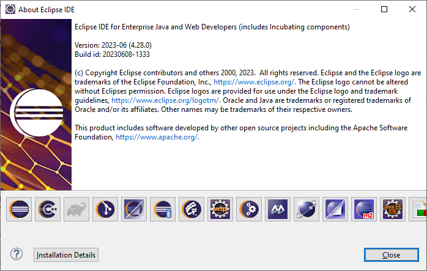

### Step 2: Install a JDK

CIMTool requires Java 20 or newer. If a suitable JDK is not already installed, one
must be installed before continuing. The [Azul Zulu OpenJDK](https://www.azul.com/downloads/?package=jdk#zulu)
distribution provides a freely available Windows 64-bit option; the `.msi`
installer makes installation straightforward.

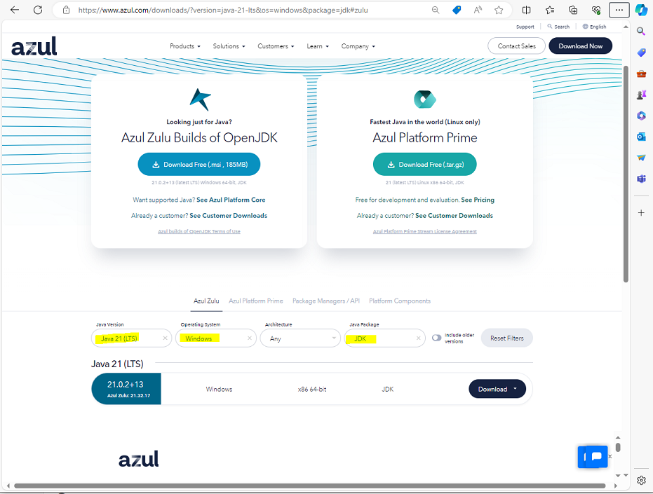

### Step 3: Extract the Eclipse IDE

Installation consists of extracting the downloaded
`eclipse-jee-2023-06-R-win32-x86_64.zip` archive. Depending on the chosen
extraction location, the process may fail with "path too long" errors on Windows.
If this occurs, create a directory off the root of a local drive (for example,
`C:\temp-eclipse`) and extract into it; the shorter base path avoids the error.
Extraction creates an `\eclipse` folder under the chosen directory containing the
IDE, which may then be relocated to a preferred location on the file system.

### Step 4: Register the Installed JRE in Eclipse

When a newer JDK has been installed in Step 2, it must be registered in the Eclipse
IDE configuration before the CIMTool projects are imported.

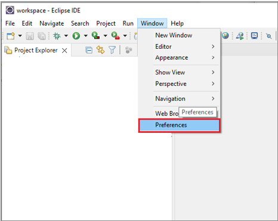

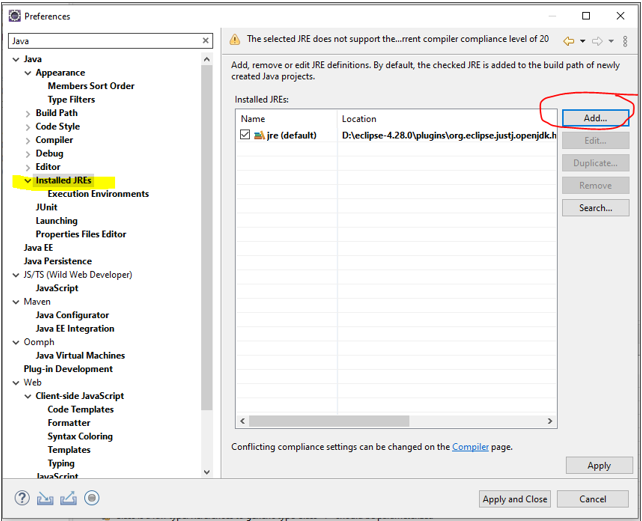

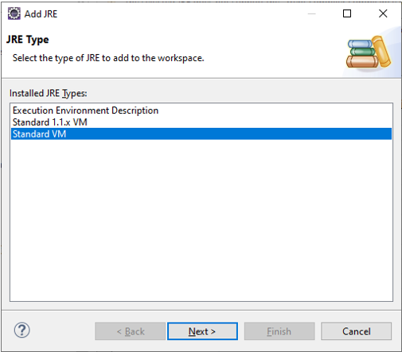

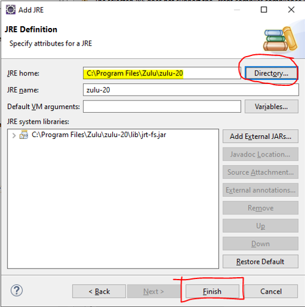

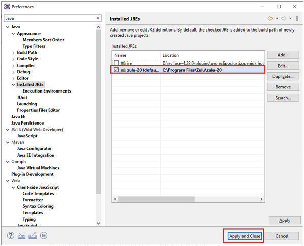

## Installing Required Eclipse Plugins

Beyond the base IDE, CIMTool development requires several Eclipse plugins that are not
part of the *Eclipse IDE for Enterprise Java and Web Developers* package and must be
installed separately. These plugins serve two purposes:

- They are used within the development environment to author and preview the project's
  AsciiDoc and PlantUML documentation.
- They are dependencies of the CIMTool product. Because a product export resolves against
  the plugins installed in the development IDE, each must be present in the IDE for the
  exported CIMTool product to include it. Omitting them produces a product that fails to
  load the corresponding features at runtime.

Each plugin is installed through `Help` > `Install New Software...`. For each one, click
`Add...`, enter the update-site *Location* (the URL given below) and a descriptive
*Name*, confirm, then check the required features under *Work with* and proceed. The
update-site URL to enter for each plugin is shown in that plugin's first screenshot.

### What to Expect During Installation

After the features are selected and `Next` is clicked, every plugin install follows the
same Eclipse p2 sequence. These shared steps are described here once and referenced from
each plugin below.

1. **Install Details** lists the resolved set of features to be installed. This page is
   worth reviewing: if Eclipse reports *"Your original request has been modified"*, or if
   two versions of the same feature appear, the selection has resolved to a conflicting
   set and should be corrected with `< Back` before continuing.
2. **Review Licenses** presents the *Eclipse Foundation Software User Agreement* (EPL).
   Select *I accept the terms of the license agreement* and click `Finish`.

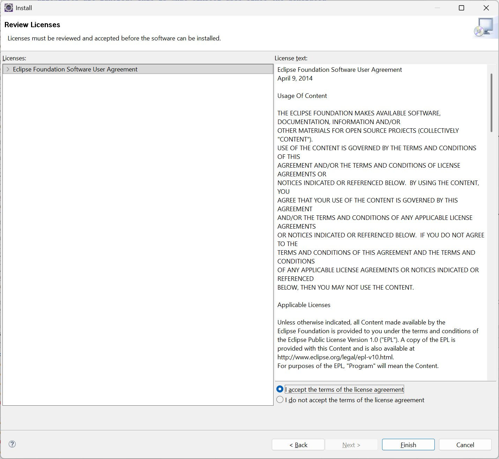

3. **Trust** dialogs verify the integrity and origin of the downloaded content. Their
   exact form depends on whether each plugin's artifacts are digitally signed, so they
   are shown per plugin below.
4. **Restart** is prompted once installation completes. Choose `Restart Now` so the newly
   installed plugins are activated and available to a subsequent product export.

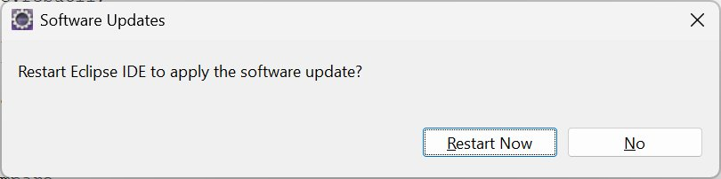

### PlantUML Eclipse Plugin

The *PlantUML Eclipse Plugin* provides the PlantUML rendering that CIMTool uses to
generate and preview UML class diagrams of profiles. Its plugins
(`net.sourceforge.plantuml.eclipse`, `net.sourceforge.plantuml.svg`,
`net.sourceforge.plantuml.library`, and their companions) are dependencies of the CIMTool
product and must be present in the development IDE so that the product export includes
them. This is the more involved of the two installs; the Asciidoctor Editor install that
follows presents the same license, trust, and restart dialogs in a simpler form.

Using `Add...`, add the update site `https://plantuml.github.io/plantuml-eclipse/` as
shown. Then select the features below and click `Next`:

- From *PlantUML Eclipse support*: the *Ecore*, *Feature*, and *UML2* features, verified
  at version `1.2.0.202511102215`.
- From *PlantUML Library*: the *PlantUML Library Feature*, verified at version
  `1.2025.10.202511041744`.
- From *PlantUML Eclipse support sources*: the *Developer Resources* (source) bundles are
  optional and are left unselected in this configuration.

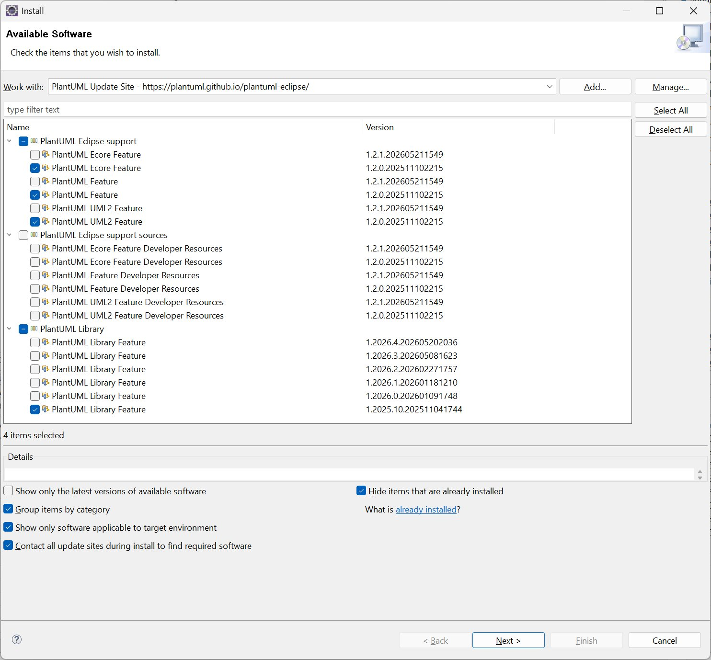

> **Tip:** The PlantUML site retains its full version history. Unticking *"Show only the
> latest versions of available software"* exposes every published build, so a specific,
> known-good version can be selected and pinned.

On the *Install Details* page, confirm that the *PlantUML Library Feature* resolves to a
**single version** and that no *"Your original request has been modified"* warning appears. If a
second Library version is added or the warning is shown, return with `< Back` and adjust
the selection until a single, conflict-free set resolves. The version pairing above
(*Eclipse support* `1.2.0.202511102215` with *Library* `1.2025.10.202511041744`) resolves
cleanly.

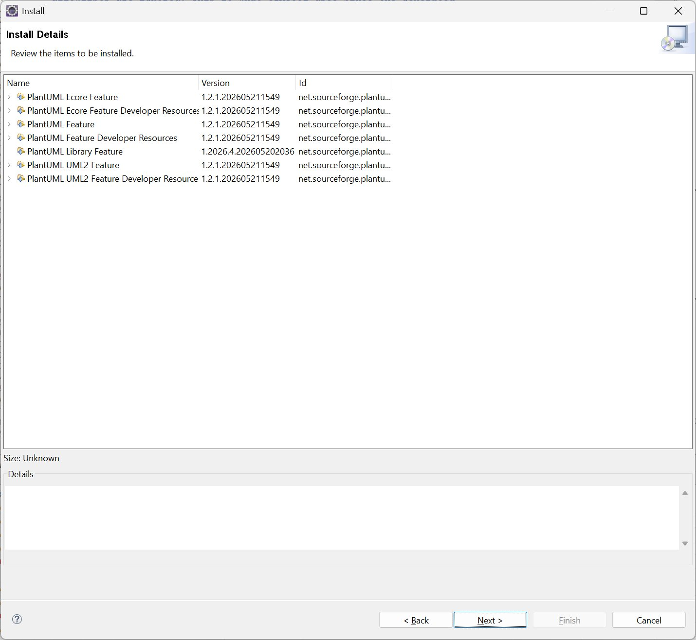

The PlantUML artifacts are **not** digitally signed. The trust dialog is headed *"Do you
trust unsigned content of unknown origin?"* and lists the `net.sourceforge.plantuml.*`
bundles as *Unsigned*. Select the content and click `Trust Selected` to proceed.

> **Note:** Unsigned content carries no cryptographic proof of origin or integrity:
> Eclipse cannot confirm who produced the artifacts or that they were not altered in
> transit. The installation proceeds only because the content is explicitly trusted at
> this prompt.

Complete the installation by accepting the license and restarting, as described in
[What to Expect During Installation](#what-to-expect-during-installation).

### Asciidoctor Editor

The *Asciidoctor Editor* provides AsciiDoc editing and live preview within the IDE and is
used to author the CIMTool developer documentation. It is also bundled in the CIMTool
product (`de.jcup.asciidoctoreditor` and its companion plugins), where it supports the
product's AsciiDoc-based documentation features. Its install follows the same sequence as
the PlantUML install above, with two differences noted below.

Using `Add...`, add the update site
`https://de-jcup.github.io/update-site-eclipse-asciidoctor-editor/update-site/` as shown.
Then, under the *Stable* category, check *Asciidoctor Editor* (verified at version
`3.1.2`) and click `Next`.

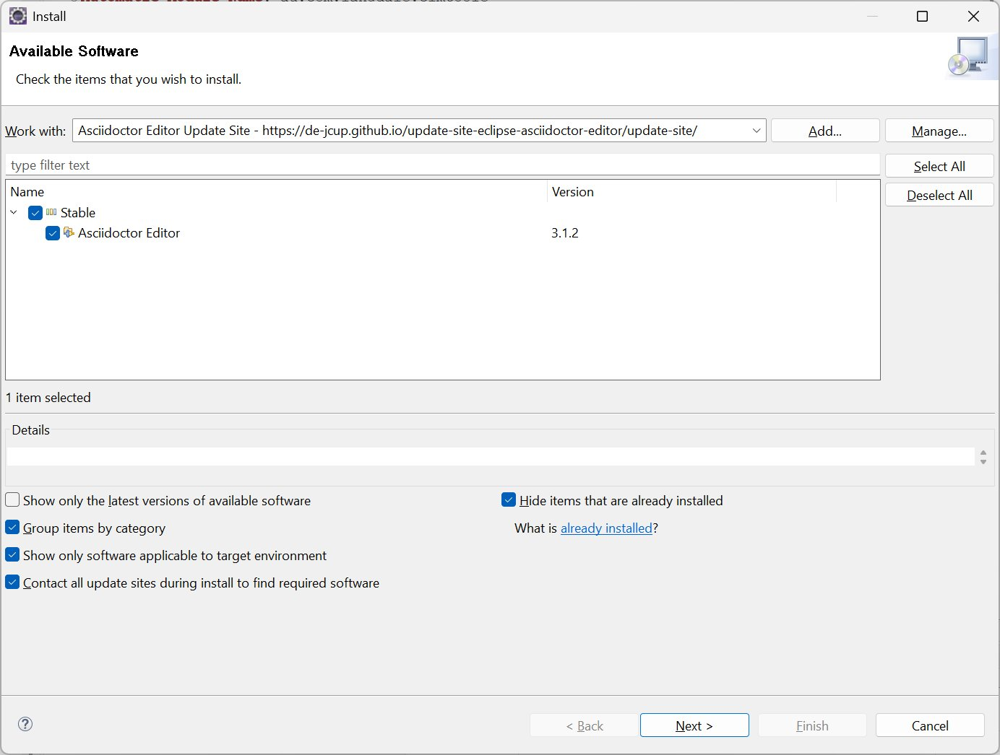

> **Tip:** The first difference from PlantUML: the Asciidoctor Editor site publishes only
> its latest release. Unticking *"Show only the latest versions of available software"*
> reveals no earlier builds, so the version obtained is whatever is current (here
> `3.1.2`). Guaranteeing this exact version on a later install therefore requires
> mirroring it.

The second difference is trust: the Asciidoctor Editor artifacts *are* digitally signed.
The trust dialog asks whether to trust the signer, presenting an x509 certificate for
*"Albert Tregnaghi; de.jcup; Private person"* with a *Valid* status. Select the signer
and click `Trust Selected` to proceed.

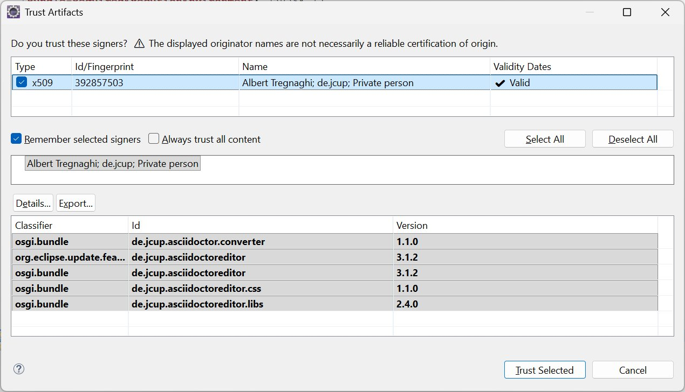

> **Note:** The dialog itself notes that *"The displayed originator names are not
> necessarily a reliable certification of origin."* A valid signature confirms that the
> content was signed by the holder of that certificate, not that an institutional
> authority has vouched for the publisher. Here the content is signed by an individual
> developer's certificate.

Complete the installation by accepting the license and restarting, as described in
[What to Expect During Installation](#what-to-expect-during-installation).

> **Note:** **Verified versions** (installed and confirmed against the pinned Eclipse
> 2023-06 / 4.28 platform):
>
> - *Asciidoctor Editor*: `3.1.2`
> - *PlantUML Eclipse support*: `1.2.0.202511102215`
> - *PlantUML Library*: `1.2025.10.202511041744`
>
> Both update sites publish the most recent release of each plugin, and a later install
> may retrieve a newer version that has not been verified against this platform. The
> PlantUML site retains older versions for selection; the Asciidoctor Editor site does
> not. The Asciidoctor Editor artifacts are signed by an individual developer's
> certificate and the PlantUML artifacts are unsigned; neither is signed by an
> institutional authority. For product builds that must be reproducible across machines
> or air-gapped, these plugins and their exact versions should be mirrored to an internal
> p2 repository and pinned in a committed target platform definition, rather than relying
> on whichever versions happen to be available from the public sites at install time.

## Cloning and Importing the CIMTool Projects

The final step is to clone a development branch of the CIMTool codebase from the
[CIMTool GitHub repository](https://github.com/cimug-org/CIMTool) and import its
projects into the workspace. Two approaches are available, and they differ in how the
projects are brought into Eclipse:

- **External Git client**: such as [GitHub Desktop](https://desktop.github.com/),
  [TortoiseGit](https://tortoisegit.org/), or [Git for Windows](https://gitforwindows.org/)
  (see the [full list](https://git-scm.com/downloads/guis)), used to clone the
  repository to a local directory *outside* Eclipse. The cloned projects are then brought
  in with Eclipse's *Existing Projects into Workspace* import (described below).

- **Eclipse's bundled Git tooling (EGit)**: used to clone *and* import the CIMTool
  projects directly from the repository in a single operation, via `File` > `Import...` >
  `Git` > `Projects from Git`.

### Importing Existing Projects from an External Clone

When the repository has been cloned with an external Git client, the projects are imported
as **existing projects from the file system**, not as Git-managed projects retrieved
through Eclipse. Choose `File` > `Import...` > `General` > `Existing Projects into
Workspace`, set *Select root directory* to the clone location (for example,
`D:\CIMug-GIT-REPOS\release-2.3.0`), and let Eclipse discover the projects it contains.
Leave *Copy projects into workspace* unchecked so the imported projects remain in the
cloned Git working tree, where the external client continues to manage them.

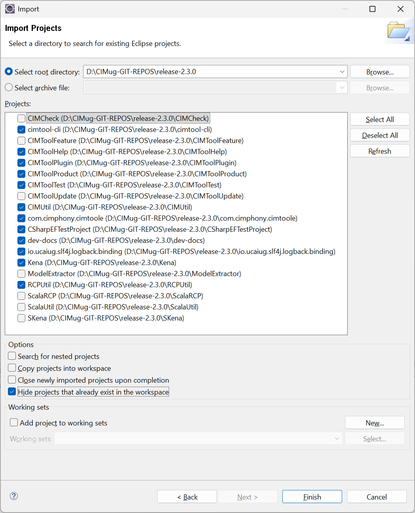

> **Note:** The checked projects in the screenshot are the **core** projects required to
> build and deploy CIMTool. The remaining, unchecked projects may optionally be imported,
> but they are **dormant**, not required to build or deploy the product.
