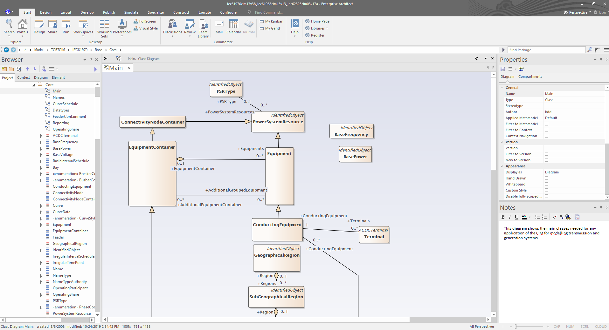
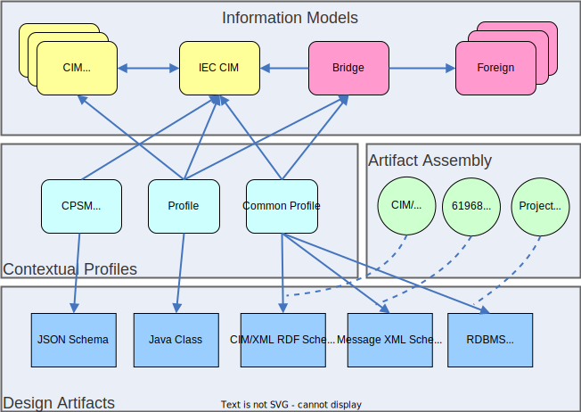

# Core Concepts
Before using **CIMTool** it is helpful to understand some vocabulary so that you can more easily navigate this documentation.

!!! tip

    If you're brand new to the Common Information Model (CIM), a great starting point is [EPRI's CIM Primer](https://www.epri.com/research/products/000000003002006001).

The CIM is an information model copyrighted by the UCAIug (i.e. CIM Users Group) and licensed under the Apache 2.0 open source license.  It is represented in [UML](https://en.wikipedia.org/wiki/Unified_Modeling_Language) and includes modeling spanning electric power generation, transmission, and distribution domains.  It has been officially adopted by the [International Electrotechnical Commission (IEC)](https://www.iec.ch/) and is designed to be used in power system planning, operation, and maintenance software and IT systems that support:

  * [SCADA (Supervisory Control And Data Acquisition)](https://en.wikipedia.org/wiki/SCADA)
  * [EMS (Energy Management Systems)](https://en.wikipedia.org/wiki/Energy_management_system)
  * [Outage Management](https://en.wikipedia.org/wiki/Outage_management_system)
  * [Capacity expansion planning](https://en.wikipedia.org/wiki/Generation_expansion_planning)
  * Distribution automation
  * [Electricity market trading](https://en.wikipedia.org/wiki/Electricity_market)
  * Teleprotection

An essential artifact is the Unified Modeling Language (UML) schema for the CIM. The UML schema is a canonical ontology and defines all the classes, fields, and relationships between classes. 

However, CIM UML by itself does not provide a way for users to create design artifacts such as database schemas, messaging schemas, source code, and reference documentation. This is where **CIMTool** comes in.

The following illustration is a example of artifacts and standards involved when using **CIMTool**. These are grouped into four main categories: 
Information Models, Contextual Profiles, Artifact Assembly, and Design Artifacts.

## Information Models
Information Models are a primary input to **CIMTool**. The previously mentioned CIM UML is an Information Model. The CIM can also be customized
through extensions or combined with other foreign Information Models that are completely separate from the CIM.

See [Import CIM UML](./how-to/import-cim-uml.md) for details on how to obtain a copy of the CIM UML and import it into **CIMTool**.

## Contextual Profiles
A Contextual Profile is a subset of the classes, attributes, and relationships from one or more Information Models. A Contextual Profile is typically 
constructed for a specific use case. For example, a utility may be required to exchange their power system network model with a neighboring utility. 
A Contextual Profile would be created to specify the classes, attributes, and relationships in that exchange. Contextual Profiles are sometimes 
referred to as "contextual models" or just "profiles".

A Contextual Profile is often given a basic name (e.g. "CPSM" or "ERCOT16") by it's creator as well as an assigned namespace to uniquely differentiate
it from other Contextual Profiles. See [Namespaces](#namespaces) for more details on namespaces.

The cardinality of a relationship in a Contextual Profile is either the same or more restrictive than the relationship in the Information Model.

!!! note

    Within **CIMTool**, Contextual Profiles are managed using [Web Ontology Language (OWL)](https://www.w3.org/OWL/) format. These files typically have a `.owl` extension. It is important to note that [Resource Description Framework (RDF)](https://www.w3.org/2001/sw/wiki/RDF) is part of the [Web Ontology Language (OWL)](https://www.w3.org/OWL/) stack so if you inspect a `.owl` file you will see RDF XML.

## Artifact Assembly
Contextual Profiles can then be processed in the context of a set of rules or standards to produce Design Drtifacts.

In order to do this, the Contextual Profile is oten processed by a set of rules that govern the standards for a particular type of design artifact. 
For example, if generating a CIM XML RDF Schema

## Design Artifacts
Design artifacts are the outputs of **CIMTool**. There are many different types that get used depending on the use case but include:

- [XML Schema](https://www.w3.org/XML/Schema) for messaging exchanges
- [RDF Schema](https://www.w3.org/2001/sw/wiki/RDFS) for message exchanges or graph databases
- [JavaScript Object Notation Schem (JSON Schema)](https://json-schema.org/) for REST APIs or web applications
- [SQL Schema](https://en.wikipedia.org/wiki/SQL) for relational database schemas
- [Hypertext Markup Language (HTML)](https://en.wikipedia.org/wiki/HTML) for reference documentation
- Microsoft Word documents for reference documentation

## Namespaces
In the CIM UML, each class name, such as ACLineSegment, is qualified by a namespace, such as `http://iec.ch/TC57/2007/CIM-schema-cim12#`. The combination of the namespace and class name forms a globally unique term. Having a globally unique term to identify a class is helpful for many reasons including version control, ownership, and validation of an instance against a schema. 

!!! note

    By convention, namespaces beginning with `http://iec.ch/TC57/` signifies that IEC [Technical Committee 57](https://www.iec.ch/dyn/www/f?p=103:7:0::::FSP_ORG_ID,FSP_LANG_ID:1273,25) is the issuing authority of whatever class representation follows. In practical applications, CIM standards published by IEC TC57 are often used alongside project and vendor-specific extensions. Each of these may have an independent author. Separate namespaces are used to prevent name conflicts between them.

Namespaces don't carry much information in themselves. A namespace can be any string but it is common and recommended to use an HTTP URI (e.g. `http://authority/...`) because it translates well to conventions followed in generated schemas (e.g. XML Schema) and it identifies the issuing authority. This is the convention IEC TC57 follows. For example, someone can easily find more information on the issuing authoriy by using something like [whois](https://www.whois.com/whois).

The namespace is also useful when generating schemas in other domains. For example, the namespace easily translates to derived XML schemas because an XML schema has a target namespace, declared in its header, that qualifies names defined in the body of the schema.

Namespaces don't garauntee inheritance. For example, `http:/x/y/` is not necessarily a superset of `http://x/y/z/`. You also can't necessarily obtain a document from a namespace via HTTP protocol either. For example, an HTTP GET request to `http://iec.ch/TC57/2007/CIM-schema-cim12#` isn't garuanteed to return anything.

In the end, a namespace is just an identifier with the recommendation that it be an HTTP URI allocated by the [IANA](https://www.iana.org/) and its delegates.

### Version Control and Namespaces
Namespaces prevent name conflicts between authors of classes. They are also used to prevent conflicts between different versions of a class's definition. For example, `http://iec.ch/TC57/2007/CIM-schema-cim12#ACLineSegment` might be a different ACLineSegment representation than `http://vendor/v1/CIM#ACLineSegment` or `http://iec.ch/TC57/2007/CIM-schema-cim12#ACLineSegment` might be succeeded by `http://iec.ch/TC57/2008/CIM-schema-cim13#ACLineSegment` with a slightly different ACLineSegment representation.

The multiple versions of a class might be in use within the same context (e.g. same XML document). The potential conflict of the base name (ACLineSegment in this example) can be detected because the different versions have different namespaces. Resolving a version conflict would be the resposbility of any consuming application or system component.

### Contextual Profile and Namespaces
A Contextual Profile could generally be defined as a subset of an information model defined such that: *An instance that conforms to the Contextual Profile also conforms to the general information model.*

The classes and properties in a Contextual Profile are subsets, or restrictions, of those in the information model.

!!! tip

    For details on namespace support in **CIMTool** for custom extensions see [CIMTool Support for Extension Namespaces](how-to/cimtool-support-for-extension-namespaces.md).

## Choosing a Namespace
What namespace should be used for the terms in a Contextual Profile? There are two general approaches:

**1. Use Separate Namespaces**
In this case, separate names are used for the namespace of the Contextual Profile and the namespace of the general information model.

The rationale for this approach is that Contextual Profile classes and properties are distinct from the general classes and properties they derive from. Therefore they require distinct namespace terms. Separate namespaces allow users to define restrictions for the Contextual Profile without affecting the general information model definitions. This also allows user to specify a specific Contextual Profile to which an instance should conform.

**2. Use the Same Namespaces**
In this case, the namespace of the Contextual Profile is the same as the namespace of the general information model.

The rationale here is that the Contextual Profile definitions are consistent. Consistent means that, when all the definitions are asserted at once, there is a non-empty set of instances that conform with them. That is true for Contextual Profile and general information model definitions. Therefore it makes sense to use the same terms. In this approach, a restricted ACLineSegment class would have the same namespace as the general ACLineSegment class.

One advantage of this approach is that the origin of any term in the profile is immediately obvious. Its namespace indicates the author (IEC, vendor, etc.). There is no need to correlate terms via the Contextual Profile definition. The same term is used everywhere.

One disadvantage of this approach is that while a Contextual Profile will be consistent with the general information model, different Contextual Profiles are not necessarily consistent with each other. The same namespace term will end up denoting a different definition for the class in each Contextual Profile. In other words, the full set of terms are not globally distinct despite the use of namespaces. That breaks one of the architectural precepts namespaces are intended to address.

Additionally, the 'same namespace' approach creates a number of other problems:

  * Since profiles can't be distinguish by namespace, there is no deterministic way to associate instances with them. This becomes a matter for per-project and per-vendor conventions.
  * There is no obvious way to version profiles separately from the general information model since the current convention is to indicate general information model versions via the namespace. This becomes a problem beacuse Contextual Profiles tend to undergo more than one formal release in the lifetime of a system. However, the CIM version is typically updated a an entirely different cadence.
  * It is unworkable with XML schemas. Normal practice is to give each XML schema its own target namespace. To do otherwise often confuses XML tooling, making it impossible to write something like a [Web Services Description Language (WSDL)](https://en.wikipedia.org/wiki/Web_Services_Description_Language) involving more than one Contextual Profile schema.
