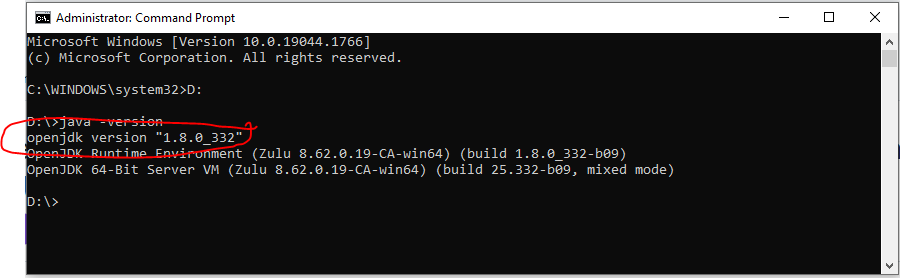
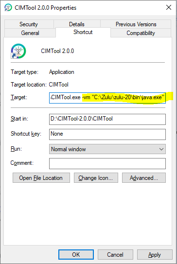
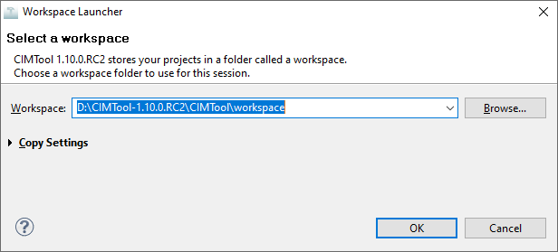
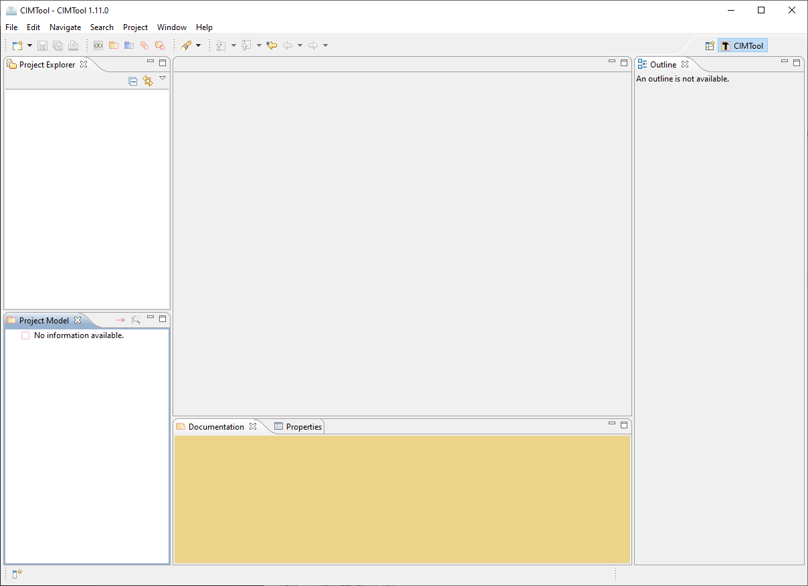

# Getting Started
**CIMTool** is an [Eclipse](https://www.eclipse.org/) plugin written in Java so you can run **CIMTool** on Windows, Linux or Mac OS. However, *only the Windows binary is built and published by maintainers*, for other platforms you must compile from Java source. You'll need at least 2GB of free disk space (more if you will be working with large Contextual Profiles).

## Step 1 - Download CIMTool
Download the latest binary release of **CIMTool** [here](https://github.com/cimug-org/CIMTool/releases) and extract. The **CIMTool** binary release is delivered as a ZIP archive (e.g. `CIMTool-x.x.x-win32.win32.x86_64.zip`) and once downloaded should be extracted to a folder on your machine. 

!!! example

    Extracting to `D:\CIMTool-2.0.0` folder on a Windows system would result in a new  `D:\CIMTool-2.0.0\CIMTool` folder containing **CIMTool** and it dependencies.  The launchable executable would be located at `D:\CIMTool-2.0.0\CIMTool\CIMTool.exe`

## Step 2 - Install Java
In order to successfully run **CIMTool**, a 64-bit Java 20 or later JRE/JDK is required. If you do not already have a newer version of Java (>= Java 20) installed on your system it should be downloaded and installed before moving on to the next step. [Azul](https://www.azul.com) has a great freely available Windows 64-bit option available at the [Azul Zulu OpenJDK Downloads](https://www.azul.com/downloads/?package=jdk#zulu) site. Installation is straightforward if using the ```.msi``` installer and installation instructions are available on Azul's site of needed.

Once installed on your system you can execute `java -version` from a command prompt to determine what the default JRE/JDK is on your system:

!!! example

    

    In this example, we see from the results that on this system the default JRE/JDK is a version of Java 20 (i.e. build 20.0.2+9). There may be other versions of Java installed on the system but we know from the output that it will be the Java 20 installation that will be used to execute **CIMTool** by default if we double click the installed executable located at `D:\CIMTool-2.0.0\CIMTool\CIMTool.exe` in our example.

### Setting up Alternate JVM
If the command line results indicate a different default Java version, then either a Windows shortcut or .bat script can be created so that an alternate (non-default) JVM can be used for launching **CIMTool**. These options can be configured in the following manner.

#### Option 1 - Windows Shortcut
Locate the directory containing the Java 20 JRE/JDK release you installed on your system (a 64-bit installation of Zulu for example will typically be located in either `C:\Program Files\Zulu\zulu-20-jre\bin\java.exe` or `C:\Program Files\Zulu\zulu-20\bin\java.exe` depending on whether you've downloaded a JRE or JDK release).

In Windows right-click on the **CIMTool.exe** and select the menu option for creating a shortcut. Right-click on the new shortcut and select the Properties menu option. In the dialog that comes up explicitly specify as a command line parameter a 64-bit JVM to use at launch time.  This change must be specified in the "Target:" field.  In this working example, the resulting entry in that field would be:  `D:\CIMTool-2.0.0\CIMTool.exe -vm "C:\Program Files\Zulu\zulu-20\bin\java.exe"`



#### Option 2 - Batch Script
An alternative approach is to create a `CIMTool.bat` script containing command line execution similar to that shown below but which correlates to the installation locations native to your own local file system:

```bat
rem Launch CIMTool using a 64-bit Java 20 JRE
C:\CIMTool-2.0.0\CIMTool\CIMTool.exe -vm "C:\Program Files\Zulu\zulu-20\bin\java.exe"
```

## Step 3 - Launch CIMTool
Upon a successful launch of **CIMTool** the following dialog is presented. A default workspace (as shown by the example in the screenshot) will be used or you can enter your own location and name for a workspace to be created.



Select the **OK** button, and the workbench view will appear



!!! tip

    It recommended to not add, modify or delete anything inside a workspace directory manually or with tools other than **CIMTool** to prevent corrupting your project. However, if you ever see a message indicating 'resource out of sync', you can usually correct it by using File -> Refresh or pressing F5.