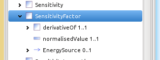
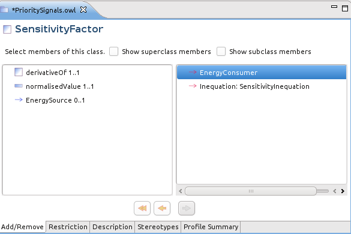

# Associations and Anonymous Classes
This section explains how to profile associations including how to define anonymous classes for the object of an association. Let's begin.

## Adding the Association
Select the class in the profile outline.

The Add/Remove page shows the available attributes and associations. Select an association (e.g. EnergyConsumer) in the right hand panel.

Click the left arrow  to move it left thus adding it to the profile.

## Restrict the Association
Double click the newly added EnergyConsumer association (or just select in in the outline) and switch to the Restriction page.

Now:

  * Click the By Reference checkbox if the object of the association will be external to the instance message or document and thus outside the scope of the profile.
  * Set the Min and Max cardinalities either with explicit numbers or using the checkboxes.
  * Choose a class as the object of the association from among the compatible classes already defined in this profile. In this example, ConformLoad (a concrete class) and its base class EnergyConsumer are available.

But, what if the desired class is not yet defined in the profile?

## Adding a New Class for the Association
Switch to the Add/Remove page and all of the compatible classes for the EnergyConsumer association in the CIM are shown in the right pane. For this example we highlighted NonConformLoad which was one of the classes not yet in the profile.

Clicking the left arrow now does two things: it adds NonConformLoad to the profile (if it does not immediately appear in the outline then click save).

Also, the newly added class becomes the object of the EnergyConsumer association, which can be seen on the Restriction page.

