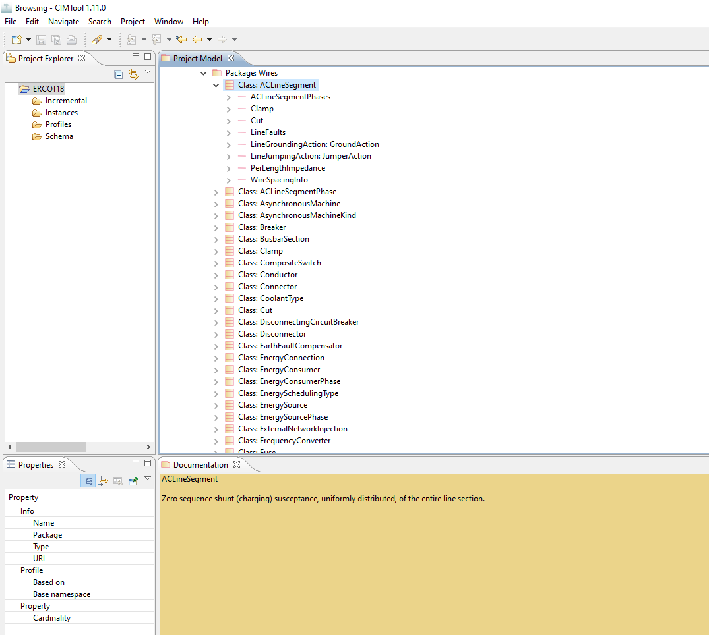

# Browsing the CIM UML
**CIMTool** provides a special window layout for browsing the CIM UML. This is sometimes more convenient than a standard UML editor such as Enerprise Architect, especially if the UML diagrams are not complete.

In particular, **CIMTool** provides efficient ways to search the CIM UML and to follow class associations through the CIM.

If this is the first time you have used **CIMTool** you will need to create a project or load an existing project. See [Create a Project](create-a-project.md) for details on how to do this.

With a project loaded, open the browsing window. From the main menu choose: Window > Open Perspective > CIMTool > Browsing

The browsing window will look like this:

The **Project Explorer** (top left) shows the available projects and their contents. For CIM UML browsing it is only necessary to select the project (as each project has one copy of the CIM UML). The first time a project is selected its copy of the CIM UML is analysed in the background. This takes a couple of seconds.

The **Project Model** (top right) displays the CIM UML package structure. Packages, classes and their members can be explored by expanding this tree view.

For an explanation of **CIMTool**'s interpretation of the CIM UML and the icons used in this view see [UML, UMI, OWL](../further-learning/uml-xmi-owl.md) for further details.

Selecting an item causes its details to be displayed in the Property View (bottom left) and the Documentation View (bottom right).

The Jump and Search buttons provide addition navigation options. They are located above the project model view: