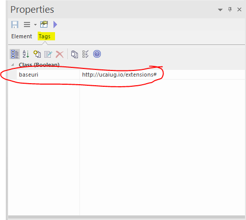

# CIMTool Support for Extension Namespaces

**CIMTool** can support multiple extension namespaces in the information model and either of the profile namespace approaches discussed here: [Profiles and Namespaces](../namespaces-in-cimtool/#profiles-and-namespaces)

## Information Model Namespaces

The information model is normally supplied to **CIMTool** as an UML/XMI file. Namespaces, in a general sense, are represented by packages and classes. To obtain URI namespaces something must be added.

### Default Namespace

A default namespace is assigned to each XMI file at the time it is imported to **CIMTool**. This is specified via a field in the import wizard. The default namespace for each XMI file can be subsequently changed in the file properties dialog.

The default namespace is used as follows:

- OWL resources representing UML packages are always named in the the default namespace. 

- OWL classes and properties representing UML classes, attributes and associations are named in the default namespace if no other namespace is specified. 

### UML Tag: baseuri

**CIMTool** recognises a UML Tag with name ```baseuri``` which is expected to have a namespace URI as its value. The ```baseuri``` tag can be attached to any **package**, **class**, **association** or **attribute** using the UML editor.  

- When attached to a class, association or attribute, ```baseuri``` specifies the namespace of the resulting OWL class or properties. 

- When attached to a package, ```baseuri``` specifies the namespace of all OWL classes and properties resulting from that package or its sub-packages recursively except where a sub-package, class, association or attribute has a ```baseuri``` tag. 

Generally, it is sufficient to tag the top level packages in a UML model to obtain the correct namespaces throughout.

An example of a Tag on a Class:



### Annotation File

**CIMTool** can obtain namespace information from a file accompanying the XMI file, called an annotation file. There is no editor or other GUI for managing namespace information in the annotation file. It is a stopgap intended for situations where the user does not control the XMI file and that file lacks ```baseuri``` tags.

The annotation file should be placed in the project's Schema folder where the XMI file is located. It must have the same base name as the XMI file and extension .annotation instead of .xmi.

The file can be edited with the eclipse text editor. (If an external text editor is used, the workspace must be manually refreshed afterwards.) 

An example file that can be used as a template can be found here: 

[example.annotation.txt](example.annotation.txt)

The file contains ```baseuri``` statements in the RDF TURTLE language. For example, the line:

```
 package:Extensions     uml:baseuri "http://www.ucaiug.org/CIM100/2024/extension#" 
 ```	

Has the same effect as attaching a ```baseuri``` tag to the Extensions package with the given URI as its value.


!!! note

    The ```baseuri``` statements are merged with any ```baseuri``` tags in the xmi file.

    The effect of assigning two different ```baseuri``` values to the same package is undefined.

    Only packages can be given ```baseuri``` values via the annotation file.


## Profile Namespaces

Each profile is assigned a namespace at the time the profile is created. There is a namespace field provided in the profile import wizard. The namespace can also be edited in the profile properties dialog. (This is obtained by right clicking on the profile definition in the project explorer.)

The profile namespace policy determines how this value will be used. The policy is set on the **CIMTool** preferences page by the Preserve schema namespaces in profiles checkbox. (This is obtained from the main menu by selecting Window > Preferences... > CIMTool.)

### Same Namespace Policy

This policy is obtained when Preserve schema namespaces in profiles is selected. It is the default.

- Each class and property defined in simple-owl and legacy-rdfs output will have the same namespace as the schema (ie information model) class or property it derives from. 

- If these are the only outputs of interest then the profile namespace is not exposed and a default value can be accepted when the profile is created. 

### Separate Namespace Policy

This policy is obtained when Preserve schema namespaces in profiles is not selected.

- Each class and property defined in simple-owl and legacy-rdfs output will have the profile namespace. 

- A meaningful value should be assigned when the profile is created. 

### Common Behaviour

The following behaviour is independent of the namespace policy:

- XML Schema output will use the profile namespace as the target namespace. A meaningfull profile namespace should be selected if the aim is to generate XSD's. 

- The profile namespace is also used for the abstract profile (or contextual model). This file (with extension .owl) is not normally an output but, internally, **CIMTool** relies on the profile namespace to keep the abstract profile separate from the information model. It is important to assign a profile namespace that is not used in the information model. 
