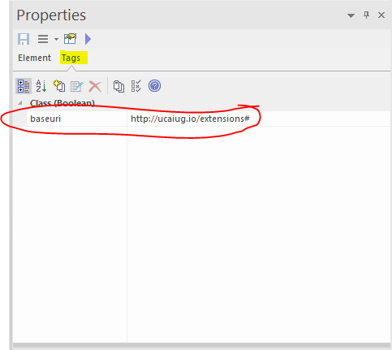
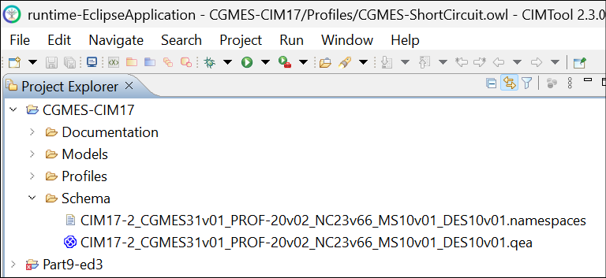

# CIMTool Support for Extension Namespaces

**CIMTool** supports multiple extension namespaces in the information model and in either of the profile namespace approaches described here: [Profiles and Namespaces](namespaces-in-cimtool.md#profiles-and-namespaces)

## Information Model Namespaces

The information model can be supplied to **CIMTool** either as an XMI file (`.xmi` or `.owl`) or directly as a Sparx EA project file (`.eap`, `.eapx`, `.qea`, or `.qeax`). The schema format chosen for import determines which mechanisms are available for defining extension namespaces in your project. What follows outlines those options based on which schema format is in use.

### Default Namespace (Common to Both Formats)

A default namespace is assigned to each schema file at the time it is imported to **CIMTool**. This is specified via a field in the import wizard. The default namespace for each schema file can be subsequently changed in the file properties dialog.

The default namespace is used as follows:

- OWL classes and properties representing UML classes, attributes and associations are named in the default namespace if no other namespace is specified.

## Option 1: Using an XMI Schema

When your project uses an XMI file (`.xmi` or `.owl`) as its schema, the `baseuri` tagged value is the mechanism for assigning URI namespaces to extension elements.

### UML Tag: `baseuri`

**CIMTool** recognises a UML tag with name `baseuri` which is expected to have a namespace URI as its value. The `baseuri` tag can be attached to any **package**, **class**, **association** or **attribute** using the UML editor.

- When attached to a class, association or attribute, `baseuri` specifies the namespace of the resulting OWL class or properties.
- When attached to a package, `baseuri` specifies the namespace of all OWL classes and properties resulting from that package or its sub-packages recursively, except where a sub-package, class, association or attribute has its own `baseuri` tag.

Generally, it is sufficient to tag the top-level packages in a UML model to obtain the correct namespaces throughout.

An example of a `baseuri` tag on a class in Sparx EA:



#### Annotation File

In the edge case where you are working with an XMI file provided by an external party that lacks `baseuri` tagged values, **CIMTool** provides a stopgap mechanism via an annotation file. There is no editor or other GUI for managing namespace information in the annotation file — it is intended solely for situations where you do not control the XMI file and cannot add `baseuri` tags to it directly.

The annotation file should be placed in the project's `Schema` folder where the XMI file is located. It must have the same base name as the XMI file with a `.annotation` extension instead of `.xmi`.

The file can be edited with the Eclipse text editor. If an external text editor is used, the workspace must be manually refreshed afterwards.

An example file that can be used as a template can be found here:

[example.annotation.txt](example.annotation.txt)

The file contains `baseuri` statements in the RDF TURTLE language. For example, the line:

```
package:Extensions     uml:baseuri "http://www.ucaiug.org/CIM100/2024/extension#"
```

Has the same effect as attaching a `baseuri` tag to the Extensions package with the given URI as its value.

!!! note

    The `baseuri` statements are merged with any `baseuri` tags in the XMI file.

    The effect of assigning two different `baseuri` values to the same package is undefined.

    Only packages can be given `baseuri` values via the annotation file.

## Option 2: Using a Sparx EA Project File Schema

When your project uses a Sparx EA project file (`.eap`, `.eapx`, `.qea`, or `.qeax`) directly as its schema, two approaches are available for assigning URI namespaces to extension elements. These two approaches are **mutually exclusive** — **CIMTool** determines which is in effect based solely on whether a `.namespaces` file is present in the project's `Schema` folder.

### Approach 1: UML Tag: `baseuri`

**CIMTool** recognises a UML tag with name `baseuri` which is expected to have a namespace URI as its value. The `baseuri` tag can be attached to any **package**, **class**, **association** or **attribute** using the UML editor.

- When attached to a class, association or attribute, `baseuri` specifies the namespace of the resulting OWL class or properties.
- When attached to a package, `baseuri` specifies the namespace of all OWL classes and properties resulting from that package or its sub-packages recursively, except where a sub-package, class, association or attribute has its own `baseuri` tag.

Generally, it is sufficient to tag the top-level packages in a UML model to obtain the correct namespaces throughout.

An example of a `baseuri` tag on a class in Sparx EA:


!!! note

    The `baseuri` approach is superseded if a `.namespaces` stereotype-to-namespace mappings file is present in the project's `Schema` folder. See [Approach 2](#approach-2-stereotype-to-namespace-mappings-file) below.

### Approach 2: Stereotype-to-Namespace Mappings File

**CIMTool** 2.3.0 introduces support for a stereotype-to-namespace mappings file as an alternative to `baseuri` tagged values for EA project file schemas. This approach brings **CIMTool** into alignment with the stereotype-based namespace assignment supported in **CimConteXtor/CimSyntaxGen**.

By convention, the mappings file must be named identically to the EA project file used as the project's schema but with a `.namespaces` file extension, and must be co-located with the EA project file on the file system. For example:

```
C:\
├── CDPSM-CIM17
│   ├── .settings
│   ├── Documentation
│   ├── Incremental
│   ├── Instances
│   ├── Profiles
│   └── Schema
│       ├── CDPSM-68968-13-ed2.qea
│       └── CDPSM-68968-13-ed2.namespaces   ← automatically imported alongside the .qea file
├── .cimtool-settings
├── .project
└── ...
```

The screenshot below shows an example of both files as they appear in the **CIMTool** Project Explorer — the `.namespaces` file alongside its corresponding `.qea` EA project file (identified by the Sparx EA icon):



!!! warning "Naming convention and file location are required for correct import"

    The `.namespaces` file must be manually created — it is not created or managed by **CIMTool**. It must be named exactly the same as the EA project file it defines mappings for (with a `.namespaces` extension in place of `.qea`, `.eap`, etc.) and co-located with that EA project file on the file system prior to import. When **CIMTool** imports a schema — whether importing a new schema or re-importing an existing one — it automatically detects any co-located `.namespaces` file and imports it into the project's `Schema` folder alongside the EA project file.

    When present in the project's `Schema` folder, all `baseuri` tagged values defined in the UML are ignored and the stereotype-to-namespace mappings in the file take effect instead. Deleting the `.namespaces` file from the `Schema` folder causes **CIMTool** to revert to honoring `baseuri` tagged values in the UML when present.

#### Namespace Resolution Precedence

When a `.namespaces` file is in effect, **CIMTool** resolves the namespace for each UML element according to the following precedence rules.

**For attributes:**

1. A stereotype specified directly on the attribute takes precedence over all others at any level.
2. If the attribute has no stereotype, **CIMTool** honors any stereotype defined on the class containing the attribute.
3. If the class has no stereotype, **CIMTool** checks for a stereotype on the package containing the class.
4. If no stereotype is found on the containing package, **CIMTool** walks up the package hierarchy until it finds one. If none is found, the attribute is assigned the namespace of the CIM schema used by the project (e.g. `http://iec.ch/TC57/CIM100#`).

**For classes:**

1. A stereotype specified directly on the class takes precedence over all others at any level.
2. If the class has no stereotype, **CIMTool** honors any stereotype defined on the package containing the class.
3. If no stereotype is found on the containing package, **CIMTool** walks up the package hierarchy until it finds one. If none is found, the class is assigned the namespace of the CIM schema used by the project (e.g. `http://iec.ch/TC57/CIM100#`).

**For associations:**

1. A stereotype specified directly on the association takes precedence over all others at any level.
2. If the association has no stereotype, **CIMTool** uses the resolved namespaces of the two connected classes (as determined by the class rules above) to infer the association's namespace:
    - If one class is a normative CIM class and the other is a stereotyped extension class, the extension namespace takes precedence for the association.
    - If both classes are extension classes each in a distinct namespace, the association is considered unresolvable without an explicit stereotype. Because extensions to the CIM are always framed as relative to the CIM, the recommended approach is to declare an explicit stereotype on the association reflecting its intended namespace.

!!! tip "Best practice: model extension associations between two `<<ShadowExtension>>` classes"

    When using the `<<ShadowExtension>>` or `<<MixIn>>` extension patterns, it is safest practice to always model extension associations between **two** `<<ShadowExtension>>` classes rather than between a `<<ShadowExtension>>` class and a normative CIM class directly.

    Modeling an association from a `<<ShadowExtension>>` class to a normative CIM class is technically valid — **CIMTool** will process and namespace it correctly — however, the direction of the association determines which package owns it. An association drawn *from* an extension class *to* a normative class is implicitly owned by the extension package and exports correctly. If that direction is inadvertently reversed, ownership shifts to the normative side and the association will be silently dropped when exporting the extensions package.

    When both endpoints are `<<ShadowExtension>>` classes, the association is unambiguously owned by the extensions package regardless of the direction in which it was drawn, completely eliminating the risk of silent loss on export. This is especially important in model upgrade and migration scenarios, where a dropped association may not be discovered until after the migration to a new CIM version is complete.

    The [CIM Modeling Guide Section 6.1.2](https://cim-mg.ucaiug.io/latest/section6-cim-uml-extension-rules-and-recommendations/#custom-cim-extensions) addresses this directly:

    > *"Note that the introduction of an association from a new extension class to an existing standard CIM class requires nothing special, just make the association as it is implicitly owned by the depending extension class's package. It is more clear to put both ends of the association into the extension package as the namespace for both association ends will follow CIM package containment rules which rely upon package dependency."*

    > *"If both classes are already extension classes, the association should be added between the two extension classes for better modularity."*

    This guidance is further reflected in **Rule204** of the CIM Modeling Guide ([Section 6.6](https://cim-mg.ucaiug.io/latest/section6-cim-uml-extension-rules-and-recommendations/#association-extension-rules)): *"Associations between CIM extension classes and high-level standard CIM classes should be minimized."*

#### Case Sensitivity

!!! note

    **Stereotype names** in the mappings file are case-insensitive. The entries `NC`, `nc`, and `Nc` are all treated as equivalent — you may use whichever form matches how the stereotype appears in your UML model.

    **Namespace URIs** are case-sensitive. Verify that each URI in the mappings file exactly matches the case used in your UML model. For example, `http://iec.ch/TC57/CIM100#` and `http://iec.ch/TC57/cim100#` are treated as distinct namespaces.

#### Example Mappings File

An example file with inline documentation and a comprehensive set of mappings can be used as a template:

[example.namespaces](example.namespaces)

The `.namespaces` file uses a simple `<stereotype>=<namespace URI>` format with one mapping per line:

```
adms=http://www.w3.org/ns/adms#
European=http://iec.ch/TC57/CIM100-European#
euvoc=http://publications.europa.eu/ontology/euvoc#
dc=http://purl.org/dc/elements/1.1/#
dcat=http://www.w3.org/ns/dcat#
dct=http://purl.org/dc/terms/#
dcterms=http://purl.org/dc/terms/#
dm=http://iec.ch/TC57/61970-552/DifferenceModel/1#
eumd=http://entsoe.eu/ns/Metadata-European#
GB=http://GB/placeholder/ext#
md=http://iec.ch/TC57/61970-552/ModelDescription/1#
NC=http://entsoe.eu/ns/nc#
owl=http://www.w3.org/2002/07/owl#
prof=http://www.w3.org/ns/dx/prof/#
profcim=http://iec.ch/TC57/ns/CIM/prof-cim#
prov=http://www.w3.org/ns/prov#
rdf=http://www.w3.org/1999/02/22-rdf-syntax-ns#
rdfs=http://www.w3.org/2000/01/rdf-schema#
skos=http://www.w3.org/2004/02/skos/core#
sh=http://www.w3.org/ns/shacl#
xsd=http://www.w3.org/2001/XMLSchema#
```

## Profile Namespaces

Each profile is assigned a namespace at the time the profile is created. There is a namespace field provided in the profile import wizard. The namespace can also be edited in the profile properties dialog. (This is obtained by right clicking on the profile definition in the project explorer.)

The profile namespace policy determines how this value will be used. The policy is set on the **CIMTool** preferences page by the Preserve schema namespaces in profiles checkbox. (This is obtained from the main menu by selecting Window > Preferences... > CIMTool.)

### Same Namespace Policy

This policy is obtained when Preserve schema namespaces in profiles is selected. It is the default.

- Each class and property defined in simple-owl and legacy-rdfs output will have the same namespace as the schema (i.e. information model) class or property it derives from.
- If these are the only outputs of interest then the profile namespace is not exposed and a default value can be accepted when the profile is created.

### Separate Namespace Policy

This policy is obtained when Preserve schema namespaces in profiles is not selected.

- Each class and property defined in simple-owl and legacy-rdfs output will have the profile namespace.
- A meaningful value should be assigned when the profile is created.

### Common Behaviour

The following behaviour is independent of the namespace policy:

- XML Schema output will use the profile namespace as the target namespace. A meaningful profile namespace should be selected if the aim is to generate XSDs.
- The profile namespace is also used for the abstract profile (or contextual model). This file (with extension `.owl`) is not normally an output but, internally, **CIMTool** relies on the profile namespace to keep the abstract profile separate from the information model. It is important to assign a profile namespace that is not used in the information model.
