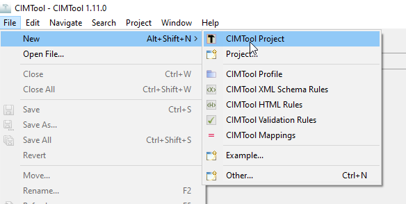

# Create a Project
To create a new project. Select File -> New -> CIMTool Project.

In the dialog box that appears, give it a name (e.g. 'ERCOT18') then click 'Finish'. This will create a new folder in your workspace directory.

