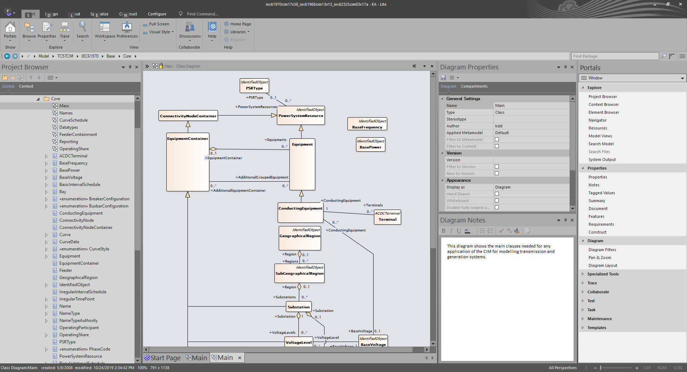
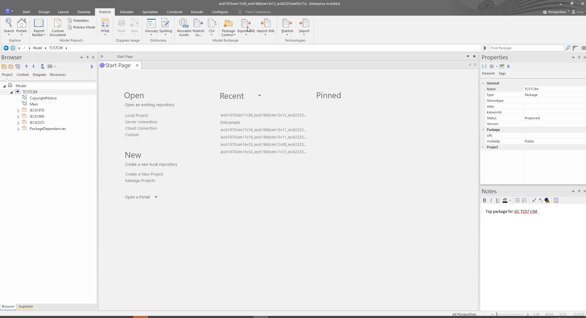
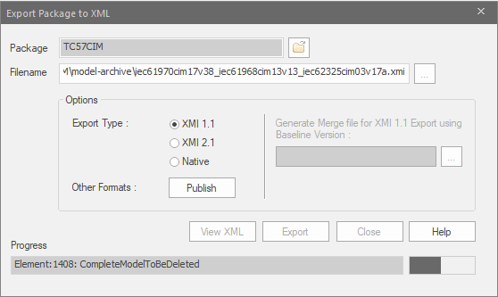
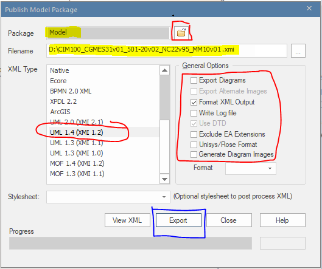
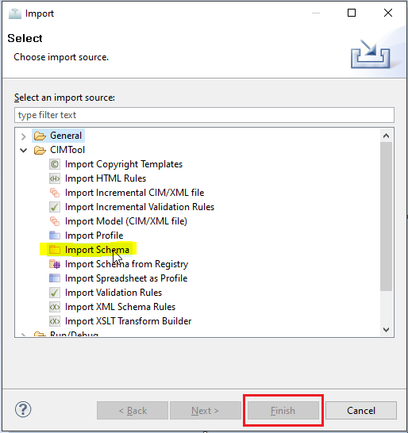
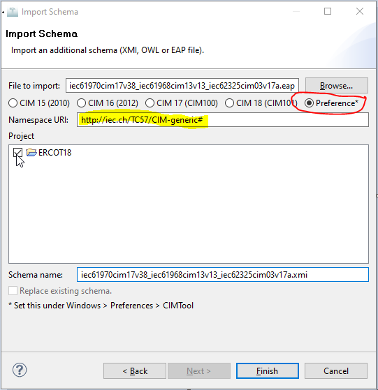

# Using CIMTool with Enterprise Architect: Importing a CIM Schema

The CIM UML model is maintained within Sparx Systems UML design tool, [Enterprise Architect (EA)](https://sparxsystems.com/) as shown. 

Before building a Contextual Profile in **CIMTool** you must first import a version of the CIM UML.  This step is typically done when creating a new **CIMTool** project. However, you can import additional custom UML schemas (i.e. additional schemas containing extensions to the CIM) and co-locate them alongside the base CIM UML schema in your project. **CIMTool** automatically processes such custom schemas by internally creating a union of them with the base CIM schema. Alternatively, an existing CIM UML schema can be replaced outright in a **CIMTool** project when a new version of the CIM is released.

The CIM can be imported in one of two possible formats as described later on this page, but first a description of where to locate the CIM UML is necessary.

## Obtain the CIM UML

UCAIug Task Force 13 (UTF 13), UCAIug Task Force 14 (UTF 14), and UCAIug Task Force 16 (UTF 16) are groups that work to advance the CIM and who publish periodic releases of the CIM UML. These releases are published to the [UCAIug (CIM Users Group)](https://cimug.ucaiug.org/) website in [Enterprise Architect](https://sparxsystems.com/) project file (`.eap` or `.eapx`) format.

Both past and current releases of these CIM EA project files are made publicly available for download from the UCAIug. Current releases can be found at [Current CIM Model Drafts](https://cimug.ucaiug.org/CIM%20Model%20Releases/Forms/AllItems.aspx) and this page should look similar to the next screenshot. Older releases are available at [Past CIM Model Releases](https://cimug.ucaiug.org/CIM%20Releases/Forms/AllItems.aspx).

!!! note

    Some content on the UCAIug site may be restricted to registered users. To access previous versions of the CIM UML you must be a CIM Users Group member. Use the CIM Users Group [join form](https://cimug.ucaiug.org/pages/Join.aspx) to register and create an account. Note that there are both paid and free levels of membership.

## Using an `.xmi` schema file in CIMTool

Enterprise Architect has an "Export" feature to export to the `.xmi` format. To use this, open the desired CIM UML version of the `.eap` or `.eapx` file (e.g. `iec61970cim17v38_iec61968cim13v13_iec62325cim03v17a.eap`) in Enterprise Architect. 

!!! note

    To export to `.xmi` the full (paid) version of Enterprise Architect is required. The Enterprise Architect Lite (free) version does not support this capability.

In the top ribbon, select the Publish tab, then click Export-XML

You'll be presented with the next dialog.  Click the "Other Formats:" **Publish** button. 

When the "Publish Model Package" dialog appears use the following export options highlighted in the screenshot below:

1. The "Package" field is used to specify which package in the model hierarchy you wish to be exported. Specifying the root "Model" package as shown in the screenshot is most common.  However, if for exmaple your profiling work is focused exclusively on classes located hierarchically within the Grid (i.e. formerly IEC61970) package then selecting that as your Package will limit the scope of the packages to be exported and reduce the size of the `.xmi` file.
2. Under "General Options" be sure that only the "Format XML Output" check box is selected. 
3. For the "XML Type" selection, choose the "UML 1.4 (XMI 1.2)" option.
4. In the "Filename" field, select or enter the filename you want (save to location and name) for the XMI file you are exporting. Using a name that matches the the name of your `.eap` file is recommended as it helps identifying the version of the model the XMI export was for (e.g. `iec61970cim17v40_iec61968cim13v13_iec62325cim03v17a.xmi`)

Finally, click the Export button.

!!! note

    A couple of noteworthy items.
    
    You may opt to check the "Export Diagrams" option if so desired. This will include in your exported `.xmi` the diagrams in the CIM. Doing so will increase the size of your `.xmi` file and will add no value for the purposes of **CIMTool**. It can be useful later if you do not have the original `.eap` project file used to create your profiles. In such a scenario the `.xmi` can be re-imported into Enterprise Architect and the UML class diagrams retained in the model.
    
    In the early years, CIM was maintained using IBM's [Rational Rose](https://en.wikipedia.org/wiki/IBM_Rational_Rose_XDE) UML modeling tools. In the late 2000s the CIM was migrated to Enterprise Architect and during that time XMI exchanges between the two products was necessary; however, this is no longer the case. Per EA's Model Exchange User Guide: "With XMI, model details can be exchanged between different UML tools and other tools that are capable of using XMI. Limited support for export to Rational Rose is provided using the Rose version of the XMI 1.1 specification, as implemented by Unisys for Rational products." 
    
    If you encounter older **CIMTool** documentation indicating the need to check the "Unisys/Rose Format" checkbox it should be ignored. The reason for this is based on the fact that, as highlighted in EA's documentation, the checkbox is only related to the XMI 1.1 specification. Since the the latest recommended `.xmi` export settings for **CIMTool** are based on "UML 1.4 (XMI 1.2)", this option is no longer irrelevant.

## Using an EA Project file in CIMTool

Exporting XMI can be slow. An alternative is to directly import an Enterprise Architect project file (`.eap` or `.eapx`) into **CIMTool**. This eliminates the need to export anything from EA before importing to CIMTool.  

!!! tip

    As of the EA 16.x release, `.eap` and `.eapx` files are no longer supported. **CIMTool** does not yet support the new EA 16.x project file format and instead the XMI schema option should be utilized if using the new release. For further information refer to EA's [EAP/EAPX File to QEA File Format](https://sparxsystems.com/enterprise_architect_user_guide/16.0/model_exchange/transfereap.html) page for a better understanding of changes in 16.x.

### File Format Considerations

The following table highlights the various tradeoffs of utilizing one format over another:

Format | Description | Pros | Cons
----- | -----| -----| -----
`.eap` / `.eapx`| Native EA project files. Standard in EA 15.x releases and earlier the internal format is based on MS Access. Specifically, `.eap` files are based on the Jet3.5 engine and `.eapx` on Jet4.0 (see [Access Database Engine History](https://en.wikipedia.org/wiki/Access_Database_Engine)) with both stored as binaries.   The Jet database engine is available only in 32 bit configurations. Which means that the `.eap` and `.eapx` file formats are still supported in the 32 bit version of EA 16.x, but not in the new 64 bit version of Enterprise Architect 16.0. To keep using the data in an `.eap` or `.eapx` file in a 64 bit release of EA 16.x you must transfer the contents of the file to another project that the 64 bit version can access. This project can be a file (such as a `.qea` or Firebird file) or a database repository (such as a SQL Server or MySQL database). Refer to the Sparx article [Migrate an EAP/EAPX File to QEA File Format](https://sparxsystems.com/enterprise_architect_user_guide/16.0/model_exchange/transfereap.html) for how to peform this. | Both file formats can be imported directly into **CIMTool** without the overhead of having to export as an `.xmi` file.   Multi-language support via unicode is available with an `.eapx` file. | If hosting a CIMTool project on Github it is not recommended that an EA project file be used (see: [About large files on GitHub](https://docs.github.com/en/repositories/working-with-files/managing-large-files/about-large-files-on-github) and [Git LFS](https://docs.github.com/en/repositories/working-with-files/managing-large-files/configuring-git-large-file-storage)). Instead the `.xmi` file format is recommended.   The `.eap` file format does not support [unicode](https://unicode.org/standard/WhatIsUnicode.html) and therefore is not ideal for profiles derived from CIM classes or attributes with descriptions and/or notes containing non-ASCII characters. NOTE: To convert an `.eap` file to an `.eapx` format see [Use Languages Other Than English](https://sparxsystems.com/enterprise_architect_user_guide/15.0/team_support/check_in_languages_other_than_.html) which has the link to the [EABase JET4](https://sparxsystems.com/bin/EABase_JET4.zip) file that can be used for this purpose. Visit the [Project Data Transfers](https://sparxsystems.com/enterprise_architect_user_guide/15.0/model_publishing/performadatatransfer.html) page for further information on this process. If choosing to migrate to Jet4 then EA must also be configured to use Jet4. Refer to the [General Options](https://sparxsystems.com/enterprise_architect_user_guide/15.0/user_interface/generalsettings.html) page for details.
`.qea` / `.qeax` | Native EA project files. Introduced in EA 16.x the internal format of these files is based on the [SQLLite](https://www.sqlite.org/) open source database and is stored as binaries. Both file types support basic replication with the `.qeax` extension indicating that file sharing is enabled. A `.qeax` file can simply be renamed back to `.qea` to disable file sharing. | _These formats are not yet supported in **CIMTool**._    These native project file formats will be able to be imported directly into **CIMTool** without the overhead of having to export an `.xmi` file.| | If hosting a CIMTool project on Github the use of one of these project files is not recommended (see: [About large files on GitHub](https://docs.github.com/en/repositories/working-with-files/managing-large-files/about-large-files-on-github) and [Git LFS](https://docs.github.com/en/repositories/working-with-files/managing-large-files/configuring-git-large-file-storage)). Instead an `.xmi` file should be utilized.
`.xmi` | The XMI (XML Metadata Interchange) format is an Object Management Group (OMG) standard for exchanging metadata information via Extensible Markup Language (XML). | Exporting the CIM as an `.xmi` schema file has added flexibility not available when using a native EA project file.  Specifically, a subset of the CIM can be exported by simply selecting a specific package for export. This approach can be used to reduce the size of the schema file in a **CIMTool** project. Given that profiles are commonly defined for a particular domain (e.g. Transmission, Distribution, Market-related profiles) just a subset of the CIM can be exported and used within **CIMTool**. This is more suitable when hosting a **CIMTool** project in Github.    **CIMTool** supports the ability to import multiple `.xmi` schema files and for a user to assign a distinct namespace to each. This is useful when defining and exporting custom extensions as a separate `.xmi` file that coexists alongside an `.xmi` for the CIM model. | Exporting `.xmi` files can be time consuming and therefore inconvenient if quick iterative changes are needed to the CIM with a reimport into a **CIMTool** project. In this scenario it is suggested to use one of the native EA project files. The direct use of a project file eliminates the roundtrip time needed for the "make changes to the UML, export to XMI, import XMI into CIMTool" cycle.

## Importing a Schema File in CIMTool 

To import an `.xmi`, `.eap` or `.eapx` file into **CIMTool**, open the project you'd like to use the schema with and **Select File -> Import**. In the Import dialog, expand CIMTool folder and select Import Schema.

Browse to find the `.xmi`, `.eap` or `.eapx` file then select the checkboxes next to the project(s) you want to import the schema file into. 

At this point it is important to determine which namespace to specify. This will be the namespace associated with your imported CIM schema (i.e. the base canonical model). Various releases of the CIM are specified as radio buttons and provide the default namespace for the respective release. While the "Preference*" radio button just gives a generic namespace, most of the time you will want to customize it as needed. If importing an `.xmi` file containing your own custom extension packages you should provide a unique namespace to associate with this "extensions schema". (For more information on extensions visit the topic [CIMTool Support for Extension Namespaces](https://cimtool.ucaiug.io/how-to/cimtool-support-for-extension-namespaces/)).  ote that if importing an `.eap` or `.eapx` file into a **CIMTool** project you must close the project in EA before importing it to **CIMTool**. Finally, if loading changes over an existing schema with the same name be sure to select the "Replace existig schema" checkbox.

Once imported the CIM UML will be stored in the **Schema** folder of the project.

There is typically one schema per project, although there are cases where there may be more than one (e.g. if you have custom extensions or multiple CIM UML versions for a single Contextual Profile).

## CIMTool Profiling Tutorial

For further details on how to use CIMTool to create and edit profiles based on the CIM visit the **How To** section of [https://cimtool.ucaiug.io/](https://cimtool.ucaiug.io/).

