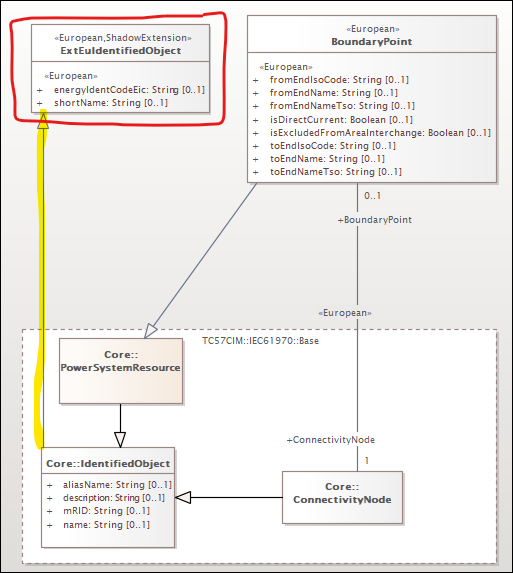
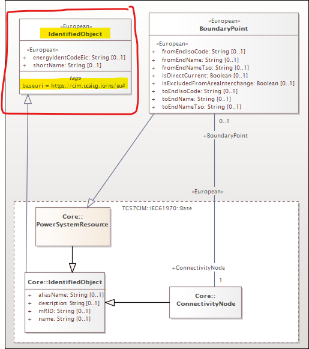
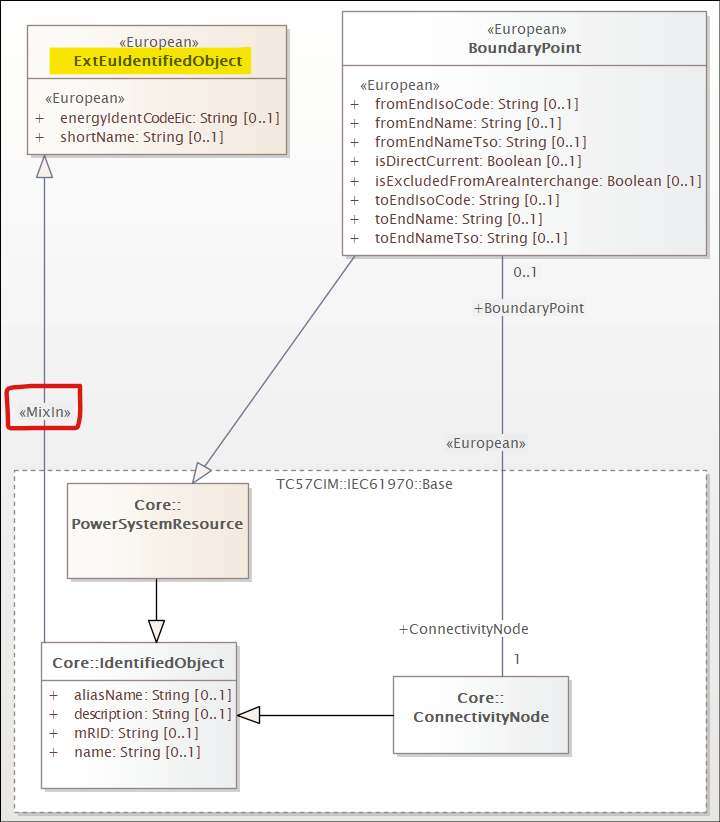
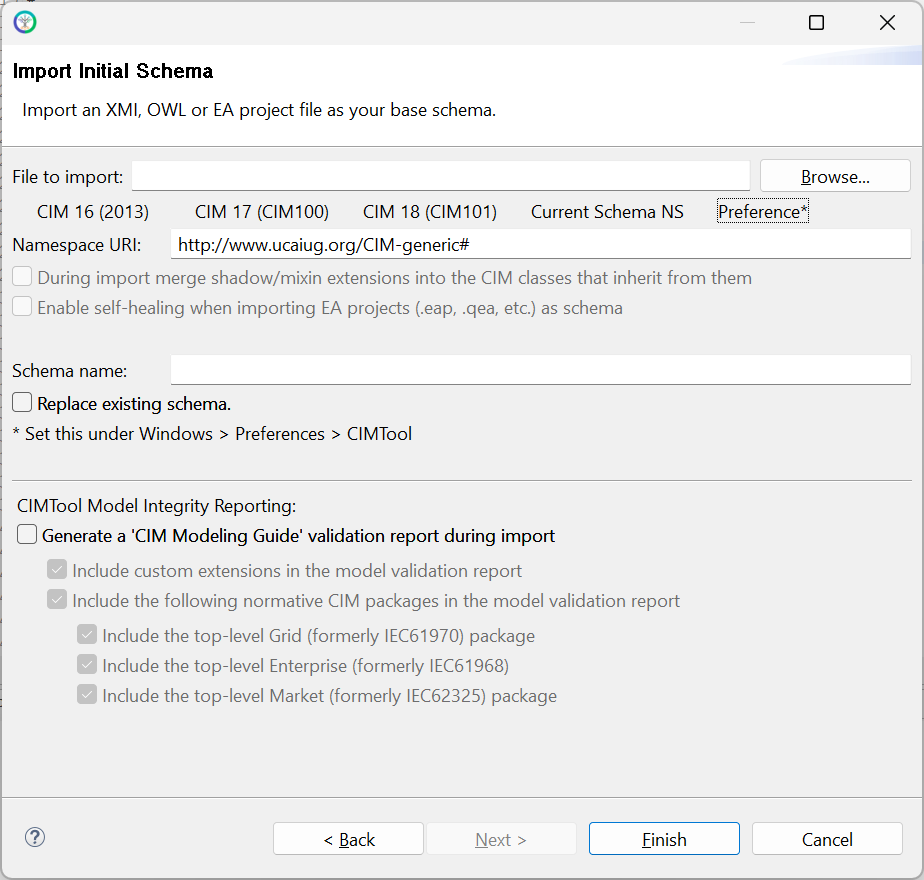
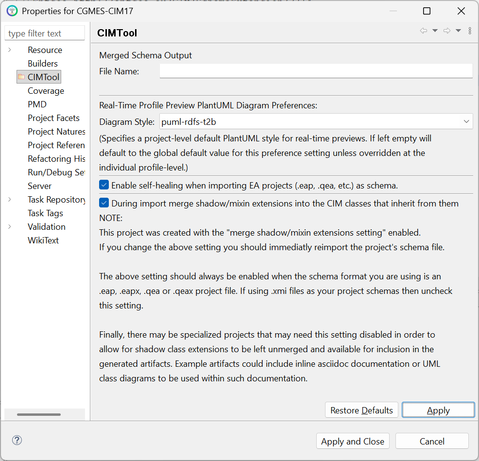
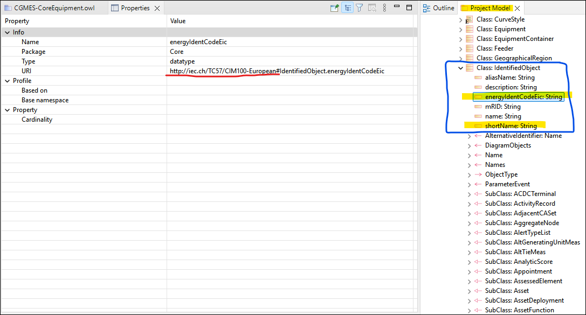

# Modeling CIM Extensions: Shadow Extension Classes and Mix-Ins

The CIM is routinely extended by standards bodies, transmission system operators, and individual organizations to address domain-specific requirements not covered by the normative model. A well-established pattern for modeling such extensions — particularly when attributes or associations need to be contributed to an existing normative CIM class under a distinct namespace — is the use of **shadow classes**.

**CIMTool** 2.3.0 introduces formal support for this pattern through two new UML stereotypes: `<<ShadowExtension>>` and `<<MixIn>>`. These stereotypes are designed to be fully compatible with the extension modeling conventions described in the [CIM Modeling Guide Section 6.1.2](https://cim-mg.ucaiug.io/latest/section6-cim-uml-extension-rules-and-recommendations/#custom-cim-extensions) (Custom CIM Extensions). A future release of the CIM Modeling Guide will be updated to reflect how these stereotypes complement and support the existing guidelines and conventions specifically within the context where the direct use of Sparx EA project files is preferred.

For details on how extension namespaces are assigned in **CIMTool**, see [CIMTool Support for Extension Namespaces](cimtool-support-for-extension-namespaces.md).

!!! note

    The mix-ins / shadow extensions approach described on this page applies specifically to projects using a Sparx EA project file (`.eap`, `.eapx`, `.qea`, or `.qeax`) as the schema. It is not applicable to the extensions modeling approach used when XMI schemas are preferred. Documentation formally describing the extensions approach for XMI-based projects will be added to this site in a future update.

## What Is a Shadow Class?

A shadow class is not a real class in the model in the conventional sense. Rather, it is a construct that "shadows" a normative CIM class, contributing attributes or associations to that class under a different namespace. When **CIMTool** processes a shadow class with merging enabled, it transparently folds the shadow class's members into the normative CIM class in its internal representation — the shadow class itself disappears, and its attributes and associations appear as members of the normative class but in the extension namespace.

The practical outcome is illustrated in the following instance data example, where the European `shortName` and `energyIdentCodeEic` attributes are contributed to `IdentifiedObject` under the `eu:` namespace:

```xml
<rdf:RDF xmlns:cim="http://iec.ch/TC57/CIM100#"
    xmlns:md="http://iec.ch/TC57/61970-552/ModelDescription/1#"
    xmlns:eu="http://iec.ch/TC57/CIM100-European#">

  <cim:Substation rdf:ID="_87f7002b-056f-4a6a-a872-1744eea757e3">
    <cim:IdentifiedObject.name>Anvers</cim:IdentifiedObject.name>
    <eu:IdentifiedObject.shortName>Anvers</eu:IdentifiedObject.shortName>
    <cim:Substation.Region rdf:resource="#_02047c0b-b5a4-4e0d-bae6-fc5437a55e74" />
    <cim:IdentifiedObject.mRID>87f7002b-056f-4a6a-a872-1744eea757e3</cim:IdentifiedObject.mRID>
  </cim:Substation>

</rdf:RDF>
```

## Three Modeling Variants

**CIMTool** recognises three variants of the shadow class pattern. All three produce the same merging behavior when the merge setting is enabled — the difference is purely in how the shadow class is declared in the UML.

### Variant 1: Explicit `<<ShadowExtension>>` Stereotype

The shadow class is given a name distinct from the normative CIM class it shadows (conventionally prefixed with `Ext`) and is decorated with the `<<ShadowExtension>>` stereotype. A generalization relationship connects it to the normative CIM class. The `<<European>>` stereotype on the class (or a `baseuri` tagged value) identifies its namespace.



In the example above, `ExtEuIdentifiedObject` shadows `IdentifiedObject`. Its `shortName` and `energyIdentCodeEic` attributes will be merged into `IdentifiedObject` under the European namespace.

!!! note

    When viewing a UML diagram containing a `<<ShadowExtension>>` class, the generalization relationship from the shadow class to the normative CIM class may at first glance appear to introduce multiple inheritance on that normative class. This appearance is intentional by design and is not conventional multiple inheritance in the broader UML sense. The [CIM Modeling Guide Section 5.10](https://cim-mg.ucaiug.io/latest/section5-cim-uml-modeling-rules-and-recommendations/#inheritance-rules) states that *"the use of multiple inheritance is not allowed (except as specified for extensions)"*, and [Section 6.1.2](https://cim-mg.ucaiug.io/latest/section6-cim-uml-extension-rules-and-recommendations/#custom-cim-extensions) explicitly acknowledges that *"the standard CIM class will now have multiple inheritance"* as a result of the shadow class pattern — noting this as a sanctioned exception specific to extension modeling. When processed by **CIMTool** with merging enabled, the shadow class is dissolved entirely and its members are folded directly into the normative class, so the apparent multiple inheritance relationship exists only transiently in the UML and has no bearing on the generated artifacts.

### Variant 2: Same-Named Class with a Distinct Namespace

The shadow class is given the exact same name as the normative CIM class it shadows. **CIMTool** implicitly identifies it as a shadow class because it has an identical name but a different namespace — that namespace being determined by whichever mechanism is in use for the project: either a `baseuri` tagged value on the class (highlighted in the example below) or a stereotype-to-namespace mapping defined in a `.namespaces` file. No explicit `<<ShadowExtension>>` stereotype is required for **CIMTool** to recognise this variant.



### Variant 3: `<<MixIn>>` Stereotype on the Generalization

The shadow class may have a distinct name (as in Variant 1) but the generalization relationship connecting it to the normative CIM class is decorated with the `<<MixIn>>` stereotype. This explicitly flags the parent as a shadow extension without requiring the `<<ShadowExtension>>` stereotype on the class itself.



## Enabling Shadow Class Merging in CIMTool

Shadow class merging is controlled by a project-level setting. It must be enabled for **CIMTool** to process shadow classes and fold their members into the normative CIM classes they shadow.

!!! note

    This setting should always be enabled when your project schema is a Sparx EA project file (`.eap`, `.eapx`, `.qea`, or `.qeax`). If your project uses `.xmi` files as its schema, uncheck this setting.

### During New Project Creation

The merge setting is available on the "Import Initial Schema" step of the **New Project** wizard. Check the "During import merge shadow/mixin extensions into the CIM classes that inherit from them" checkbox to enable it before completing the wizard.

!!! note

    This setting does not appear on the "Import Schema" dialog used when re-importing or replacing a schema in an existing project. For existing projects, use the **Properties** dialog described below.



### After Project Creation

The setting can also be changed after a project has been created via the project's "Properties" dialog, accessible by right-clicking the project in the Project Explorer and selecting "Properties".



!!! warning

    If you change this setting after a project has been created you should immediately re-import the project's schema file for the change to take effect.

## Result: Merged Attributes in the Project Model

When merging is enabled and the schema is imported, shadow class members appear directly under their normative CIM parent class in the **CIMTool** Project Model view. The screenshot below shows `energyIdentCodeEic` and `shortName` appearing as members of `IdentifiedObject`, with their URI reflecting the European extension namespace:



## Further Reading

The extension modeling conventions underpinning the shadow class pattern are described in detail in the [CIM Modeling Guide](https://cim-mg.ucaiug.io/latest/), specifically:

- [Section 6.1.2 — Custom CIM Extensions](https://cim-mg.ucaiug.io/latest/section6-cim-uml-extension-rules-and-recommendations/#custom-cim-extensions): covers the use of shadow classes, the `<<CIMExtension>>` generalization stereotype, and association modeling guidance for extensions.
- [Section 6.6 — Association Extension Rules](https://cim-mg.ucaiug.io/latest/section6-cim-uml-extension-rules-and-recommendations/#association-extension-rules): covers Rule204 and best practices for modeling associations between extension classes and normative CIM classes.

For guidance on assigning extension namespaces in **CIMTool** — including the `baseuri` tagged value and the stereotype-to-namespace mappings file introduced in 2.3.0 — see [CIMTool Support for Extension Namespaces](cimtool-support-for-extension-namespaces.md).
