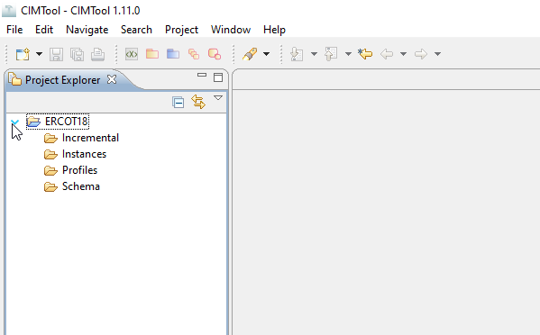

# Navigate the Workspace
After creating or opening a project. Click on the arrow to the left of the project name in the Project Explorer to expand it. 

Notice that the project has the 4 folders:

  * **Incremental**: Contains CIM XML incremental files in RDF format (`.xml`)
  * **Instances**: Contains CIM XML instance files in RDF format (`.xml`)
  * **Profiles**: Contains Contextual Profile definitions
  * **Schema**: Contains the imported CIM UML (`.xmi`)

In the **Profiles** folder, you can find Contextual Profile definitions stored in [Web Ontology Language (OWL)](https://www.w3.org/OWL/) (`.owl`) and [RDF Schema](https://www.w3.org/2001/sw/wiki/RDFS) (`.xml`) format. As well as log files (`.log`), which help identify errors. Depending upon your usage of **CIMTool**, there may also be HTML, JSON Schema, or XSD files in this folder.

!!! tip

    Folders and files that have errors will have a red 'X' on their associated icon

Each **CIMTool** project has a named folder in your workspace directory on your computer's file system. This directory will have the same four sub-folders.

!!! warning

    It recommended to not add, modify or delete anything inside a workspace directory manually or with tools other than **CIMTool** to prevent corrupting your project.
