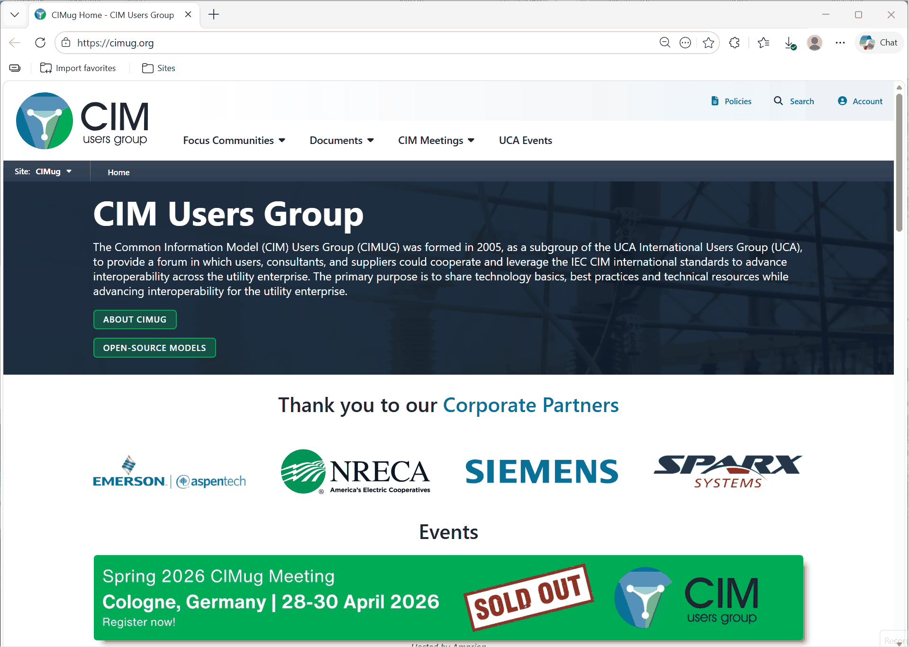

# Obtain Stable Releases of the CIM

One of the first questions often asked is: "Where do I download releases of the CIM UML model for use with Sparx Enterprise Architect?" 

## Obtain the CIM UML

UCAIug Task Force 13 (TF13), UCAIug Task Force 14 (TF14), and UCAIug Task Force 16 (TF16) are groups that work to advance the CIM and who publish periodic releases of the CIM UML. These releases are published to the [UCAIug (CIM Users Group)](https://cimug.org/) website in [Enterprise Architect](https://sparxsystems.com/) project file (`.eap`, `.eapx`, `.qea`, or `.qeax`) format.

Both past and current stables releases of these CIM EA project files are made publicly available for download from the UCAIug. Current releases can be found at [Current CIM Model Drafts](https://cimug.org/cimdocs/standards-artifacts/) and this page should look similar to the next screenshot. Older releases are available at [Past CIM Model Releases](https://cimug.org/cimdocs/standards-artifacts/?wpcp_link=JTdCJTIyc291cmNlJTIyJTNBJTIyNjM4YTc4MjZkMjRmNzQxNTI3ZWIyMmU5NDU5YzYyMjElMjIlMkMlMjJhY2NvdW50X2lkJTIyJTNBJTIyMTg2MDYxNzEwNTYlMjIlMkMlMjJsYXN0Rm9sZGVyJTIyJTNBJTIyMzA3OTU5MzA4NTYxJTIyJTJDJTIyZm9sZGVyUGF0aCUyMiUzQSUyMld5SXpNRGM1TmpNeE9ETXhOekVpTENJek1EYzVOVGt6TURnMU5qRWlYUSUzRCUzRCUyMiUyQyUyMmZvY3VzX2lkJTIyJTNBJTIyMzA3OTU5MzA4NTYxJTIyJTdE).

!!! note

    Some content on the UCAIug site may be restricted to registered users. To access previous versions of the CIM UML you must be a CIM Users Group member. Use the CIM Users Group [join form](https://ucaiug.org/join/) to register and create an account. Note that there are both paid and free levels of membership.
    
    Note that interim non-published releases of the CIM that reflect "work in progress" by the aforementioned Task Forces are generally not publically available  for non-participants. If you are interested in becoming an active member please reach out via the UCA [CIM User's Group](https://cimug.org/) webite.

