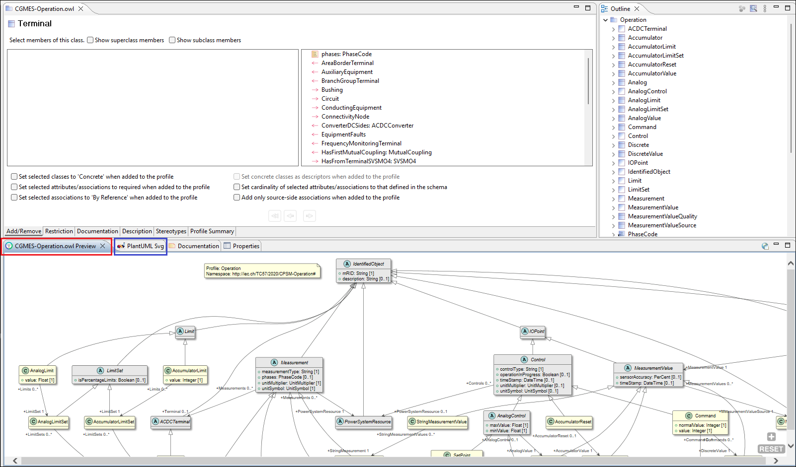
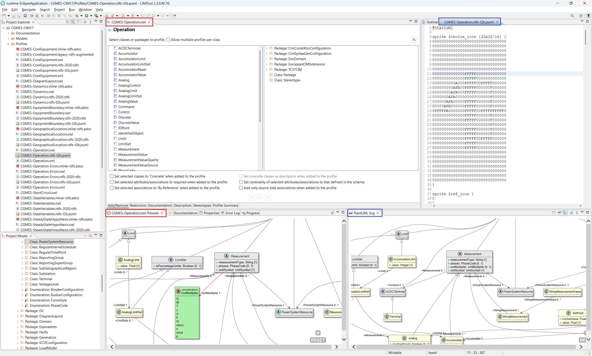
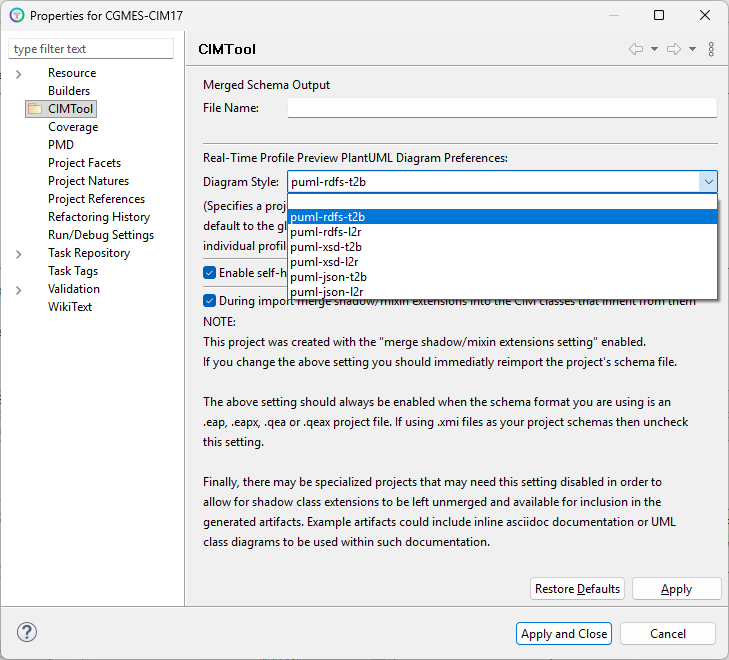
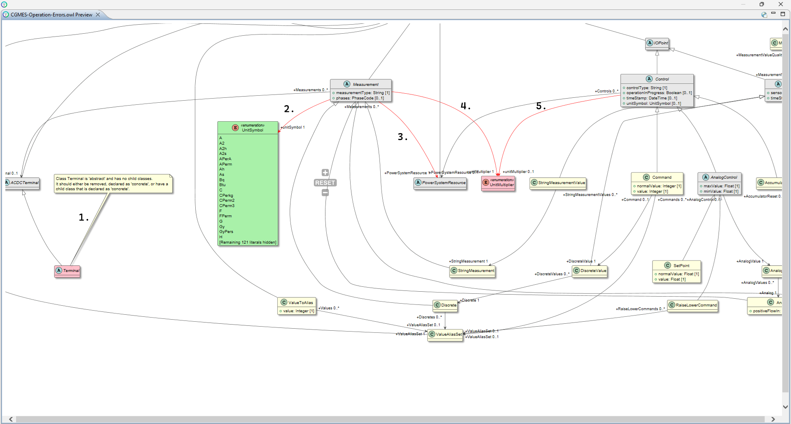
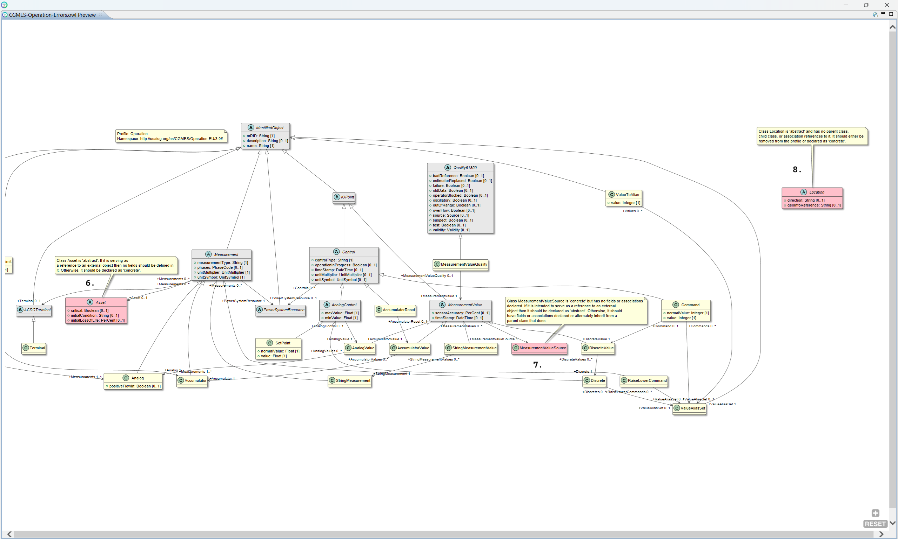
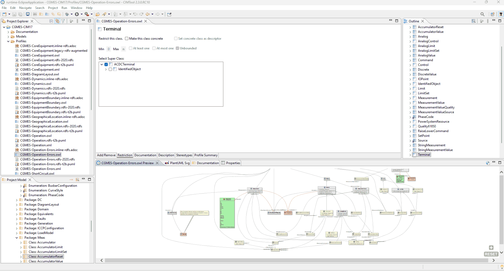
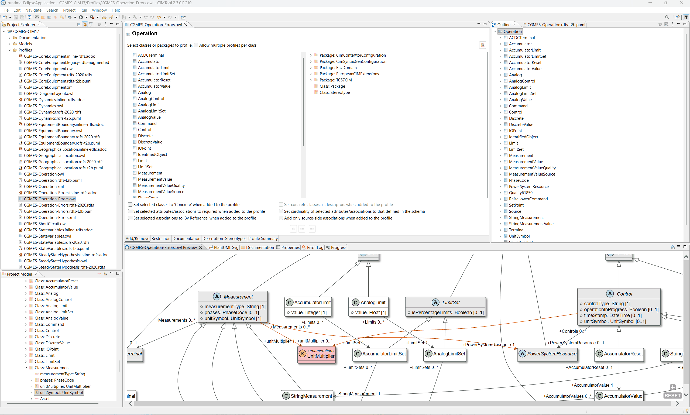
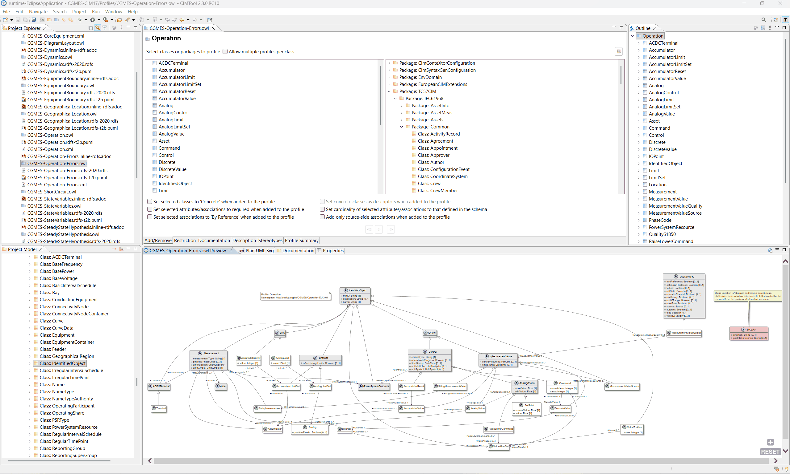

# Profile Real-Time Preview

**CIMTool** 2.3.0 introduces the **Profile Real-Time Preview** feature, which
renders a live UML class diagram of the active CIM profile directly within the
**CIMTool** workbench. The diagram updates automatically each time the profile
is saved, giving profile designers an immediate, visual representation of the
profile's current state without leaving the application or switching to an
external tool.

The **Profile Real-Time Preview** view is part of the default **CIMTool**
workbench layout. In **CIMTool**, a *perspective* is a named arrangement of
views, editors, and toolbars that is optimized for a particular type of work.
The default **CIMTool** perspective is
pre-configured for profile design and includes the **Profile Real-Time Preview**
as one of its built-in views, visible as a tab in the lower portion of the
workbench. No manual setup is required to use it.

Click on the image to present a larger view.

 and the PlantUML Svg tab (outlined in blue) in the default CIMTool perspective")

The **Profile Real-Time Preview** view tracks whichever profile is currently
active in the profile editor and updates in place when focus moves to a
different profile. The diagram is pan-and-zoom capable: holding **Ctrl** and
scrolling zooms in or out; clicking and dragging pans the viewport. This is
especially practical when working with large profiles whose full diagram extends
well beyond the visible area of the view.

!!! note

    The **Profile Real-Time Preview** view is distinct from the **PlantUML Svg** view that also appears in the default workbench layout (outlined in blue in the screenshot above). The **PlantUML Svg** view is a general-purpose PlantUML renderer that displays whatever `.puml` file is currently open or selected in the editor. The **Profile Real-Time Preview**, by contrast, is purpose-built for profile design work: it automatically tracks the active profile and regenerates its diagram on every save — no manual file selection is required.

Beyond visualizing the profile's structure, the Real-Time Preview serves a
second purpose that is especially valuable when building large or complex
profiles: it surfaces incomplete or invalid profile definitions directly within
the rendered diagram using distinct visual cues. This makes it possible to
identify and correct structural problems as they arise, rather than discovering
them only after a lengthy, systematic post-completion review.

Because the two views serve different purposes, they can be used together. The
**PlantUML Svg** view can be repositioned within the workbench by dragging its
tab to a different panel, making it possible to display both views
simultaneously side by side. The screenshot below illustrates this arrangement
— and demonstrates the key difference between them: the Real-Time Preview
(left) renders definition errors using distinct visual cues, flagging issues
within the profile definition. The PlantUML Svg view (right), rendering the
same profile as a standard diagram, shows no such indicator even though the
issue exists in the profile.

Click on the image to present a larger view.

 surfacing definition errors using distinct visual cues; the PlantUML Svg view (right) rendering the same profile as a standard diagram with no error indicators")

Historically, validating a large profile required a meticulous inspection of
every class, attribute, and association definition in the profile editor — a
process that was time-consuming and error-prone precisely because definition
problems had no visible presence in the workspace. The Real-Time Preview
eliminates that burden by making errors immediately visible each time the
profile is saved.

## Diagram Style and Target Schema Type

A CIM profile definition is shaped by its intended target artifact — the type
of schema or serialization format the profile is ultimately meant to produce.
The style of diagram rendered by the Real-Time Preview reflects this:
**CIMTool** generates a PlantUML diagram appropriate for the profile's target
schema type, and it is within that diagram that any definition errors will be
visualized.

When a new project is created, the diagram style defaults to `puml-rdfs-t2b`.
If the project is primarily targeting a different schema type — for example,
XSD — the default should be overridden by updating the project-level preference.
Right-click the project in the **Project Explorer**, select **Properties**,
navigate to **CIMTool**, and select the appropriate diagram style from the
**Diagram Style** dropdown. For an XSD-oriented project, for instance,
`puml-xsd-t2b` or `puml-xsd-l2r` would be the appropriate choice. Selecting
the correct diagram style ensures that the errors visualized in the Real-Time
Preview are relevant to the target schema type the profile is being designed for.

Under **Real-Time Profile Preview PlantUML Diagram Preferences**, the
**Diagram Style** dropdown presents the available options:

Click on the image to present a larger view.

| Diagram Style | Target Schema Type | Layout |
|---|---|---|
| `puml-rdfs-t2b` | RDFS | Top-to-bottom |
| `puml-rdfs-l2r` | RDFS | Left-to-right |
| `puml-xsd-t2b` | XSD | Top-to-bottom |
| `puml-xsd-l2r` | XSD | Left-to-right |
| `puml-json-t2b` | JSON Schema | Top-to-bottom |
| `puml-json-l2r` | JSON Schema | Left-to-right |

This project-level setting applies as the default for all profiles in the
project. It can be overridden on a per-profile basis from within the profile's
own properties. The layout orientation — top-to-bottom or left-to-right — is a
presentational preference and has no effect on the content of the diagram or
the errors it surfaces.

The type of errors that can appear in the diagram depends on the target schema
type selected. Some errors are common to all diagram styles; others are
specific to the conventions and constraints of a particular target schema type.
The sections below address each target schema type in turn, describing how
errors are visualized within it and how to resolve each one.

## Working with the Preview on a Second Monitor

The **Profile Real-Time Preview** view can be detached from the workbench
entirely and moved to a separate window — for example, onto a second monitor
— by dragging its tab away from its current panel and releasing it outside the
workbench boundary. Once detached, the view can be maximized to fill the full
screen, giving the diagram the maximum possible space while leaving the profile
editor and the rest of the workbench fully accessible on the primary monitor.
This arrangement is particularly effective when working with large profiles
whose diagrams would otherwise require significant panning and zooming to
navigate within a docked view. 

Click on the image to present a larger view.

The next set of screenshots are used for illustration purposes and show a profile
that contains a wide range of profile errors — each numbered 1 through 8 for reference. 

Click on the image to present a larger view.

Click on the image to present a larger view.

, a concrete class with no fields or associations (7), and an isolated abstract class with no parent, child, or associations (8)")

The sections that follow examine each of the above errors in detail, explaining
what each one indicates and how to resolve it, beginning with the RDFS diagram
style.

## RDFS Profile Definition Style

An RDFS-style profile definition targets RDF Schema artifact generation
conforming to **IEC 61970-501:2016** — *Energy management system application
program interface (EMS-API) – Part 501: Common Information Model Resource
Description Framework (CIM RDF) schema*. When the diagram style is set to
`puml-rdfs-t2b` or `puml-rdfs-l2r`, the Real-Time Preview renders a PlantUML
class diagram that reflects the structural conventions of an RDFS profile
definition. Errors specific to those conventions are visualized directly within
the diagram.

The numbered errors shown in the overview screenshot above are each examined
below in sequence, using a deliberately constructed profile that contains each
type of error so they can be illustrated and resolved one by one.

### Issue 1 — Abstract Class with No Concrete Child Classes

#### What the diagram shows

When a class included in the profile is marked as **abstract** but has no
child classes in the profile that are declared as **concrete**, the Real-Time
Preview flags it with two distinct visual cues:

- The class is rendered in **pink/red** rather than the standard yellow
  used for concrete classes. This color convention is used throughout the RDFS
  diagram style to indicate an abstract class that violates the profile
  definition rules.
- A **note callout** is attached directly to the class in the diagram, stating
  the problem in plain language. In the example above, the note on `Terminal`
  reads: *"Class Terminal is 'abstract' and has no child classes. It should
  either be removed, declared as 'concrete', or have a child class that is
  declared as 'concrete'."*

The note callout is particularly useful in large profiles where it may not be
immediately obvious why a class has been flagged — it tells you exactly what
the problem is and what your options are to resolve it, without requiring you
to inspect the profile definition manually.

#### What it means

An abstract class in an RDFS profile definition exists to be specialized — it
is expected to have at least one concrete subclass through which instances are
actually typed. A profile that includes an abstract class with no concrete
child classes creates an ambiguity in the generated RDFS artifact: the class is
present but can never be instantiated. **CIMTool** flags this as a definition
error because the resulting artifact would be structurally incomplete.

#### How to resolve it

There are three ways to address this error, as the note callout itself states:

1. **Declare the class as concrete** — if the class is appropriate to include
   directly in the profile without requiring a subclass, check the **"Make
   this class concrete"** checkbox on the class's **Restriction** tab in the
   profile editor.
2. **Add a concrete subclass** — if a suitable subclass exists in the CIM
   model, add it to the profile and declare it as concrete. This is the
   preferred resolution when the intent is to preserve the abstract nature of
   the parent class.
3. **Remove the class from the profile** — if the class is not needed, remove
   it from the profile entirely via the **"Add/Remove"** tab.

In the example shown here, `Terminal` has no subclasses in the CIM model, so
option 2 is not available. The fix applied in the animated GIF below is
option 1 — navigating to `Terminal` via the profile editor's **Restriction**
tab and checking **"Make this class concrete"**. 

Click on the image to present a larger view.

#### Result

After saving the profile the diagram refreshes automatically. Navigating to
`Terminal` in the updated diagram confirms the error has been resolved — the
note callout is no longer present and `Terminal` now appears rendered in the
standard **yellow** convention for concrete classes.

### Issue 2 — Attribute Type Not Selected in the Profile Definition

#### What the diagram shows

When an attribute has been added to the profile but its associated enumeration
or compound type has not been included in the attribute's definition, the
Real-Time Preview flags it with a **red association** drawn from the class
that owns the attribute to the enumeration or compound type class. In this
example, the `unitSymbol` attribute on `Measurement` has been added to the
profile, but the `UnitSymbol` enumeration that is its declared type has not
been selected as part of the attribute definition. The result is a red
association from `Measurement` to the `UnitSymbol` class.

#### What it means

In the CIM, enumeration and compound types never participate in associations —
they are only ever used as the declared type of an attribute. When **CIMTool**
renders a red association between a class and an enumeration or compound
type, it is signalling that the attribute exists in the profile but its type
has not been properly included in the attribute's definition. The diagram is
making visible what would otherwise be an invisible gap in the profile
definition: the attribute is present but incomplete.

#### How to resolve it

The fix is to drill into the attribute definition via the **"Add/Remove"** tab
and select the enumeration or compound type on the attribute's detail page:

1. On the **"Add/Remove"** tab, double-click the class that owns the attribute
   (in this example, `Measurement`) to drill into its member list.
2. In the member list, locate the affected attribute (`unitSymbol 1..1`) and
   double-click it to open its attribute detail page.
3. The attribute detail page shows two columns. The declared type
   (`Enumeration: UnitSymbol`) will appear in the right-hand (available)
   column. Move it to the left-hand (selected) column to include it in the
   attribute's definition.
4. Save the profile.

Click on the image to present a larger view.

#### Result

After saving the profile the diagram refreshes automatically. The red
association from `Measurement` to `UnitSymbol` is gone. The `unitSymbol`
attribute now appears correctly as a typed property within the `Measurement`
class — rendered as `unitSymbol: UnitSymbol [1]` — which is the expected
representation for a properly defined attribute whose type is an enumeration.

### Issue 3 — Association Target End Not Included in the Profile Definition

#### What the diagram shows

When an association between two classes has been added to the profile but the
target end of the association has not been included in the profile definition
for that relationship, the Real-Time Preview renders the associationin **red** 
between the two classes. In this example, a red association runs from
`Measurement` to `PowerSystemResource`.

Note that this error looks visually similar to Issue 2, but its cause is
fundamentally different. In Issue 2 the red arc indicated a missing declared
type on an attribute. Here, the arc represents a **true association** between
two classes — `Measurement` and `PowerSystemResource` — and `PowerSystemResource`
is already included in the profile, as confirmed by its presence in the
**Outline** panel's alphabetical list of currently profiled classes. Because
`PowerSystemResource` is profiled, it appears in the diagram in grey — the
convention used for abstract classes — rather than pink/red, which would
indicate a class that is entirely absent from the profile. The issue is not
that the class is missing; it is that the **association's target end has not
been included in the profile definition** for that relationship.

#### What it means

In a CIM profile definition, adding an association to the profile is not
sufficient on its own — the target end of the association must also be
explicitly included in the association's definition within the profile. Until
that step is completed, **CIMTool** cannot fully resolve the relationship and
renders the association in red to make the incomplete definition visible.

#### How to resolve it

The fix follows the same drill-down pattern as Issue 2, but the detail page
being completed is an association definition rather than an attribute type
selection:

1. On the **"Add/Remove"** tab, double-click the class that owns the
   association (in this example, `Measurement`) to drill into its member list.
2. In the member list, locate the affected association (`PowerSystemResource
   1..1`) and double-click it to open its association detail page.
3. The association detail page shows two columns. `Class: PowerSystemResource`
   will appear in the right-hand (available) column. Move it to the left-hand
   (selected) column to include it in the association's definition.
4. Save the profile.

Click on the image to present a larger view.

#### Result

After saving the profile the diagram refreshes automatically. The red association from
`Measurement` to `PowerSystemResource` is replaced by a **grey association** —
confirming that the association is now fully and correctly defined within the
profile, with `PowerSystemResource` participating as a properly profiled
abstract class on the target end of the relationship.

### Issues 4 & 5 — Enumeration Type Not Yet Referenced by Any Attribute in the Profile

#### What the diagram shows

The Real-Time Preview renders `UnitMultiplier` as an **entirely pink/red**
class with red arcs running from both `Measurement` and `Control` to it.

This is an important distinction from Issue 2, where `UnitSymbol` appeared
rendered in the default **green** typical for enumerations. In Issue 2 the 
green body indicated that `UnitSymbol` was already a defined member in the 
profile. The pink/red association signalled only that a specific attribute 
definition was incomplete.

Here, in Issue 4 and 5, `UnitMultiplier` is **entirely pink/red** because it is 
not yet a defined member of the profile; **CIMTool** renders it this way to signal 
that the enumeration is wholly unresolved within the profile.

#### What it means

Both `Measurement` and `Control` have a `unitMultiplier` attribute in the CIM
whose declared type is the `UnitMultiplier` enumeration. Both attributes have
been added to the profile, but neither has had `UnitMultiplier` selected in the
attribute's definition on the **"Add/Remove"** tab. Until at least one of them
does so, `UnitMultiplier` remains entirely unresolved and is rendered fully
pink/red. The two red arcs — one from `Measurement` and one from `Control` —
each represent the same underlying problem on their respective attribute
definitions.

#### How to resolve it

Each attribute definition must be completed independently, following the same
drill-down pattern as Issue 2. Issue 4 addresses `Measurement`'s
`unitMultiplier` attribute first; Issue 5 then addresses `Control`'s.

**Issue 4 — Measurement → unitMultiplier:**

1. On the **"Add/Remove"** tab, double-click `Measurement` to drill into its
   member list.
2. Double-click `unitMultiplier 1..1` to open its attribute detail page.
3. `Enumeration: UnitMultiplier` will appear in the right-hand (available)
   column. Move it to the left-hand (selected) column.
4. Save the profile.

After saving, the diagram refreshes. The red arc from `Measurement` to
`UnitMultiplier` disappears and `unitMultiplier: UnitMultiplier [1]` now
appears as a correctly typed property within the `Measurement` class.
Critically, `UnitMultiplier` itself is now rendered in **green** — because
its membership in the profile has been established through `Measurement`'s
attribute definition. The red arc from `Control` remains, but `UnitMultiplier`
is no longer entirely unresolved.

**Issue 5 — Control → unitMultiplier:**

5. Double-click `Control` on the **"Add/Remove"** tab to drill into its member
   list.
6. Double-click `unitMultiplier 0..1` to open its attribute detail page.
7. `Enumeration: UnitMultiplier` will appear in the right-hand (available)
   column. Move it to the left-hand (selected) column.
8. Save the profile.

Click on the image to present a larger view.

#### Result

After the second save the diagram refreshes fully. Both red arcs are gone.
`UnitMultiplier` no longer appears as a standalone class in the diagram —
it is now correctly resolved as the declared type of the `unitMultiplier`
attribute on both `Measurement` and `Control`, appearing as a typed property
within each class respectively.

### Issue 6 — Abstract Class with Fields Defined

#### What the diagram shows

The Real-Time Preview renders `Asset` in **pink/red** with a note callout
attached, reading: *"Class Asset is 'abstract'. If it is serving as a reference
to an external object then no fields should be defined in it. Otherwise, it
should be declared as 'concrete'."*

Unlike Issue 1 where the class was abstract simply because it lacked a concrete
child, here `Asset` is abstract **and** has fields defined on it (`critical`,
`initialCondition`, `initialLossOfLife`). This combination is flagged because
it does not fit either of the two valid patterns for an abstract class in an
RDFS profile definition.

#### What it means

In an RDFS profile definition, an abstract class can serve one of two valid
roles:

- **An external reference** — the class is included in the profile not because
  instances of it will be fully described within the data exchange, but because
  other classes need to reference instances of it that exist outside the scope
  of the exchange. The class acts as a typed pointer to an external resource.
  For this role, the class should have **no fields defined** — fields would
  never be populated in practice and their presence is misleading.
- **A parent class to be specialized** — the class exists to be subclassed by
  one or more concrete child classes that inherit its structure. For this role,
  having fields is appropriate, but the class itself must not be directly
  instantiable — it must remain abstract.

`Asset` is currently abstract with fields defined — it cannot serve as a clean
external reference (because it has fields) and it cannot serve as a parent class
to be specialized (because it has no concrete child classes in the profile).
**CIMTool** flags this as a definition error because the intent is ambiguous and
must be resolved explicitly.

#### How to resolve it

There are two valid resolutions, depending on the intended role of `Asset` in
the profile:

1. **If `Asset` is intended as an external reference** — remove the fields from
   its profile definition via the **"Add/Remove"** tab. Navigate to `Asset` in
   the member list, select all three fields (`critical`, `initialCondition`,
   `initialLossOfLife`) in the selected column and remove them. `Asset` will
   then be a clean abstract class with no fields, appropriate for use as an
   external reference pointer.
2. **If `Asset` is intended to carry data** — declare it concrete via the
   **Restriction** tab by checking **"Make this class concrete"**.

In the example shown here, the fix applied is option 1 — removing the three
fields from `Asset`'s profile definition, leaving it as a clean abstract class
suited to its role as an external reference.

Click on the image to present a larger view.

#### Result

After saving the profile the diagram refreshes automatically. `Asset` now
renders in **grey** — the convention for abstract classes — with no fields
and no note callout. Its role as an external reference is now correctly
expressed in the profile definition.

### Issue 7 — Concrete Class with No Fields or Associations

#### What the diagram shows

The Real-Time Preview renders `MeasurementValueSource` in **pink/red** with a
note callout reading: *"Class MeasurementValueSource is 'concrete' but has no
fields or associations declared. If it is intended to serve as a reference to
an external object then it should be declared as 'abstract'. Otherwise, it
should have fields or associations declared or alternately inherit from a parent
class that does."*

This is in some ways the mirror image of Issue 6. Where Issue 6 showed an
abstract class that had fields it should not have, Issue 7 shows a concrete
class that has **no** fields or associations — and no parent class from which
to inherit them.

#### What it means

A concrete class in an RDFS profile definition is expected to carry substance —
either its own fields or associations, or those inherited from a parent class.
A concrete class with none of these has no meaningful content to contribute to a
data exchange. As noted in Issue 6, a class that is intended purely as an
external reference (a typed pointer to an object existing outside the scope of
the exchange) should have no fields — but for that role, **abstract** is the
correct declaration, not concrete.

**CIMTool** flags `MeasurementValueSource` because it is concrete, has no
fields or associations, and has no parent class from which to inherit them.
The note callout presents two paths to resolution: declare it abstract (if it
is serving as an external reference) or give it fields, associations, or a
parent class (if it is meant to carry data).

#### How to resolve it

There are three valid resolutions, as the note callout itself states:

1. **Declare the class as abstract** — if `MeasurementValueSource` is intended
   purely as an external reference (a typed pointer to an object existing outside
   the scope of the exchange), uncheck the **"Make this class concrete"** checkbox
   on the **Restriction** tab. A clean abstract class with no fields is the
   correct expression of that role.
2. **Add a parent class** — navigate to `MeasurementValueSource` on the
   **Restriction** tab and select a super class. This allows the class to remain
   concrete while inheriting fields from a parent, satisfying the requirement
   that a concrete class must carry substance. In the example shown here, this
   is the fix applied — `IdentifiedObject` is selected as the super class,
   providing inherited fields without requiring any direct field definitions on
   `MeasurementValueSource` itself.
3. **Add fields or associations directly** — navigate to `MeasurementValueSource`
   on the **"Add/Remove"** tab and add one or more fields or associations to its
   profile definition.

Click on the image to present a larger view.

#### Result

After saving the profile the diagram refreshes automatically.
`MeasurementValueSource` now renders as a **yellow** concrete class with no
note callout — the pink/red coloring is gone and the error is resolved. By
inheriting from `IdentifiedObject`, it now has a parent class that provides
the substance required of a concrete class in an RDFS profile definition.

### Issue 8 — Isolated Abstract Class with No Parent, Child, or Associations

#### What the diagram shows

The Real-Time Preview renders `Location` in **pink/red** with a note callout
reading: *"Class Location is 'abstract' and has no parent class, child class,
or association references to it. It should either be removed from the profile
or declared as 'concrete'."*

`Location` has two fields defined (`direction: String [0..1]` and
`geoInfoReference: String [0..1]`) but is declared abstract, and has no
parent class, no concrete child classes, and no association references
connecting it to any other class in the profile.

#### What it means

An abstract class exists to be specialized or referenced through its
relationships. If a class has no parent to inherit from, no child classes to
specialize it, and no associations connecting it to anything else in the
profile, it is completely isolated — there is no path through which it could
ever be instantiated or referenced in a data exchange. In this state, the class
serves no purpose in the profile regardless of what fields it carries.

Declaring it **concrete** resolves this because it changes the class's role
entirely: instead of requiring specialization or indirect reference, it becomes
directly instantiable. Instances of a concrete class can be included in a data
exchange as standalone objects — a legitimate and meaningful role even without
parent, child, or association relationships. The presence of fields
(`direction` and `geoInfoReference`) confirms that `Location` is intended to
carry data, making concrete the appropriate declaration.

#### How to resolve it

There are two valid resolutions, as the note callout itself states:

1. **Declare the class as concrete** — navigate to `Location` on the
   **Restriction** tab and check the **"Make this class concrete"** checkbox.
   Since `Location` already has fields defined (`direction` and
   `geoInfoReference`), declaring it concrete is sufficient — it gains a
   legitimate role as a directly instantiable class whose instances can
   participate in a data exchange. No further changes to the profile definition
   are needed. This is the fix applied in the example shown here.
2. **Remove the class from the profile** — if `Location` is not needed, remove
   it from the profile entirely via the **"Add/Remove"** tab.

Click on the image to present a larger view.

#### Result

After saving the profile the diagram refreshes automatically. `Location` now
renders as a **yellow** concrete class with its two fields displayed and no
note callout. It is now correctly defined as a directly instantiable class
whose instances can participate in a data exchange.
