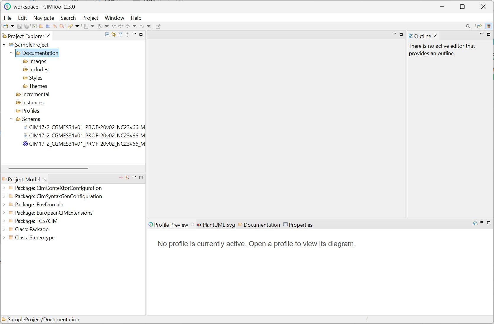
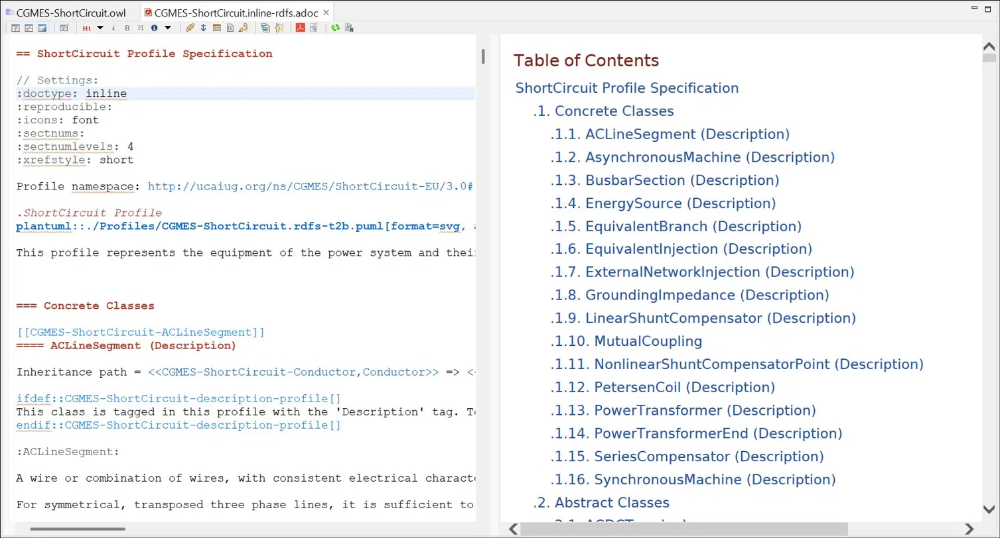
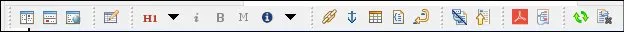
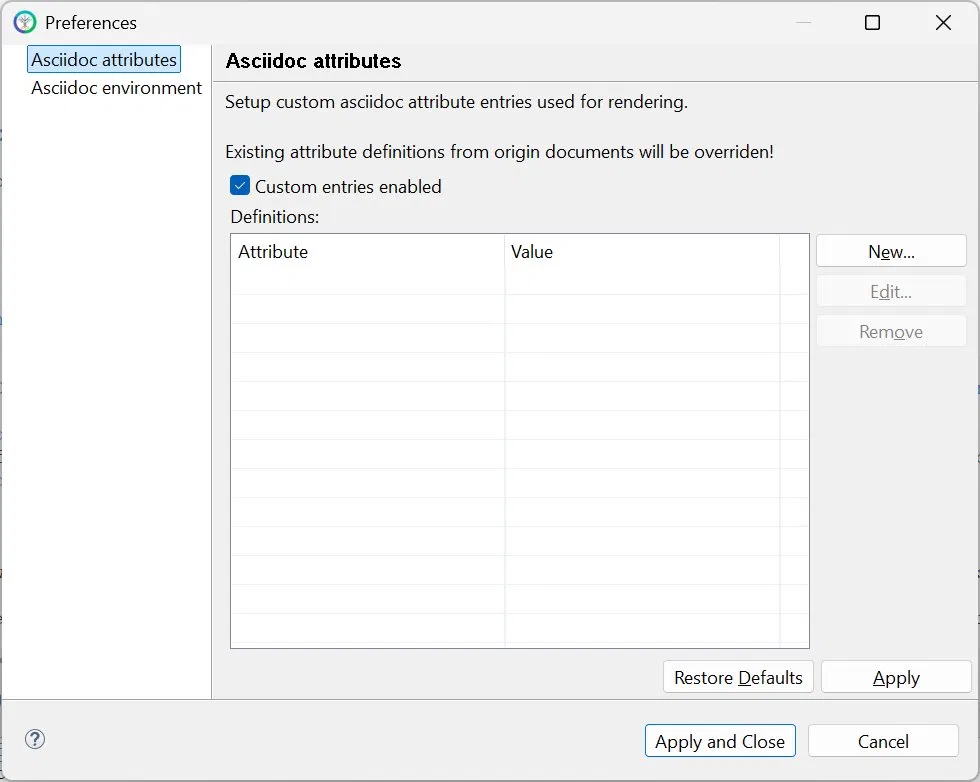
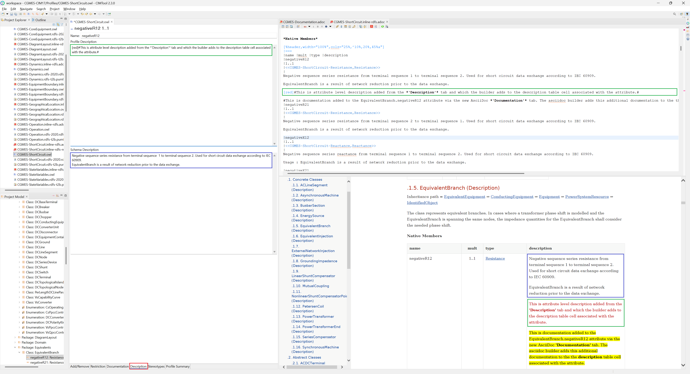
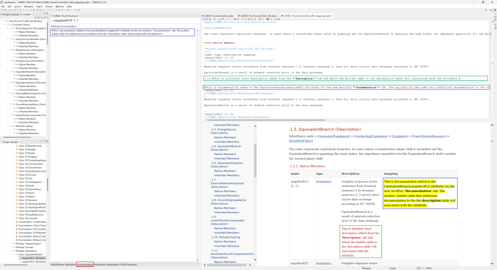
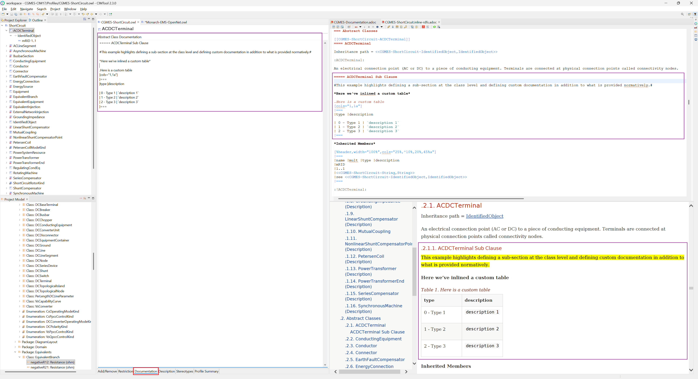
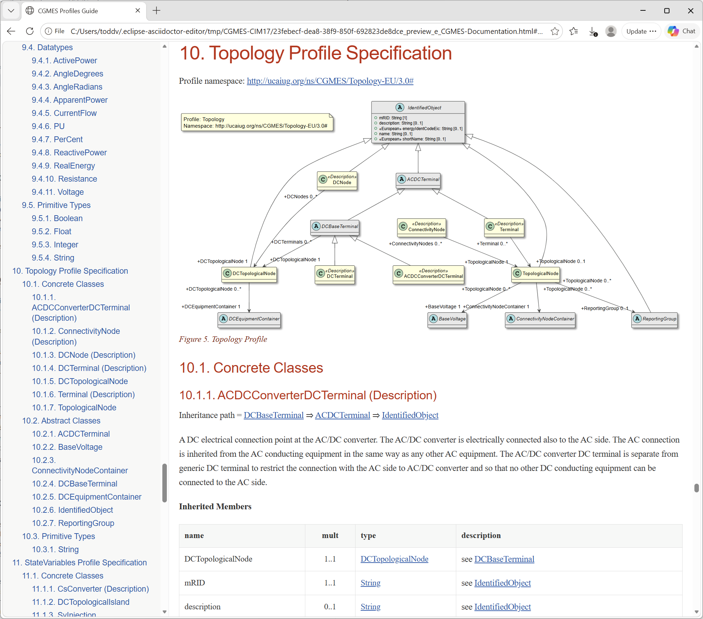
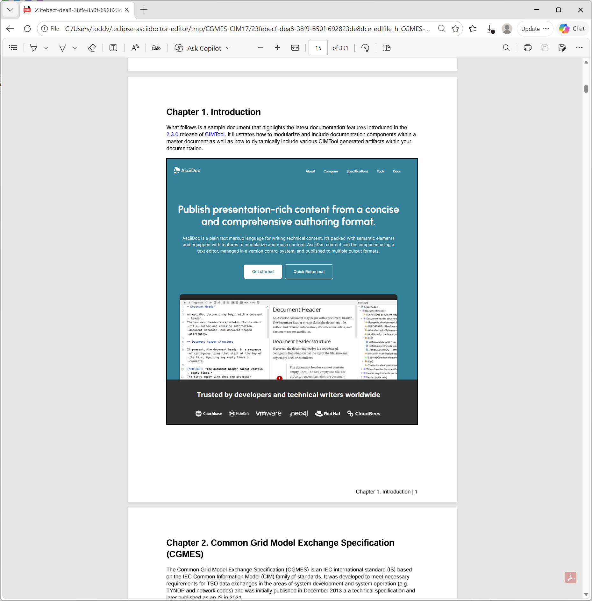

# Using CIMTool Documentation Features

**CIMTool** 2.3.0 introduces a set of features for authoring rich, professional documentation directly from a CIM profile.

These features address a need that profile authors have long had: producing human-readable specifications that stay in step with the profile itself. Rather than maintaining documentation separately and by hand, you can write narrative content within **CIMTool** and author expanded documentation for individual profile elements. **CIMTool**'s builders can generate modularized documentation components that can then be included in master documents.

All of this is built on [AsciiDoc](https://asciidoc.org/), a concise, plain-text authoring format designed for technical documentation. AsciiDoc content is easy to write, friendly to version control, and can be published to multiple output formats. The documentation **CIMTool** generates from a profile is AsciiDoc, the content you author within **CIMTool** is AsciiDoc, and the bundled editor renders AsciiDoc previews — so a working familiarity with the format is helpful. This page closes with an [AsciiDoc Syntax Quick Reference](#asciidoc-syntax-quick-reference) to get you started.

Finally, what follows will walk you through where documentation lives in a project, how to author it at the profile and element level, what types of documentation builders currently ship with **CIMTool** and what they produce, and how to assemble a complete master document using the publicly available [CGMES-CIM17](https://github.com/cimug-org/CGMES-CIM17) sample project as a worked example.


## The Five Project Folders

Every **CIMTool** project is created with the same set of top-level folders, generated automatically when the project is created. Prior to **CIMTool** 2.3.0 there were four; the **Documentation** folder, new in 2.3.0, brings the total to five. Understanding what each one holds makes it clear where the **Documentation** folder fits and where the documentation features described on this page do their work.

Click on the image to present a larger view.

[](../images/ProjectExplorer-FiveFolders.png "A newly created CIMTool project in the Project Explorer, showing the five auto-created folders: Documentation, Incremental, Instances, Profiles, and Schema")

The five folders, shown in the **Project Explorer** above are:

| Folder | Purpose |
|---|---|
| **Documentation** | For AsciiDoc-related artifacts with the `.adoc` extension. Introduced in **CIMTool** 2.3.0 and the focus of this page. |
| **Incremental** | For CIM XML incremental files in RDF format, with a `.xml` extension. |
| **Instances** | For CIM XML instance files in RDF format, with a `.xml` extension. |
| **Profiles** | For profile definitions and their generated artifacts. A profile definition itself is stored as an OWL file (`.owl`); the XSD, JSON Schema, RDFS, and other formats found here are artifacts generated from that definition by **CIMTool**'s builders. Log files identifying errors are written as `.log` text files, and depending on how **CIMTool** is used, HTML, RTF, XML, Java, and SQL files, among other types, may also be hosted here. |
| **Schema** | Contains the schema that profiles are built from. Two formats can be used: a CIM model in XMI format (`.xmi`), generated from the UML model in Sparx EA; or **Enterprise Architect** project files used directly by **CIMTool** — both 32-bit EA15 (`.eap`, `.eapx`) and 64-bit EA16/EA17 (`.qea`, `.qeap`). |

The **Documentation** and **Profiles** folders are the two that matter most for documentation work: the documentation builders write their generated AsciiDoc output into **Profiles** alongside the OWL profile definitions, while the **Documentation** folder is where you assemble generated content together with end-user written content into a finished document. The remaining sections look at each of these in turn.


## Inside the Documentation Folder

The **Documentation** folder is created with four subfolders, each intended for a specific kind of AsciiDoc-related content. As with the project folders themselves, these subfolders are generated automatically — you do not need to create them by hand. Within the CGMES-CIM17 sample project, each subfolder also contains a small `readme.txt` placeholder describing what belongs there.

| Subfolder | Purpose |
|---|---|
| **Images** | Image assets referenced from your documents — diagrams, screenshots, logos, and the like. |
| **Includes** | Modular AsciiDoc content files (`.adoc`) intended to be pulled into a master document. |
| **Styles** | Custom CSS stylesheets (`.css`) that control the appearance of HTML output. |
| **Themes** | Custom theme files (`.yml`) that control the appearance of PDF output. |

The master document itself — the top-level `.adoc` file that aggregates modularized documentation components together — lives at the root of the **Documentation** folder, alongside these four subfolders. Building a master document is covered in detail in [Building a Master Document](#building-a-master-document).

!!! tip

    For larger documentation efforts, it is common to organize the **Includes** folder further by creating subfolders beneath it, grouping related modular content into logical units. **CIMTool** places no restrictions on this — the structure beneath **Includes** is yours to arrange in a manner that best meets your documentation needs.

The [CGMES-CIM17](https://github.com/cimug-org/CGMES-CIM17) sample project shows this layout in practice. Its **Documentation** folder holds a master document, `CGMES-Documentation.adoc`, at the root; a set of modular narrative files under **Includes** (an introduction, a CGMES overview, profile-group introductions, a conclusion, and more); a custom HTML stylesheet under **Styles**; and a custom PDF theme under **Themes**.


## The Asciidoctor Eclipse Editor

Authoring and previewing AsciiDoc content within **CIMTool** is handled by the Asciidoctor Eclipse editor, which is bundled with **CIMTool** 2.3.0 out of the box. No separate installation is required — when you open an `.adoc` file in the workbench, the editor is automatically launched for the selected file.

The editor provides a live, side-by-side preview: your AsciiDoc source on one side and the rendered result on the other. The preview reflects the same AsciiDoc processing **CIMTool** uses elsewhere, so what you see in the editor is a faithful representation of the final output.

Click on the image to present a larger view.

[](../images/AsciidoctorEditor-SplitView.png "The Asciidoctor editor in split view: AsciiDoc source with syntax highlighting on the left, the live rendered preview with table of contents and section numbering on the right")

!!! note

    The Asciidoctor editor renders previews by running an external Asciidoctor process and communicating with it, rather than by embedding the AsciiDoc processor inside **CIMTool** itself. This is an implementation detail you do not normally need to think about, but it explains the editor's "rebuild" and "clear cache" toolbar actions described below, which manage that external rendering process.

### The Editor Toolbar

The editor's toolbar provides quick access to formatting, insertion, navigation, and output actions.

Click on the image to present a larger view.

[](../images/AsciidoctorEditor-Toolbar.png "The Asciidoctor editor toolbar")

The buttons, from left to right, are:

| Button | Action |
|---|---|
| Vertical layout | Arranges source and preview side by side (vertical split). |
| Horizontal layout | Arranges source and preview one above the other (horizontal split). |
| Preview in external browser | Renders the document to HTML and opens it in your default external browser. |
| Open rendering preferences | Opens the editor's rendering preferences, where custom AsciiDoc attributes used during rendering can be defined. |
| Section level (`H1`) | Inserts a section heading. The dropdown selects the level, from Document Title (`H0`) through Level 5 Section (`H5`). |
| Italic | Formats the selected text as italic. |
| Bold | Formats the selected text as bold. |
| Monospace | Formats the selected text as monospace. |
| Admonition (NOTE) | Inserts an admonition. The dropdown selects the type: TIP, NOTE, IMPORTANT, WARNING, or CAUTION. |
| Insert a link | Inserts a link. |
| Insert a reference anchor | Inserts an anchor that can be referenced elsewhere via a cross reference. |
| Insert a table | Inserts a table skeleton. |
| Insert a code block | Inserts a source/listing code block. |
| Add linebreak | Inserts a hard line break. |
| Toggle table of contents | Shows or hides the table of contents in the preview. The tooltip reads "TOC is hidden" when off and "TOC is shown" when on. |
| Jump to top of AsciiDoc view | Scrolls the preview back to the top of the document. |
| Create temporary PDF | Renders the document to a temporary PDF file and opens it. |
| Create overview diagram | Generates a structural overview diagram of the current document. |
| Rebuild AsciiDoc preview content | Rebuilds the preview (also available via **F5**). Useful when included files or other resources have changed outside the editor, or when refreshing an external-browser preview. |
| Clear complete cache | Clears all temporary files cached for the project. The next rebuild takes longer because everything is regenerated. |

### Rendering Preferences

The **Open rendering preferences** toolbar button opens a preferences dialog for defining custom AsciiDoc attributes that are applied when the editor renders a document.

Click on the image to present a larger view.

[](../images/AsciidoctorEditor-RenderingPreferences.png "The rendering preferences dialog showing the AsciiDoc attributes page, where custom attribute entries can be defined")

!!! warning

    Custom attribute entries defined here override attribute definitions of the same name declared in your documents. If a rendered document does not reflect an attribute set in its own header, check whether an entry here is overriding it.

### Configuration Files

When you first open an `.adoc` file, the editor automatically generates an `.asciidoctorconfig.adoc` configuration file. This file establishes the rendering context for documents in its directory and is created and maintained by the editor — you should leave it in place.


## Adding Documentation to Profile Elements

Beyond authoring standalone narrative content, **CIMTool** lets you attach documentation directly to individual elements of a profile — a class, an enumeration, an attribute, an association role end, and so on. This element-level documentation is carried with the profile and is emitted by the documentation builders into the generated output for that element, so it travels with the profile rather than living in a separate document.

Two tabs in the profile editor contribute this documentation: the **"Description"** tab, which has been part of **CIMTool** since its inception, and the **"Documentation"** tab, introduced in **CIMTool** 2.3.0. Both accept AsciiDoc, so the formatting and styling described in the [AsciiDoc Syntax Quick Reference](#asciidoc-syntax-quick-reference) applies to the text you enter in either one.

### The "Description" Tab

The **"Description"** tab presents two fields for a selected element:

- **Schema Description** — the normative description carried in the source CIM schema (the UML model in the `.qea`, `.eap`, `.xmi`, etc. file). This text is read-only by design: it reflects the definition as it exists in the model and cannot be edited in **CIMTool**.
- **Profile Description** — a field for additional notes you supply. AsciiDoc syntax is honored here, so you can format and style the text.

Click on the image to present a larger view.

[](../images/Documentation-DescriptionTab.png "The Description tab for the negativeR12 attribute: the read-only Schema Description (top) and the editable Profile Description (bottom)")

### The "Documentation" Tab

The **"Documentation"** tab, new in **CIMTool** 2.3.0, provides a dedicated, full-page area for authoring element documentation in AsciiDoc.

The **"Documentation"** tab was introduced to give authors a substantially larger editing and viewing area than the **"Description"** tab's field affords. A planned future enhancement will embed richer AsciiDoc editing and live preview directly within the **"Documentation"** tab itself — a further reason to favor it for anything beyond a brief note.

### Where Your Content Appears

The normative **Schema Description** is non-editable, but you can always supplement or clarify it using the two editable fields above — the **"Description"** tab's Profile Description and the **"Documentation"** tab. You may use either, or both; they are complementary. The one thing to be aware of is where each one lands in the generated output, which depends on the kind of documentation builder you use:

- The **Schema Description** and the **Profile Description** always appear together in the element's **description**, with the normative Schema Description first.
- The **"Documentation"** tab content appears in the **description** as well for the standard builders — but for a *mappings* builder it is placed instead in a separate **mapping** column, making the **"Documentation"** tab the natural place to record how an element maps to another information model or third-party system. The builders and the mapping column are covered in [The AsciiDoc Builders](#the-asciidoc-builders).

### Documentation in the Generated Output

The following example shows attribute-level documentation flowing through to the generated output. Documentation authored on the **"Documentation"** tab for the `negativeR12` attribute appears in the generated AsciiDoc source and is rendered, in the preview, into the description cell for that attribute — demonstrating the full path from authored text to final output.

Click on the image to present a larger view.

[](../images/Documentation-AttributeLevel.png "Documentation authored on the Documentation tab for the negativeR12 attribute, shown in the generated AsciiDoc source and in the rendered preview's description cell")

Because both tabs accept arbitrary AsciiDoc, element documentation is not limited to plain prose. You can introduce your own headings, tables, lists, and other structures, and the documentation builders fold them into the generated document. The example below adds class-level documentation to the abstract class `ACDCTerminal`: a custom sub-section heading and an inlined AsciiDoc table authored on the **"Documentation"** tab. In the generated output, the sub-section appears as a numbered subsection beneath the class — and in the document's table of contents — and the table renders as a titled, formatted table.

Click on the image to present a larger view.

[](../images/Documentation-ClassLevel.png "Class-level documentation on ACDCTerminal: a custom sub-section and an inlined table authored on the Documentation tab, rendered as a numbered subsection and a formatted table in the generated output")


## The AsciiDoc Builders

**CIMTool**'s documentation builders generate AsciiDoc directly from a profile definition. Like all **CIMTool** builders, they are enabled per profile and write their output into the **Profiles** folder alongside the profile's `.owl` definition. For documentation, **CIMTool** ships eight AsciiDoc builders, organized into two families of four.

The distinction between the two families is the kind of document each produces:

- **Article builders** generate a complete, standalone AsciiDoc document. The output carries a full document header, uses the `article` document type, has its own document title, and can be rendered on its own into HTML or PDF.
- **Inline builders** generate an AsciiDoc fragment designed to be pulled into a larger document. The output uses the `inline` document type, has no document title of its own, and begins at a section heading so that it slots cleanly beneath the headings of the master document that includes it.

Within each family, the four builders differ by the schema convention the documentation is generated for:

| Builder | Family | Output file | Generated for |
|---|---|---|---|
| `adoc-article-rdfs` | Article | `.article-rdfs.adoc` | RDFS |
| `adoc-article-rdfs-mappings` | Article | `.article-rdfs-mappings.adoc` | RDFS |
| `adoc-article-xsd` | Article | `.article-xsd.adoc` | XSD |
| `adoc-article-json` | Article | `.article-json.adoc` | JSON Schema |
| `adoc-inline-rdfs` | Inline | `.inline-rdfs.adoc` | RDFS |
| `adoc-inline-rdfs-mappings` | Inline | `.inline-rdfs-mappings.adoc` | RDFS |
| `adoc-inline-xsd` | Inline | `.inline-xsd.adoc` | XSD |
| `adoc-inline-json` | Inline | `.inline-json.adoc` | JSON Schema |

### Choosing Between Article and Inline

Use an **article** builder when you want a self-contained document for a single profile — a standalone specification that can be rendered and distributed on its own. Use an **inline** builder when the profile's documentation is one piece of a larger work — for example, a master document that brings together several profiles along with hand-written narrative. Because an inline fragment has no document title and starts at a section heading, the master document controls the overall structure and the fragment falls into place beneath it.

The element-level documentation described in [Adding Documentation to Profile Elements](#adding-documentation-to-profile-elements) is emitted by these builders into the generated output, regardless of which family you choose.

!!! note

    The `adoc-article-rdfs-mappings` and `adoc-inline-rdfs-mappings` builders produce the same RDFS documentation as their non-mappings counterparts, with one addition: each class member table includes a dedicated **mapping** column for documenting how each CIM element maps to another information model or third-party system. This column is populated from the element's **"Documentation"** tab, as described in [Adding Documentation to Profile Elements](#adding-documentation-to-profile-elements). Mappings are currently an RDFS-only feature in CIMTool 2.3.0; the XSD and JSON Schema builders will have mappings variant in future releases.


## Building a Master Document

A *master document* is a top-level AsciiDoc file that assembles a complete, publishable document from smaller pieces — hand-written narrative, generated profile documentation, diagrams, and supporting assets. It lives at the root of the **Documentation** folder and uses AsciiDoc's `include::` directive to pull in content from elsewhere in the project.

The publicly available [CGMES-CIM17](https://github.com/cimug-org/CGMES-CIM17) sample project is a complete, worked example of this approach, and the rest of this section walks through how its master document, `CGMES-Documentation.adoc`, is put together. It is a recommended starting point for anyone looking to build their own modularized documentation.

### The Document Header

The master document opens with a header that establishes document-wide settings and, importantly, defines a set of path attributes that the rest of the document uses to locate content:

```asciidoc
:profilesdir: {docdir}/Profiles
:includedir: {docdir}/Documentation/Includes
:pdf-themesdir: {docdir}/Documentation/Themes
:pdf-theme: cgmes-adoc
:stylesdir: {docdir}/Documentation/Styles
:stylesheet: cgmes-adoc.css
:doctype: book
```

Two things are worth highlighting here. First, `:doctype: book` selects the AsciiDoc book document type, which supports the multi-chapter structure appropriate for a specification of this size. Second, the `:stylesheet:` and `:pdf-theme:` attributes point at the custom CSS and PDF theme in the **Styles** and **Themes** subfolders, applying the project's own look to HTML and PDF output respectively.

!!! note

    Within a **CIMTool** project, the `{docdir}` attribute always resolves to the **project root**. The Asciidoctor editor runs with the project root as its base directory, so every path attribute above is written relative to that root — `{docdir}/Profiles`, `{docdir}/Documentation/Includes`, and so on — regardless of the fact that the master document itself lives in the **Documentation** folder. A leading `./` resolves from the same project root, so the `./Profiles/...` paths you will see in **CIMTool**'s generated artifacts and the `{docdir}/Profiles/...` paths you write in a master document point to the same place; `{docdir}/` is simply the explicit, self-documenting form recommended when authoring. Writing your own master-document paths this way ensures they resolve correctly.

### Assembling the Content

With the path attributes defined, the body of the master document is largely a sequence of `include::` directives that interleave two kinds of content:

- **Hand-written narrative** from the **Includes** subfolder — introductions, overviews, and connecting prose — referenced via the `{includedir}` attribute.
- **Generated profile documentation** from the **Profiles** folder — the `.inline-rdfs.adoc` fragments produced by the AsciiDoc builders — referenced via the `{profilesdir}` attribute.

A simplified excerpt illustrates the pattern:

```asciidoc
= CGMES Profiles Guide

include::{includedir}/introduction.adoc[]

include::{includedir}/cgmes-overview.adoc[]

include::{profilesdir}/CGMES-CoreEquipment.inline-rdfs.adoc[]

include::{profilesdir}/CGMES-Operation.inline-rdfs.adoc[]

include::{includedir}/conclusion.adoc[]
```

Because the included profile fragments are produced by *inline* builders they carry no document title of their own. However, they do generate their own section heading at the correct level — so they slot neatly beneath the master document's structure rather than competing with it. The narrative includes and the generated profile sections combine into a single, continuously document with appropriate page number automatically assigned across the document.

### The Rendered Result

The master document can be rendered to HTML or PDF directly from the Asciidoctor editor using the toolbar actions described in [The Asciidoctor Eclipse Editor](#the-asciidoctor-eclipse-editor). Both outputs apply the project's custom styling and include a generated table of contents with the assembled content.

The HTML output, opened in an external browser, presents the assembled guide with a navigable table of contents, the generated profile sections, and the PlantUML class diagrams embedded from each profile:

Click on the image to present a larger view.

[](../images/MasterDocument-HTML.png "The assembled CGMES Profiles Guide rendered to HTML, showing the table of contents, a generated profile section, and an embedded PlantUML class diagram")

The same document rendered to PDF produces a paginated, book-style specification — here, a multi-hundred-page guide assembled entirely from the project's narrative includes and generated profile documentation:

Click on the image to present a larger view.

[](../images/MasterDocument-PDF.png "The assembled CGMES Profiles Guide rendered to PDF, showing the book-style chapter layout")


## AsciiDoc Syntax Quick Reference

This quick reference covers the AsciiDoc syntax you are most likely to use when authoring **CIMTool** documentation — in the **"Description"** and **"Documentation"** tabs, in **Includes** content, and in a master document. Each entry shows a brief example and links to the corresponding page in the official Asciidoctor documentation, where the full set of options is described. A few entries marked *(CIMTool-specific)* describe patterns particular to **CIMTool** projects and are documented more fully here, as they have no direct equivalent in the general AsciiDoc reference.

The examples below are a quick reference only. For the complete, authoritative AsciiDoc syntax documentation, see the [AsciiDoc Syntax Quick Reference](https://docs.asciidoctor.org/asciidoc/latest/syntax-quick-reference/) at the Asciidoctor documentation site, which this reference draws on.

### Text Formatting

| Syntax | Description | Reference |
|---|---|---|
| `*bold*` | Bold text | [&rarr; Docs](https://docs.asciidoctor.org/asciidoc/latest/text/bold/) |
| `_italic_` | Italic text | [&rarr; Docs](https://docs.asciidoctor.org/asciidoc/latest/text/italic/) |
| `` `monospace` `` | Monospace (code) text | [&rarr; Docs](https://docs.asciidoctor.org/asciidoc/latest/text/monospace/) |
| `*_bold italic_*` | Combined bold and italic | [&rarr; Docs](https://docs.asciidoctor.org/asciidoc/latest/text/) |
| `#highlight#` | Highlighted (marked) text | [&rarr; Docs](https://docs.asciidoctor.org/asciidoc/latest/text/highlight/) |
| `[.underline]#text#` | Underlined text | [&rarr; Docs](https://docs.asciidoctor.org/asciidoc/latest/text/text-span-built-in-roles/) |
| `[.line-through]#text#` | Strikethrough text | [&rarr; Docs](https://docs.asciidoctor.org/asciidoc/latest/text/text-span-built-in-roles/) |
| `^super^` | Superscript | [&rarr; Docs](https://docs.asciidoctor.org/asciidoc/latest/text/subscript-and-superscript/) |
| `~sub~` | Subscript | [&rarr; Docs](https://docs.asciidoctor.org/asciidoc/latest/text/subscript-and-superscript/) |

### Paragraphs &amp; Breaks

| Syntax | Description | Reference |
|---|---|---|
| *(blank line between blocks)* | Separates paragraphs | [&rarr; Docs](https://docs.asciidoctor.org/asciidoc/latest/blocks/paragraphs/) |
| `+` *(at end of line)* | Hard line break within a paragraph | [&rarr; Docs](https://docs.asciidoctor.org/asciidoc/latest/blocks/hard-line-breaks/) |
| `[%hardbreaks]` | Preserve all line breaks in a block | [&rarr; Docs](https://docs.asciidoctor.org/asciidoc/latest/blocks/hard-line-breaks/) |
| `[.lead]` | Style a paragraph as a lead paragraph | [&rarr; Docs](https://docs.asciidoctor.org/asciidoc/latest/blocks/preamble-and-lead/) |
| `'''` | Thematic break (horizontal rule) | [&rarr; Docs](https://docs.asciidoctor.org/asciidoc/latest/blocks/breaks/) |
| `<<<` | Page break | [&rarr; Docs](https://docs.asciidoctor.org/asciidoc/latest/blocks/breaks/) |

### Section Headings

| Syntax | Description | Reference |
|---|---|---|
| `= Title` | Document title (level 0) | [&rarr; Docs](https://docs.asciidoctor.org/asciidoc/latest/sections/titles-and-levels/) |
| `== Section` | Level 1 section heading | [&rarr; Docs](https://docs.asciidoctor.org/asciidoc/latest/sections/titles-and-levels/) |
| `=== Section` | Level 2 section heading (add `=` per level, to level 5) | [&rarr; Docs](https://docs.asciidoctor.org/asciidoc/latest/sections/titles-and-levels/) |
| `[discrete]` | Mark a heading as discrete (not part of the section hierarchy) | [&rarr; Docs](https://docs.asciidoctor.org/asciidoc/latest/blocks/discrete-headings/) |

### Document Header &amp; Attributes

| Syntax | Description | Reference |
|---|---|---|
| `:name: value` | Define a document attribute | [&rarr; Docs](https://docs.asciidoctor.org/asciidoc/latest/attributes/attribute-entries/) |
| `{name}` | Reference a defined attribute | [&rarr; Docs](https://docs.asciidoctor.org/asciidoc/latest/attributes/reference-attributes/) |
| `:doctype: book` | Set the document type (`article`, `book`, etc.) | [&rarr; Docs](https://docs.asciidoctor.org/asciidoc/latest/document/doctype/) |
| `{docdir}` | Built-in attribute; in a **CIMTool** project resolves to the project root | [&rarr; Docs](https://docs.asciidoctor.org/asciidoc/latest/attributes/document-attributes-ref/) |

### Table of Contents

| Syntax | Description | Reference |
|---|---|---|
| `:toc:` | Enable the table of contents | [&rarr; Docs](https://docs.asciidoctor.org/asciidoc/latest/toc/) |
| `:toc: left` | Position the TOC (e.g. in a left sidebar) | [&rarr; Docs](https://docs.asciidoctor.org/asciidoc/latest/toc/position/) |
| `:toclevels: 3` | Set how many heading levels the TOC includes | [&rarr; Docs](https://docs.asciidoctor.org/asciidoc/latest/toc/levels/) |
| `:toc-title: Contents` | Customize the TOC title | [&rarr; Docs](https://docs.asciidoctor.org/asciidoc/latest/toc/title/) |

### Lists

| Syntax | Description | Reference |
|---|---|---|
| `* item` | Unordered list item (`**`, `***` for nesting) | [&rarr; Docs](https://docs.asciidoctor.org/asciidoc/latest/lists/unordered/) |
| `. item` | Ordered list item (`..`, `...` for nesting) | [&rarr; Docs](https://docs.asciidoctor.org/asciidoc/latest/lists/ordered/) |
| `* [ ] item` / `* [*] item` | Checklist item, unchecked / checked | [&rarr; Docs](https://docs.asciidoctor.org/asciidoc/latest/lists/checklist/) |
| `term:: description` | Description (definition) list | [&rarr; Docs](https://docs.asciidoctor.org/asciidoc/latest/lists/description/) |
| `+` *(on its own line)* | List continuation — attach another block to a list item | [&rarr; Docs](https://docs.asciidoctor.org/asciidoc/latest/lists/continuation/) |

### Links &amp; Cross References

| Syntax | Description | Reference |
|---|---|---|
| `https://example.org` | Bare URL becomes an automatic link | [&rarr; Docs](https://docs.asciidoctor.org/asciidoc/latest/macros/autolinks/) |
| `https://example.org[Link text]` | URL with custom link text | [&rarr; Docs](https://docs.asciidoctor.org/asciidoc/latest/macros/url-macro/) |
| `link:path/to/file.html[Text]` | Link to a relative file | [&rarr; Docs](https://docs.asciidoctor.org/asciidoc/latest/macros/link-macro/) |
| `mailto:user@example.org[Text]` | Email link | [&rarr; Docs](https://docs.asciidoctor.org/asciidoc/latest/macros/mailto-macro/) |
| `[[anchor-id]]` | Define an inline anchor (reference target) | [&rarr; Docs](https://docs.asciidoctor.org/asciidoc/latest/macros/xref/) |
| `<<anchor-id,link text>>` | Cross reference to an anchor in the same document | [&rarr; Docs](https://docs.asciidoctor.org/asciidoc/latest/macros/xref/) |
| `xref:other.adoc#id[Text]` | Cross reference to another document | [&rarr; Docs](https://docs.asciidoctor.org/asciidoc/latest/macros/inter-document-xref/) |

### Images &amp; Diagrams

| Syntax | Description | Reference |
|---|---|---|
| `image::file.png[Alt]` | Block image (on its own line) | [&rarr; Docs](https://docs.asciidoctor.org/asciidoc/latest/macros/images/) |
| `image:file.png[Alt]` | Inline image (within a line of text) | [&rarr; Docs](https://docs.asciidoctor.org/asciidoc/latest/macros/images/) |
| `image::file.png[Alt,300,200]` | Image with width and height | [&rarr; Docs](https://docs.asciidoctor.org/asciidoc/latest/macros/image-size/) |
| `image::file.png[Alt,align=center]` | Image with alignment / positioning | [&rarr; Docs](https://docs.asciidoctor.org/asciidoc/latest/macros/image-position/) |

The `plantuml::` block macro embeds a PlantUML diagram, rendering a `.puml` file to an image as part of the document. **CIMTool**'s generated profile documentation uses this macro to embed the PlantUML class diagrams produced by the PlantUML builders. It is provided by the Asciidoctor Diagram extension rather than core AsciiDoc, so it is documented here. You will most often see it in generated `Profiles/` artifacts, where the builder writes the path relative to the project root:

```asciidoc
.ShortCircuit Profile
plantuml::./Profiles/CGMES-ShortCircuit.rdfs-t2b.puml[format=svg, align=center]
```

The line beginning with a dot (`.ShortCircuit Profile`) is the optional diagram title. The macro target is the `.puml` file to render — resolved from the project root, the same base used everywhere in a **CIMTool** project — and the bracketed attributes control the output: `format=svg` renders to SVG (sharp at any zoom), and `align=center` centers the diagram.

### Include Directives

| Syntax | Description | Reference |
|---|---|---|
| `include::file.adoc[]` | Include the contents of another AsciiDoc file | [&rarr; Docs](https://docs.asciidoctor.org/asciidoc/latest/directives/include/) |
| `include::file.adoc[lines=5..10]` | Include only specific lines | [&rarr; Docs](https://docs.asciidoctor.org/asciidoc/latest/directives/include-lines/) |
| `include::file.adoc[tag=name]` | Include only a tagged region | [&rarr; Docs](https://docs.asciidoctor.org/asciidoc/latest/directives/include-tagged-regions/) |
| `include::file.adoc[leveloffset=+1]` | Shift the included content's heading levels | [&rarr; Docs](https://docs.asciidoctor.org/asciidoc/latest/directives/include-with-leveloffset/) |

In a **CIMTool** master document — content you author yourself — `include::` directives are written project-root-relative using the `{docdir}` attribute (or path attributes derived from it, such as `{includedir}` and `{profilesdir}`). This is how a master document pulls in both hand-written narrative and generated profile documentation:

```asciidoc
include::{docdir}/Documentation/Includes/introduction.adoc[]

include::{docdir}/Profiles/CGMES-CoreEquipment.inline-rdfs.adoc[]
```

The first line includes a hand-written narrative file from the **Includes** subfolder; the second includes a generated `.inline-rdfs.adoc` profile fragment from the **Profiles** folder. See [Building a Master Document](#building-a-master-document) for the full pattern.

### Admonitions

| Syntax | Description | Reference |
|---|---|---|
| `NOTE: text` | Single-paragraph admonition (also `TIP`, `IMPORTANT`, `WARNING`, `CAUTION`) | [&rarr; Docs](https://docs.asciidoctor.org/asciidoc/latest/blocks/admonitions/) |
| `[NOTE]` + `====` block | Multi-paragraph admonition block | [&rarr; Docs](https://docs.asciidoctor.org/asciidoc/latest/blocks/admonitions/) |

### Source Code &amp; Literal Blocks

| Syntax | Description | Reference |
|---|---|---|
| `` `+literal+` `` | Inline literal monospace (no substitutions) | [&rarr; Docs](https://docs.asciidoctor.org/asciidoc/latest/text/literal-monospace/) |
| `....` block | Literal block — text shown verbatim | [&rarr; Docs](https://docs.asciidoctor.org/asciidoc/latest/verbatim/literal-blocks/) |
| `----` block | Listing block — preformatted code or output | [&rarr; Docs](https://docs.asciidoctor.org/asciidoc/latest/verbatim/listing-blocks/) |
| `[source,xml]` + `----` block | Source block with language for syntax highlighting | [&rarr; Docs](https://docs.asciidoctor.org/asciidoc/latest/verbatim/source-blocks/) |
| `<1>` *(in code)* + `<1> note` | Callouts annotating lines of a code block | [&rarr; Docs](https://docs.asciidoctor.org/asciidoc/latest/verbatim/callouts/) |

### Tables

| Syntax | Description | Reference |
|---|---|---|
| `\|===` ... `\|===` | Table delimiters enclosing the table | [&rarr; Docs](https://docs.asciidoctor.org/asciidoc/latest/tables/build-a-basic-table/) |
| `\|cell` | A table cell (one per line, or several on a line) | [&rarr; Docs](https://docs.asciidoctor.org/asciidoc/latest/tables/add-cells-and-rows/) |
| `[%header]` | Promote the first row to a header row | [&rarr; Docs](https://docs.asciidoctor.org/asciidoc/latest/tables/add-header-row/) |
| `[cols="1,1,2"]` | Define columns and their relative widths | [&rarr; Docs](https://docs.asciidoctor.org/asciidoc/latest/tables/add-columns/) |
| `[cols="1,1a"]` | The `a` modifier makes a column render AsciiDoc content | [&rarr; Docs](https://docs.asciidoctor.org/asciidoc/latest/tables/format-column-content/) |
| `.Title` *(above table)* | Give the table a caption/title | [&rarr; Docs](https://docs.asciidoctor.org/asciidoc/latest/tables/add-title/) |

### Sidebars, Examples &amp; Blockquotes

| Syntax | Description | Reference |
|---|---|---|
| `****` block | Sidebar — set-apart auxiliary content | [&rarr; Docs](https://docs.asciidoctor.org/asciidoc/latest/blocks/sidebars/) |
| `====` block | Example block | [&rarr; Docs](https://docs.asciidoctor.org/asciidoc/latest/blocks/example-blocks/) |
| `____` block | Blockquote | [&rarr; Docs](https://docs.asciidoctor.org/asciidoc/latest/blocks/blockquotes/) |
| `--` block | Open block — a general-purpose container | [&rarr; Docs](https://docs.asciidoctor.org/asciidoc/latest/blocks/open-blocks/) |

### Comments

| Syntax | Description | Reference |
|---|---|---|
| `// comment` | Single-line comment (not rendered) | [&rarr; Docs](https://docs.asciidoctor.org/asciidoc/latest/comments/) |
| `////` block | Block comment (not rendered) | [&rarr; Docs](https://docs.asciidoctor.org/asciidoc/latest/comments/) |

### PDF &amp; HTML Styling Attributes

These attributes, set in a master document's header, control the appearance of generated output. In a **CIMTool** project they typically point at the **Styles** and **Themes** subfolders of the **Documentation** folder.

| Syntax | Description | Reference |
|---|---|---|
| `:stylesdir:` | Directory containing CSS stylesheets (HTML output) | [&rarr; Docs](https://docs.asciidoctor.org/asciidoc/latest/html-backend/default-stylesheet/) |
| `:stylesheet:` | The CSS stylesheet to apply to HTML output | [&rarr; Docs](https://docs.asciidoctor.org/asciidoc/latest/html-backend/default-stylesheet/) |
| `:pdf-themesdir:` | Directory containing PDF theme files (PDF output) | [&rarr; Docs](https://docs.asciidoctor.org/pdf-converter/latest/theme/) |
| `:pdf-theme:` | The PDF theme to apply to PDF output | [&rarr; Docs](https://docs.asciidoctor.org/pdf-converter/latest/theme/) |
| `[.rolename]#text#` | Apply a custom role (styled by the stylesheet or theme) | [&rarr; Docs](https://docs.asciidoctor.org/asciidoc/latest/text/text-span-built-in-roles/) |

### Text Replacements &amp; Escaping

| Syntax | Description | Reference |
|---|---|---|
| `(C)` `(R)` `(TM)` | Replaced with &copy;, &reg;, &trade; | [&rarr; Docs](https://docs.asciidoctor.org/asciidoc/latest/subs/replacements/) |
| `--` | Replaced with an em dash (&mdash;) | [&rarr; Docs](https://docs.asciidoctor.org/asciidoc/latest/subs/replacements/) |
| `->` `=>` `<-` `<=` | Replaced with arrows (&rarr;, &rArr;, &larr;, &lArr;) | [&rarr; Docs](https://docs.asciidoctor.org/asciidoc/latest/subs/replacements/) |
| `\` *(before markup)* | Backslash escapes the character that follows | [&rarr; Docs](https://docs.asciidoctor.org/asciidoc/latest/subs/prevent/) |
| `+text+` | Inline passthrough — render text without substitutions | [&rarr; Docs](https://docs.asciidoctor.org/asciidoc/latest/pass/pass-macro/) |
| `&amp;#NNN;` | Named, decimal, or hexadecimal character reference | [&rarr; Docs](https://docs.asciidoctor.org/asciidoc/latest/subs/replacements/) |
