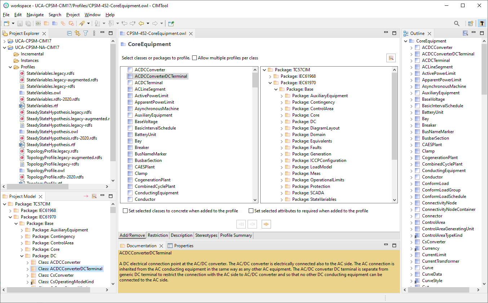

# Welcome

**CIMTool** is an open source platform used in the provides a comprehensive technical foundation for the creation, development, and maintenance of IEC standards-compliant data exchange profiles based on the Common Information Model (CIM). Rather than a single-purpose utility, CIMTool delivers an integrated environment where profile definition, schema generation, documentation, and validation converge — enabling organizations to manage the full lifecycle of CIM-based interoperability artifacts from a single platform.

Designed for the IEC standards community, utility enterprises, systems integrators, software developers, and data architects, **CIMTool** supports standards-based interoperability across the power systems domain. Its built-in schema builders automatically generate fully compliant output — including RDFS profiles (per IEC 61970-501 and -552), XML schemas (per IEC 62361-100), and JSON schemas (per the IEC 62361-104 draft specification) — eliminating the risk and effort associated with manual schema creation.

 

## Overview
**CIMTool** allows users to:

  * Create Contextual Profiles from the CIM Unified Model Language (UML)
  * Generate schemas such as [Resource Description Framework Schema (RDF Schema)](https://www.w3.org/2001/sw/wiki/RDFS) from a Contextual Profile
  * Create their own custom builders and import them into CIMTool to generate alternate types of target output (e.g. Word docs, SQL DB scripts, Apache Avro schemas, source code such as Java, C#, Python, etc).  See the [CIMTool Builders Library](https://cimtool-builders.ucaiug.io/) for detailed instructions on how to create your own builder.
  * Validate Contextual Profile schemas
  * Validate data instances against a Contextual Profile schema
  * Validate incremental data instances against an instance and a Contextual Profile schema
  * Import Contextual Profiles from a spreadsheet

## Questions and Discussion
The **CIMTool** community has a [Discussion board on GitHub](https://github.com/CIMug-org/CIMTool/discussions) which you can use to ask questions, get help, and engage with the rest of the community.
